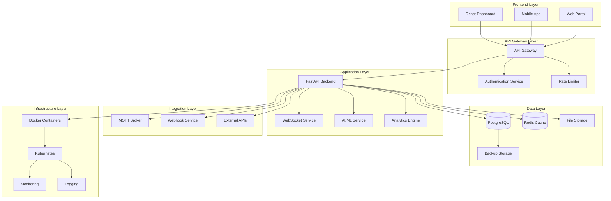
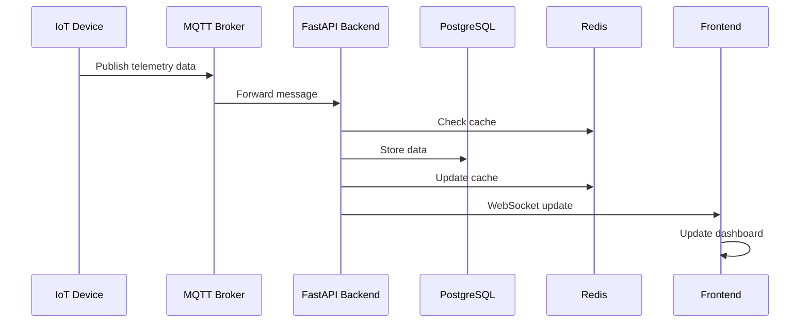
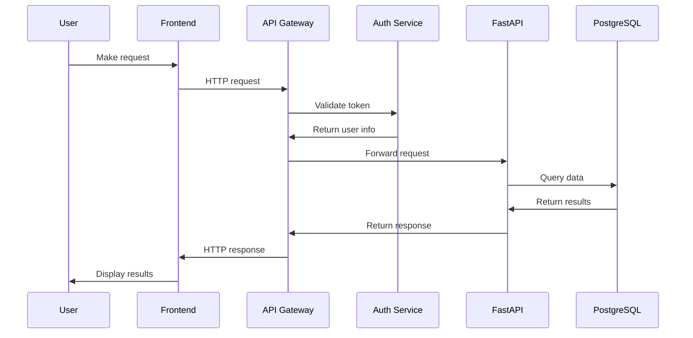
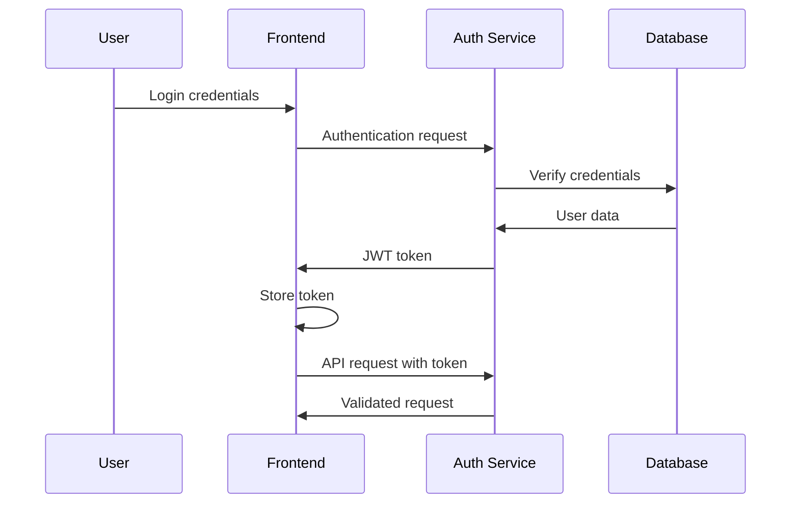
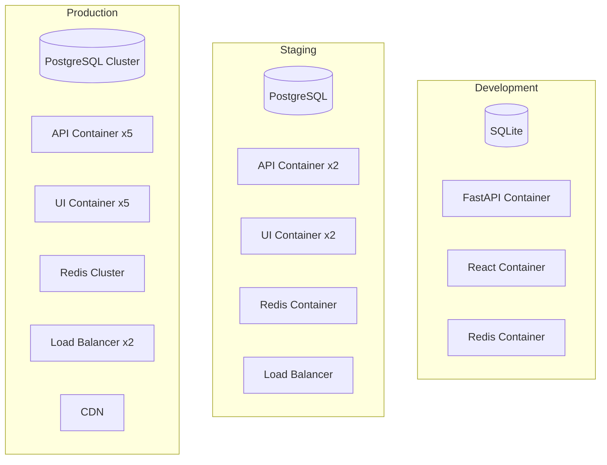

# Valtronics Architecture Overview

**High-level system architecture and design principles**

---

## Overview

Valtronics is built on a modern, microservices-oriented architecture designed for scalability, reliability, and real-time performance. The system follows a layered architecture pattern with clear separation of concerns.

---

## System Architecture Diagram



---

## Architectural Principles

### 1. Microservices Architecture
- **Service Separation**: Each component is an independent service
- **Loose Coupling**: Services communicate through well-defined APIs
- **High Cohesion**: Related functionality grouped together
- **Independent Deployment**: Services can be deployed independently

### 2. Scalability First
- **Horizontal Scaling**: Services can scale horizontally
- **Load Balancing**: Automatic load distribution
- **Resource Optimization**: Efficient resource utilization
- **Performance Monitoring**: Real-time performance tracking

### 3. Reliability and Availability
- **Fault Tolerance**: Graceful degradation on failures
- **Redundancy**: Multiple instances for high availability
- **Health Checks**: Continuous health monitoring
- **Disaster Recovery**: Backup and recovery procedures

### 4. Security by Design
- **Zero Trust**: Verify everything, trust nothing
- **Defense in Depth**: Multiple security layers
- **Data Protection**: Encryption at rest and in transit
- **Access Control**: Role-based access control

---

## Layer Architecture

### Frontend Layer
**Purpose**: User interface and experience
- **React Dashboard**: Main web interface
- **Mobile Applications**: iOS and Android apps
- **Web Portal**: Administrative interface
- **API Clients**: Third-party integrations

**Technologies**:
- React 18+ with TypeScript
- Redux Toolkit for state management
- Material-UI and custom components
- WebSocket client for real-time updates

### API Gateway Layer
**Purpose**: Request routing, authentication, and protection
- **API Gateway**: Request routing and load balancing
- **Authentication Service**: User authentication and authorization
- **Rate Limiter**: API rate limiting and protection
- **Request Validation**: Input validation and sanitization

**Technologies**:
- Nginx or Kong for API gateway
- JWT for authentication
- Redis for rate limiting
- Custom middleware for validation

### Application Layer
**Purpose**: Business logic and data processing
- **FastAPI Backend**: Main application server
- **WebSocket Service**: Real-time communication
- **AI/ML Service**: Machine learning and analytics
- **Analytics Engine**: Data processing and reporting

**Technologies**:
- FastAPI with Python
- WebSocket for real-time communication
- OpenAI API for AI features
- Pandas and NumPy for analytics

### Integration Layer
**Purpose**: External system integration
- **MQTT Broker**: Device communication protocol
- **Webhook Service**: External system notifications
- **External APIs**: Third-party service integration
- **Message Queue**: Asynchronous processing

**Technologies**:
- Mosquitto for MQTT
- Celery for background tasks
- Redis for message queuing
- HTTP clients for external APIs

### Data Layer
**Purpose**: Data storage and management
- **PostgreSQL**: Primary database
- **Redis Cache**: Caching and session storage
- **File Storage**: Document and media storage
- **Backup Storage**: Data backup and recovery

**Technologies**:
- PostgreSQL 14+ with extensions
- Redis 7+ for caching
- AWS S3 or equivalent for files
- Automated backup solutions

### Infrastructure Layer
**Purpose**: Deployment and operations
- **Docker Containers**: Containerization
- **Kubernetes**: Container orchestration
- **Monitoring**: System and application monitoring
- **Logging**: Centralized logging

**Technologies**:
- Docker and Docker Compose
- Kubernetes for orchestration
- Prometheus and Grafana for monitoring
- ELK stack for logging

---

## Data Flow Architecture

### Device Data Flow


### User Request Flow


---

## Component Architecture

### Backend Components

#### FastAPI Application
```
app/
├── api/                    # API endpoints
│   ├── v1/                # API version 1
│   │   ├── endpoints/     # Route handlers
│   │   └── dependencies.py  # Dependencies
├── core/                   # Core configuration
│   ├── config.py         # Settings
│   ├── security.py       # Security utilities
│   └── database.py       # Database setup
├── models/                 # Data models
│   ├── device.py         # Device models
│   ├── alert.py          # Alert models
│   └── user.py           # User models
├── schemas/               # Pydantic schemas
│   ├── device.py         # Device schemas
│   ├── alert.py          # Alert schemas
│   └── user.py           # User schemas
├── services/              # Business logic
│   ├── device_service.py  # Device operations
│   ├── alert_service.py   # Alert operations
│   └── analytics_service.py # Analytics
├── db/                    # Database
│   ├── session.py        # Database session
│   └── migrations/       # Database migrations
└── main.py               # Application entry point
```

#### Frontend Components
```
src/
├── components/            # React components
│   ├── common/          # Common components
│   ├── dashboard/       # Dashboard components
│   ├── devices/         # Device components
│   └── alerts/          # Alert components
├── pages/                # Page components
│   ├── Dashboard.js     # Main dashboard
│   ├── Devices.js       # Device management
│   └── Analytics.js     # Analytics page
├── services/            # API services
│   ├── api.js           # API client
│   ├── websocket.js     # WebSocket client
│   └── auth.js          # Authentication
├── store/               # Redux store
│   ├── slices/          # Redux slices
│   └── index.js         # Store configuration
├── styles/              # CSS styles
│   ├── globals.css      # Global styles
│   └── components/      # Component styles
└── App.js               # Main application
```

---

## Communication Patterns

### Synchronous Communication
- **HTTP/REST**: Standard REST API calls
- **GraphQL**: Query language for APIs (future)
- **WebSocket**: Real-time bidirectional communication
- **gRPC**: High-performance RPC (future)

### Asynchronous Communication
- **Message Queues**: Redis/Celery for background tasks
- **Event Streaming**: Kafka for event streaming (future)
- **Webhooks**: External system notifications
- **MQTT**: IoT device communication

### Data Synchronization
- **Database Replication**: PostgreSQL streaming replication
- **Cache Invalidation**: Redis cache invalidation
- **Event Sourcing**: Event-driven architecture
- **CQRS**: Command Query Responsibility Segregation

---

## Security Architecture

### Authentication Flow


### Authorization Model
- **Role-Based Access Control (RBAC)**
- **Resource-Based Permissions**
- **API Rate Limiting**
- **Input Validation and Sanitization**

### Data Protection
- **Encryption at Rest**: AES-256 database encryption
- **Encryption in Transit**: TLS 1.3 for all communications
- **Data Masking**: Sensitive data protection
- **Audit Logging**: Complete audit trail

---

## Performance Architecture

### Caching Strategy
- **Application Cache**: Redis for frequently accessed data
- **Database Cache**: PostgreSQL query cache
- **CDN**: Content delivery network for static assets
- **Browser Cache**: Client-side caching policies

### Database Optimization
- **Indexing Strategy**: Optimized database indexes
- **Query Optimization**: Efficient SQL queries
- **Connection Pooling**: Database connection management
- **Read Replicas**: Read scaling for analytics

### Load Balancing
- **Application Load Balancer**: Distribute API requests
- **Database Load Balancer**: Distribute database queries
- **Cache Load Balancer**: Distribute cache requests
- **Static Asset Load Balancer**: Distribute static content

---

## Deployment Architecture

### Container Strategy


### Environment Strategy
- **Development**: Single machine with SQLite
- **Staging**: Multi-container with PostgreSQL
- **Production**: Multi-region with high availability

### Infrastructure as Code
- **Docker Compose**: Local development
- **Kubernetes**: Production orchestration
- **Terraform**: Infrastructure provisioning
- **Ansible**: Configuration management

---

## Monitoring and Observability

### Monitoring Stack
- **Prometheus**: Metrics collection
- **Grafana**: Visualization and dashboards
- **AlertManager**: Alert management
- **Jaeger**: Distributed tracing

### Logging Strategy
- **ELK Stack**: Elasticsearch, Logstash, Kibana
- **Structured Logging**: JSON format logs
- **Log Aggregation**: Centralized log collection
- **Log Retention**: Configurable retention policies

### Health Monitoring
- **Application Health**: Custom health endpoints
- **Infrastructure Health**: System metrics
- **Database Health**: Database performance
- **Network Health**: Network connectivity

---

## Scalability Patterns

### Horizontal Scaling
- **Stateless Services**: Services without state
- **Load Balancing**: Distribute load across instances
- **Auto Scaling**: Automatic scaling based on load
- **Database Sharding**: Horizontal database scaling

### Vertical Scaling
- **Resource Optimization**: Efficient resource usage
- **Performance Tuning**: Application performance
- **Database Optimization**: Query and index optimization
- **Cache Optimization**: Efficient caching strategies

---

## Evolution Architecture

### Current Architecture (v1.0)
- **Monolithic Backend**: Single FastAPI application
- **React Frontend**: Single-page application
- **PostgreSQL**: Primary database
- **Redis**: Caching and session storage

### Future Architecture (v2.0)
- **Microservices**: Split into specialized services
- **Event-Driven**: Event sourcing and CQRS
- **GraphQL**: API query language
- **Multi-Cloud**: Multi-cloud deployment

### Technology Roadmap
- **Short Term**: Performance optimization, additional features
- **Medium Term**: Microservices migration, advanced analytics
- **Long Term**: AI/ML integration, edge computing

---

## Best Practices

### Code Organization
- **Modular Design**: Clear module boundaries
- **Dependency Injection**: Loose coupling
- **Interface Segregation**: Small, focused interfaces
- **Single Responsibility**: One responsibility per module

### Data Management
- **Data Validation**: Input validation at all layers
- **Error Handling**: Comprehensive error handling
- **Transaction Management**: ACID compliance
- **Data Consistency**: Consistent data state

### Security Practices
- **Principle of Least Privilege**: Minimal access required
- **Defense in Depth**: Multiple security layers
- **Regular Updates**: Keep dependencies updated
- **Security Testing**: Regular security assessments

---

## Documentation Standards

### Architecture Documentation
- **Diagrams**: Visual architecture representations
- **API Documentation**: Comprehensive API docs
- **Deployment Guides**: Step-by-step deployment
- **Troubleshooting Guides**: Common issues and solutions

### Code Documentation
- **Inline Comments**: Clear code comments
- **README Files**: Project documentation
- **API Specs**: OpenAPI specifications
- **Database Schema**: Data model documentation

---

## Support and Maintenance

### Maintenance Procedures
- **Regular Updates**: Monthly dependency updates
- **Security Patches**: Immediate security updates
- **Performance Reviews**: Quarterly performance reviews
- **Architecture Reviews**: Annual architecture assessments

### Support Channels
- **Documentation**: Comprehensive wiki documentation
- **Community**: Community support forums
- **Professional**: Professional support services
- **Emergency**: 24/7 emergency support

---

**© 2024 Software Customs Auto Bot Solution. All Rights Reserved.**  
**Valtronics Architecture Overview v1.0**
