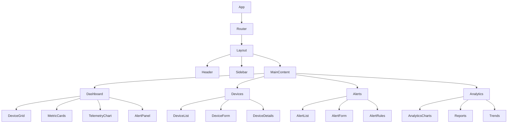

# Frontend Overview

**Comprehensive guide to the Valtronics frontend application**

---

## Overview

The Valtronics frontend is a modern, responsive web application built with React that provides an intuitive interface for monitoring and managing IoT devices. The frontend features real-time data visualization, interactive dashboards, and a sci-fi themed user interface.

---

## Technology Stack

### Core Technologies
- **React 18+**: Modern React with hooks and concurrent features
- **TypeScript**: Type-safe JavaScript development
- **Redux Toolkit**: State management and data flow
- **React Router**: Client-side routing
- **Material-UI**: Component library and design system

### Development Tools
- **Vite**: Fast build tool and development server
- **ESLint**: Code quality and linting
- **Prettier**: Code formatting
- **Jest**: Unit testing framework
- **React Testing Library**: Component testing

### Styling and Design
- **CSS Modules**: Scoped CSS styling
- **Custom Themes**: Sci-fi themed design system
- **Responsive Design**: Mobile-first approach
- **CSS Variables**: Dynamic theming support

### Communication
- **Axios**: HTTP client for API requests
- **WebSocket Client**: Real-time data streaming
- **Socket.IO**: WebSocket library integration

---

## Project Structure

```
frontend/
├── public/                 # Static assets
│   ├── index.html         # Main HTML template
│   ├── favicon.ico        # Application favicon
│   └── manifest.json      # PWA manifest
├── src/                   # Source code
│   ├── components/        # React components
│   │   ├── common/       # Reusable components
│   │   ├── dashboard/    # Dashboard components
│   │   ├── devices/      # Device management
│   │   ├── alerts/       # Alert management
│   │   └── analytics/    # Analytics components
│   ├── pages/            # Page components
│   │   ├── Dashboard.js  # Main dashboard
│   │   ├── Devices.js    # Device management page
│   │   ├── Alerts.js     # Alerts page
│   │   └── Analytics.js  # Analytics page
│   ├── services/         # API and business logic
│   │   ├── api.js        # API client
│   │   ├── websocket.js  # WebSocket client
│   │   ├── auth.js       # Authentication
│   │   └── utils.js      # Utility functions
│   ├── store/            # Redux store
│   │   ├── slices/       # Redux slices
│   │   └── index.js      # Store configuration
│   ├── styles/           # CSS styles
│   │   ├── globals.css   # Global styles
│   │   ├── variables.css # CSS variables
│   │   └── components/   # Component styles
│   ├── hooks/            # Custom React hooks
│   │   ├── useAuth.js    # Authentication hook
│   │   ├── useWebSocket.js # WebSocket hook
│   │   └── useApi.js     # API hook
│   ├── utils/            # Utility functions
│   │   ├── constants.js  # Application constants
│   │   ├── helpers.js    # Helper functions
│   │   └── validators.js # Input validators
│   ├── App.js            # Main application component
│   ├── index.js          # Application entry point
│   └── setupTests.js     # Test configuration
├── package.json          # Dependencies and scripts
├── vite.config.js        # Vite configuration
├── .env.example          # Environment variables template
└── README.md             # Frontend documentation
```

---

## Component Architecture

### Component Hierarchy


### Component Categories

#### 1. Layout Components
- **Layout**: Main application layout
- **Header**: Application header with navigation
- **Sidebar**: Navigation sidebar
- **Footer**: Application footer

#### 2. Common Components
- **LoadingSpinner**: Loading indicator
- **ErrorBoundary**: Error handling component
- **Modal**: Modal dialog component
- **Tooltip**: Tooltip component
- **Badge**: Status badge component

#### 3. Dashboard Components
- **DeviceGrid**: Grid display of devices
- **MetricCards**: Key performance indicators
- **TelemetryChart**: Real-time data visualization
- **AlertPanel**: Alert notification panel
- **SystemStatus**: System health indicator

#### 4. Device Components
- **DeviceList**: List of devices
- **DeviceCard**: Device card display
- **DeviceForm**: Device creation/editing form
- **DeviceDetails**: Detailed device information
- **DeviceStatus**: Device status indicator

#### 5. Alert Components
- **AlertList**: List of alerts
- **AlertCard**: Alert card display
- **AlertForm**: Alert creation form
- **AlertRules**: Alert rule management
- **SeverityIndicator**: Alert severity indicator

#### 6. Analytics Components
- **AnalyticsCharts**: Analytics visualization
- **Reports**: Report generation
- **Trends**: Trend analysis
- **Metrics**: Performance metrics

---

## State Management

### Redux Store Structure
```javascript
{
  auth: {
    user: null,
    token: null,
    isAuthenticated: false,
    loading: false,
    error: null
  },
  devices: {
    list: [],
    selected: null,
    loading: false,
    error: null,
    filters: {
      status: null,
      type: null,
      location: null
    }
  },
  telemetry: {
    data: {},
    realTime: {},
    loading: false,
    error: null
  },
  alerts: {
    list: [],
    unreadCount: 0,
    loading: false,
    error: null,
    filters: {
      severity: null,
      status: null
    }
  },
  analytics: {
    systemStats: null,
    devicePerformance: null,
    trends: null,
    loading: false,
    error: null
  },
  ui: {
    sidebarOpen: true,
    theme: 'dark',
    notifications: [],
    loading: false
  }
}
```

### Redux Slices
- **authSlice**: Authentication state management
- **devicesSlice**: Device data management
- **telemetrySlice**: Telemetry data management
- **alertsSlice**: Alert management
- **analyticsSlice**: Analytics data management
- **uiSlice**: UI state management

---

## API Integration

### API Client Configuration
```javascript
// src/services/api.js
import axios from 'axios';

const API_BASE_URL = process.env.REACT_APP_API_URL || 'http://localhost:8000';

const apiClient = axios.create({
  baseURL: API_BASE_URL,
  timeout: 10000,
  headers: {
    'Content-Type': 'application/json',
  },
});

// Request interceptor for authentication
apiClient.interceptors.request.use(
  (config) => {
    const token = localStorage.getItem('token');
    if (token) {
      config.headers.Authorization = `Bearer ${token}`;
    }
    return config;
  },
  (error) => Promise.reject(error)
);

// Response interceptor for error handling
apiClient.interceptors.response.use(
  (response) => response,
  (error) => {
    if (error.response?.status === 401) {
      // Handle authentication error
      localStorage.removeItem('token');
      window.location.href = '/login';
    }
    return Promise.reject(error);
  }
);

export default apiClient;
```

### API Services
```javascript
// src/services/deviceService.js
import apiClient from './api';

export const deviceService = {
  // Get all devices
  getDevices: async (params = {}) => {
    const response = await apiClient.get('/api/v1/devices/', { params });
    return response.data;
  },

  // Create device
  createDevice: async (deviceData) => {
    const response = await apiClient.post('/api/v1/devices/', deviceData);
    return response.data;
  },

  // Update device
  updateDevice: async (id, deviceData) => {
    const response = await apiClient.put(`/api/v1/devices/${id}`, deviceData);
    return response.data;
  },

  // Delete device
  deleteDevice: async (id) => {
    const response = await apiClient.delete(`/api/v1/devices/${id}`);
    return response.data;
  },

  // Get device statistics
  getDeviceStats: async () => {
    const response = await apiClient.get('/api/v1/devices/stats');
    return response.data;
  }
};
```

---

## WebSocket Integration

### WebSocket Client
```javascript
// src/services/websocket.js
class WebSocketClient {
  constructor(url) {
    this.url = url;
    this.ws = null;
    this.reconnectAttempts = 0;
    this.maxReconnectAttempts = 5;
    this.reconnectInterval = 1000;
    this.listeners = {};
  }

  connect(token) {
    try {
      this.ws = new WebSocket(this.url);
      
      this.ws.onopen = () => {
        console.log('WebSocket connected');
        this.reconnectAttempts = 0;
        this.authenticate(token);
      };

      this.ws.onmessage = (event) => {
        const data = JSON.parse(event.data);
        this.handleMessage(data);
      };

      this.ws.onclose = () => {
        console.log('WebSocket disconnected');
        this.reconnect(token);
      };

      this.ws.onerror = (error) => {
        console.error('WebSocket error:', error);
      };

    } catch (error) {
      console.error('Failed to connect WebSocket:', error);
    }
  }

  authenticate(token) {
    if (this.ws && this.ws.readyState === WebSocket.OPEN) {
      this.ws.send(JSON.stringify({
        type: 'auth',
        token: token
      }));
    }
  }

  subscribe(channel, callback) {
    if (!this.listeners[channel]) {
      this.listeners[channel] = [];
    }
    this.listeners[channel].push(callback);

    if (this.ws && this.ws.readyState === WebSocket.OPEN) {
      this.ws.send(JSON.stringify({
        type: 'subscribe',
        channel: channel
      }));
    }
  }

  unsubscribe(channel) {
    if (this.listeners[channel]) {
      delete this.listeners[channel];
    }

    if (this.ws && this.ws.readyState === WebSocket.OPEN) {
      this.ws.send(JSON.stringify({
        type: 'unsubscribe',
        channel: channel
      }));
    }
  }

  handleMessage(data) {
    const { type, channel, payload } = data;
    
    if (this.listeners[channel]) {
      this.listeners[channel].forEach(callback => {
        callback(payload);
      });
    }
  }

  reconnect(token) {
    if (this.reconnectAttempts < this.maxReconnectAttempts) {
      this.reconnectAttempts++;
      setTimeout(() => {
        console.log(`Reconnecting... (${this.reconnectAttempts}/${this.maxReconnectAttempts})`);
        this.connect(token);
      }, this.reconnectInterval * this.reconnectAttempts);
    }
  }

  disconnect() {
    if (this.ws) {
      this.ws.close();
      this.ws = null;
    }
  }
}

export default WebSocketClient;
```

### WebSocket Hook
```javascript
// src/hooks/useWebSocket.js
import { useEffect, useRef, useCallback } from 'react';
import { useDispatch, useSelector } from 'react-redux';
import WebSocketClient from '../services/websocket';
import { updateTelemetry, addAlert, updateDeviceStatus } from '../store/slices';

export const useWebSocket = () => {
  const dispatch = useDispatch();
  const { token } = useSelector(state => state.auth);
  const wsClientRef = useRef(null);

  const connectWebSocket = useCallback(() => {
    if (!token) return;

    const wsUrl = process.env.REACT_APP_WS_URL || 'ws://localhost:8000/ws';
    wsClientRef.current = new WebSocketClient(wsUrl);
    wsClientRef.current.connect(token);

    // Subscribe to channels
    wsClientRef.current.subscribe('telemetry', (data) => {
      dispatch(updateTelemetry(data));
    });

    wsClientRef.current.subscribe('alerts', (data) => {
      dispatch(addAlert(data));
    });

    wsClientRef.current.subscribe('device_status', (data) => {
      dispatch(updateDeviceStatus(data));
    });

  }, [token, dispatch]);

  const disconnectWebSocket = useCallback(() => {
    if (wsClientRef.current) {
      wsClientRef.current.disconnect();
      wsClientRef.current = null;
    }
  }, []);

  useEffect(() => {
    connectWebSocket();

    return () => {
      disconnectWebSocket();
    };
  }, [connectWebSocket, disconnectWebSocket]);

  return {
    connect: connectWebSocket,
    disconnect: disconnectWebSocket
  };
};
```

---

## Theming and Styling

### CSS Variables
```css
/* src/styles/variables.css */
:root {
  /* Colors */
  --primary-color: #00ffff;
  --secondary-color: #ff00ff;
  --accent-color: #00ff00;
  --gold-color: #ffd700;
  --dark-bg: #0a0a0f;
  --light-bg: #1a1a2e;
  --text-primary: #ffffff;
  --text-secondary: #b8b8c8;

  /* Gradients */
  --gradient-primary: linear-gradient(135deg, var(--primary-color), var(--secondary-color));
  --gradient-gold: linear-gradient(135deg, var(--gold-color), var(--primary-color));

  /* Shadows */
  --neon-glow: 0 0 20px rgba(0, 255, 255, 0.5);
  --gold-glow: 0 0 30px rgba(255, 215, 0, 0.6);

  /* Typography */
  --font-primary: 'Orbitron', monospace;
  --font-secondary: 'Space Mono', monospace;

  /* Spacing */
  --spacing-xs: 0.25rem;
  --spacing-sm: 0.5rem;
  --spacing-md: 1rem;
  --spacing-lg: 1.5rem;
  --spacing-xl: 2rem;

  /* Border Radius */
  --border-radius-sm: 4px;
  --border-radius-md: 8px;
  --border-radius-lg: 12px;
  --border-radius-xl: 20px;
}
```

### Theme Provider
```javascript
// src/components/ThemeProvider.js
import React, { createContext, useContext, useState } from 'react';

const ThemeContext = createContext();

export const useTheme = () => {
  const context = useContext(ThemeContext);
  if (!context) {
    throw new Error('useTheme must be used within a ThemeProvider');
  }
  return context;
};

export const ThemeProvider = ({ children }) => {
  const [theme, setTheme] = useState('dark');

  const toggleTheme = () => {
    setTheme(prevTheme => prevTheme === 'dark' ? 'light' : 'dark');
  };

  const value = {
    theme,
    toggleTheme,
    isDark: theme === 'dark'
  };

  return (
    <ThemeContext.Provider value={value}>
      {children}
    </ThemeContext.Provider>
  );
};
```

---

## Component Examples

### Device Card Component
```javascript
// src/components/devices/DeviceCard.js
import React from 'react';
import { Card, CardContent, Typography, Chip, Box } from '@mui/material';
import { useTheme } from '../ThemeProvider';
import { getStatusColor, getStatusIcon } from '../../utils/helpers';

const DeviceCard = ({ device, onClick }) => {
  const { theme } = useTheme();

  const statusColor = getStatusColor(device.status);
  const statusIcon = getStatusIcon(device.status);

  return (
    <Card 
      className={`device-card ${theme}`}
      onClick={() => onClick(device)}
      sx={{
        background: theme.isDark ? 'var(--dark-bg)' : 'var(--light-bg)',
        border: `1px solid var(--primary-color)`,
        cursor: 'pointer',
        transition: 'all 0.3s ease',
        '&:hover': {
          transform: 'translateY(-4px)',
          boxShadow: 'var(--neon-glow)'
        }
      }}
    >
      <CardContent>
        <Box display="flex" justifyContent="space-between" alignItems="center" mb={2}>
          <Typography variant="h6" component="h3" color="var(--text-primary)">
            {device.name}
          </Typography>
          <Chip 
            icon={statusIcon}
            label={device.status}
            style={{ 
              backgroundColor: statusColor,
              color: 'white'
            }}
          />
        </Box>
        
        <Box mb={1}>
          <Typography variant="body2" color="var(--text-secondary)">
            ID: {device.device_id}
          </Typography>
          <Typography variant="body2" color="var(--text-secondary)">
            Type: {device.device_type}
          </Typography>
          <Typography variant="body2" color="var(--text-secondary)">
            Location: {device.location}
          </Typography>
        </Box>

        {device.last_seen && (
          <Typography variant="caption" color="var(--text-secondary)">
            Last seen: {new Date(device.last_seen).toLocaleString()}
          </Typography>
        )}
      </CardContent>
    </Card>
  );
};

export default DeviceCard;
```

### Real-time Chart Component
```javascript
// src/components/analytics/RealTimeChart.js
import React, { useEffect, useRef } from 'react';
import { Line } from 'react-chartjs-2';
import { useSelector } from 'react-redux';

const RealTimeChart = ({ deviceId, metric }) => {
  const { telemetry } = useSelector(state => state.telemetry);
  const chartRef = useRef(null);

  const data = telemetry[deviceId]?.[metric] || [];
  
  const chartData = {
    labels: data.map(point => new Date(point.timestamp).toLocaleTimeString()),
    datasets: [
      {
        label: metric,
        data: data.map(point => point.value),
        borderColor: 'var(--primary-color)',
        backgroundColor: 'rgba(0, 255, 255, 0.1)',
        borderWidth: 2,
        tension: 0.4
      }
    ]
  };

  const options = {
    responsive: true,
    maintainAspectRatio: false,
    scales: {
      y: {
        beginAtZero: false,
        grid: {
          color: 'rgba(255, 255, 255, 0.1)'
        },
        ticks: {
          color: 'var(--text-secondary)'
        }
      },
      x: {
        grid: {
          color: 'rgba(255, 255, 255, 0.1)'
        },
        ticks: {
          color: 'var(--text-secondary)'
        }
      }
    },
    plugins: {
      legend: {
        labels: {
          color: 'var(--text-primary)'
        }
      }
    }
  };

  useEffect(() => {
    if (chartRef.current) {
      chartRef.current.update();
    }
  }, [data]);

  return (
    <div className="chart-container">
      <Line ref={chartRef} data={chartData} options={options} />
    </div>
  );
};

export default RealTimeChart;
```

---

## Performance Optimization

### Code Splitting
```javascript
// src/App.js
import React, { Suspense, lazy } from 'react';
import { BrowserRouter as Router, Routes, Route } from 'react-router-dom';
import { ThemeProvider } from './components/ThemeProvider';
import LoadingSpinner from './components/common/LoadingSpinner';

// Lazy load components
const Dashboard = lazy(() => import('./pages/Dashboard'));
const Devices = lazy(() => import('./pages/Devices'));
const Alerts = lazy(() => import('./pages/Alerts'));
const Analytics = lazy(() => import('./pages/Analytics'));

function App() {
  return (
    <ThemeProvider>
      <Router>
        <div className="App">
          <Suspense fallback={<LoadingSpinner />}>
            <Routes>
              <Route path="/" element={<Dashboard />} />
              <Route path="/devices" element={<Devices />} />
              <Route path="/alerts" element={<Alerts />} />
              <Route path="/analytics" element={<Analytics />} />
            </Routes>
          </Suspense>
        </div>
      </Router>
    </ThemeProvider>
  );
}

export default App;
```

### Memoization
```javascript
// src/components/devices/DeviceList.js
import React, { memo, useMemo } from 'react';
import { useSelector } from 'react-redux';
import DeviceCard from './DeviceCard';

const DeviceList = ({ filters, onDeviceClick }) => {
  const { devices } = useSelector(state => state.devices);

  // Memoize filtered devices
  const filteredDevices = useMemo(() => {
    return devices.filter(device => {
      if (filters.status && device.status !== filters.status) return false;
      if (filters.type && device.device_type !== filters.type) return false;
      if (filters.location && device.location !== filters.location) return false;
      return true;
    });
  }, [devices, filters]);

  return (
    <div className="device-list">
      {filteredDevices.map(device => (
        <DeviceCard 
          key={device.id} 
          device={device} 
          onClick={onDeviceClick}
        />
      ))}
    </div>
  );
};

export default memo(DeviceList);
```

---

## Testing

### Component Testing
```javascript
// src/components/devices/__tests__/DeviceCard.test.js
import React from 'react';
import { render, screen, fireEvent } from '@testing-library/react';
import { ThemeProvider } from '../../ThemeProvider';
import DeviceCard from '../DeviceCard';

const mockDevice = {
  id: 1,
  name: 'Test Device',
  device_id: 'TEST-001',
  device_type: 'sensor',
  status: 'online',
  location: 'Test Lab'
};

const renderWithTheme = (component) => {
  return render(
    <ThemeProvider>
      {component}
    </ThemeProvider>
  );
};

describe('DeviceCard', () => {
  test('renders device information correctly', () => {
    renderWithTheme(<DeviceCard device={mockDevice} />);
    
    expect(screen.getByText('Test Device')).toBeInTheDocument();
    expect(screen.getByText('TEST-001')).toBeInTheDocument();
    expect(screen.getByText('sensor')).toBeInTheDocument();
    expect(screen.getByText('Test Lab')).toBeInTheDocument();
  });

  test('calls onClick when clicked', () => {
    const mockOnClick = jest.fn();
    renderWithTheme(<DeviceCard device={mockDevice} onClick={mockOnClick} />);
    
    fireEvent.click(screen.getByText('Test Device'));
    expect(mockOnClick).toHaveBeenCalledWith(mockDevice);
  });

  test('displays correct status', () => {
    renderWithTheme(<DeviceCard device={mockDevice} />);
    
    const statusChip = screen.getByText('online');
    expect(statusChip).toBeInTheDocument();
    expect(statusChip).toHaveStyle({ backgroundColor: 'var(--success-color)' });
  });
});
```

### Integration Testing
```javascript
// src/pages/__tests__/Dashboard.test.js
import React from 'react';
import { render, screen, waitFor } from '@testing-library/react';
import { Provider } from 'react-redux';
import { BrowserRouter } from 'react-router-dom';
import { store } from '../../store';
import Dashboard from '../Dashboard';

const renderWithProviders = (component) => {
  return render(
    <Provider store={store}>
      <BrowserRouter>
        {component}
      </BrowserRouter>
    </Provider>
  );
};

describe('Dashboard', () => {
  test('renders dashboard components', async () => {
    renderWithProviders(<Dashboard />);
    
    await waitFor(() => {
      expect(screen.getByText('Valtronics Dashboard')).toBeInTheDocument();
      expect(screen.getByText('Device Overview')).toBeInTheDocument();
      expect(screen.getByText('System Analytics')).toBeInTheDocument();
    });
  });

  test('displays device statistics', async () => {
    renderWithProviders(<Dashboard />);
    
    await waitFor(() => {
      expect(screen.getByText('Total Devices')).toBeInTheDocument();
      expect(screen.getByText('Online Devices')).toBeInTheDocument();
    });
  });
});
```

---

## Build and Deployment

### Build Configuration
```javascript
// vite.config.js
import { defineConfig } from 'vite';
import react from '@vitejs/plugin-react';

export default defineConfig({
  plugins: [react()],
  build: {
    outDir: 'dist',
    sourcemap: true,
    rollupOptions: {
      output: {
        manualChunks: {
          vendor: ['react', 'react-dom'],
          redux: ['@reduxjs/toolkit', 'react-redux'],
          ui: ['@mui/material', '@mui/icons-material'],
          charts: ['chart.js', 'react-chartjs-2']
        }
      }
    }
  },
  server: {
    port: 3000,
    proxy: {
      '/api': 'http://localhost:8000',
      '/ws': {
        target: 'ws://localhost:8000',
        ws: true
      }
    }
  },
  define: {
    __APP_VERSION__: JSON.stringify(process.env.npm_package_version)
  }
});
```

### Environment Variables
```bash
# .env.example
REACT_APP_API_URL=http://localhost:8000
REACT_APP_WS_URL=ws://localhost:8000/ws
REACT_APP_NAME=Valtronics
REACT_APP_VERSION=1.0.0
REACT_APP_ENABLE_AI_FEATURES=true
REACT_APP_ENABLE_REAL_TIME=true
REACT_APP_ENABLE_ANALYTICS=true
```

---

## Best Practices

### Code Organization
- Use functional components with hooks
- Implement proper error boundaries
- Use TypeScript for type safety
- Follow consistent naming conventions

### Performance
- Implement code splitting
- Use React.memo for expensive components
- Optimize re-renders with useMemo/useCallback
- Lazy load heavy components

### Accessibility
- Use semantic HTML elements
- Implement proper ARIA labels
- Ensure keyboard navigation
- Test with screen readers

### Security
- Validate all user inputs
- Use HTTPS in production
- Implement proper authentication
- Sanitize user-generated content

---

## Troubleshooting

### Common Issues
- **WebSocket Connection**: Check backend server status
- **API Errors**: Verify authentication tokens
- **Build Failures**: Check dependency versions
- **Performance Issues**: Profile with React DevTools

### Debug Tools
- React Developer Tools
- Redux DevTools
- Chrome DevTools
- Network tab for API calls

---

## Support

For frontend development support:
- **Documentation**: [Component Library](components.md)
- **Styling**: [Themes and Styling](themes-and-styling.md)
- **Troubleshooting**: [Troubleshooting Guide](../10-reference/troubleshooting.md)
- **Email**: autobotsolution@gmail.com

---

**© 2024 Software Customs Auto Bot Solution. All Rights Reserved.**  
**Frontend Overview v1.0**
