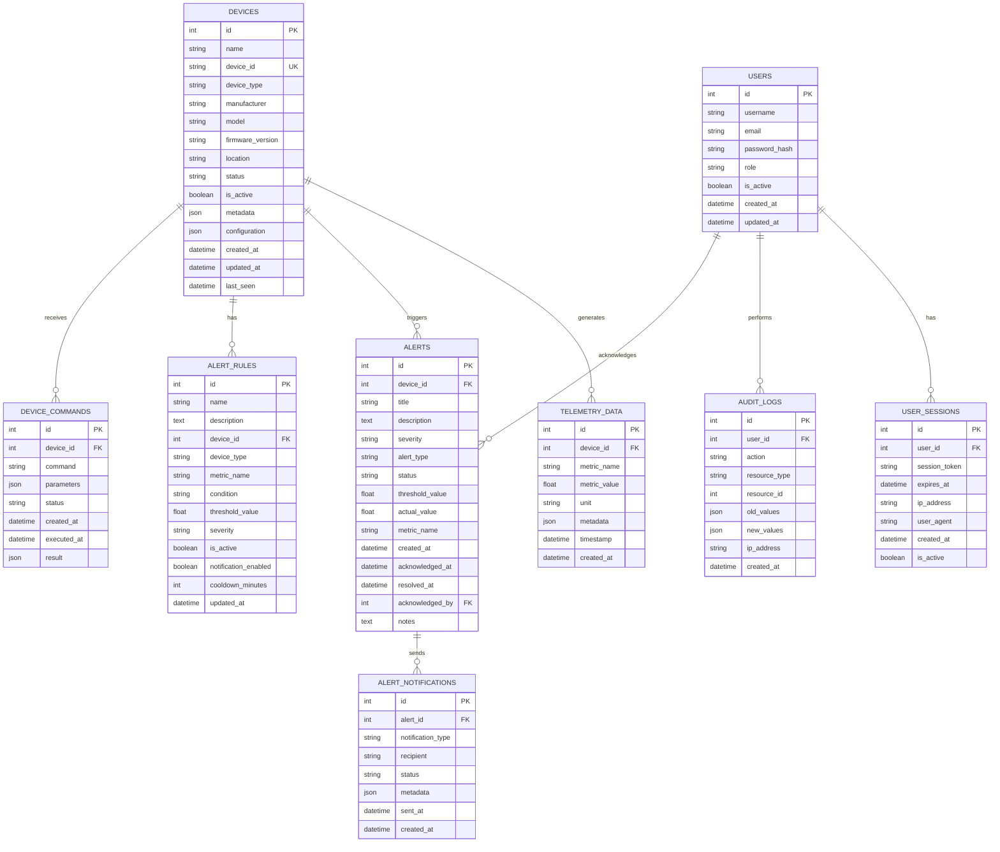

# Database Overview

**Complete database architecture and design documentation**

---

## Overview

The Valtronics system uses a relational database architecture designed for high-performance telemetry data storage, real-time analytics, and scalable device management. The database supports both SQLite for development and PostgreSQL for production deployments.

---

## Database Architecture

### Database Systems
- **Development**: SQLite 3.35+ (file-based)
- **Production**: PostgreSQL 14+ (server-based)
- **Caching**: Redis 7+ (optional)
- **Backup**: Automated backup solutions

### Design Principles
- **ACID Compliance**: Atomicity, Consistency, Isolation, Durability
- **Normalization**: Third Normal Form (3NF)
- **Scalability**: Horizontal and vertical scaling
- **Performance**: Optimized for high-frequency writes
- **Security**: Row-level security and encryption

---

## Database Schema

### Entity Relationship Diagram


---

## Table Definitions

### 1. Users Table
```sql
CREATE TABLE users (
    id SERIAL PRIMARY KEY,
    username VARCHAR(50) UNIQUE NOT NULL,
    email VARCHAR(255) UNIQUE NOT NULL,
    password_hash VARCHAR(255) NOT NULL,
    role VARCHAR(20) DEFAULT 'user' CHECK (role IN ('admin', 'operator', 'user')),
    is_active BOOLEAN DEFAULT true,
    created_at TIMESTAMP DEFAULT CURRENT_TIMESTAMP,
    updated_at TIMESTAMP DEFAULT CURRENT_TIMESTAMP
);

-- Indexes
CREATE INDEX idx_users_username ON users(username);
CREATE INDEX idx_users_email ON users(email);
CREATE INDEX idx_users_role ON users(role);
```

### 2. Devices Table
```sql
CREATE TABLE devices (
    id SERIAL PRIMARY KEY,
    name VARCHAR(255) NOT NULL,
    device_id VARCHAR(100) UNIQUE NOT NULL,
    device_type VARCHAR(50) NOT NULL,
    manufacturer VARCHAR(100),
    model VARCHAR(100),
    firmware_version VARCHAR(50),
    location VARCHAR(255),
    status VARCHAR(20) DEFAULT 'offline' CHECK (status IN ('online', 'offline', 'warning', 'error', 'maintenance')),
    is_active BOOLEAN DEFAULT true,
    metadata JSONB,
    configuration JSONB,
    created_at TIMESTAMP DEFAULT CURRENT_TIMESTAMP,
    updated_at TIMESTAMP DEFAULT CURRENT_TIMESTAMP,
    last_seen TIMESTAMP
);

-- Indexes
CREATE INDEX idx_devices_device_id ON devices(device_id);
CREATE INDEX idx_devices_type ON devices(device_type);
CREATE INDEX idx_devices_status ON devices(status);
CREATE INDEX idx_devices_location ON devices(location);
CREATE INDEX idx_devices_last_seen ON devices(last_seen);
CREATE INDEX idx_devices_metadata ON devices USING GIN(metadata);
```

### 3. Telemetry Data Table
```sql
CREATE TABLE telemetry_data (
    id BIGSERIAL PRIMARY KEY,
    device_id INTEGER NOT NULL REFERENCES devices(id) ON DELETE CASCADE,
    metric_name VARCHAR(100) NOT NULL,
    metric_value DOUBLE PRECISION NOT NULL,
    unit VARCHAR(20),
    metadata JSONB,
    timestamp TIMESTAMP NOT NULL,
    created_at TIMESTAMP DEFAULT CURRENT_TIMESTAMP
);

-- Indexes
CREATE INDEX idx_telemetry_device_id ON telemetry_data(device_id);
CREATE INDEX idx_telemetry_metric ON telemetry_data(metric_name);
CREATE INDEX idx_telemetry_timestamp ON telemetry_data(timestamp);
CREATE INDEX idx_telemetry_device_metric_time ON telemetry_data(device_id, metric_name, timestamp);
CREATE INDEX idx_telemetry_metadata ON telemetry_data USING GIN(metadata);

-- Partitioning for large datasets (PostgreSQL)
CREATE TABLE telemetry_data_y2024m01 PARTITION OF telemetry_data
FOR VALUES FROM ('2024-01-01') TO ('2024-02-01');
```

### 4. Alerts Table
```sql
CREATE TABLE alerts (
    id SERIAL PRIMARY KEY,
    device_id INTEGER REFERENCES devices(id) ON DELETE CASCADE,
    title VARCHAR(255) NOT NULL,
    description TEXT,
    severity VARCHAR(20) NOT NULL CHECK (severity IN ('info', 'warning', 'critical')),
    alert_type VARCHAR(50) NOT NULL,
    status VARCHAR(20) DEFAULT 'active' CHECK (status IN ('active', 'acknowledged', 'resolved')),
    threshold_value DOUBLE PRECISION,
    actual_value DOUBLE PRECISION,
    metric_name VARCHAR(100),
    created_at TIMESTAMP DEFAULT CURRENT_TIMESTAMP,
    acknowledged_at TIMESTAMP,
    resolved_at TIMESTAMP,
    acknowledged_by INTEGER REFERENCES users(id),
    notes TEXT
);

-- Indexes
CREATE INDEX idx_alerts_device_id ON alerts(device_id);
CREATE INDEX idx_alerts_severity ON alerts(severity);
CREATE INDEX idx_alerts_status ON alerts(status);
CREATE INDEX idx_alerts_created_at ON alerts(created_at);
CREATE INDEX idx_alerts_type ON alerts(alert_type);
```

### 5. Alert Rules Table
```sql
CREATE TABLE alert_rules (
    id SERIAL PRIMARY KEY,
    name VARCHAR(255) NOT NULL,
    description TEXT,
    device_id INTEGER REFERENCES devices(id) ON DELETE CASCADE,
    device_type VARCHAR(50),
    metric_name VARCHAR(100) NOT NULL,
    condition VARCHAR(20) NOT NULL CHECK (condition IN ('gt', 'lt', 'eq', 'gte', 'lte', 'ne')),
    threshold_value DOUBLE PRECISION NOT NULL,
    severity VARCHAR(20) NOT NULL CHECK (severity IN ('info', 'warning', 'critical')),
    is_active BOOLEAN DEFAULT true,
    notification_enabled BOOLEAN DEFAULT true,
    cooldown_minutes INTEGER DEFAULT 30,
    updated_at TIMESTAMP DEFAULT CURRENT_TIMESTAMP
);

-- Indexes
CREATE INDEX idx_alert_rules_device_id ON alert_rules(device_id);
CREATE INDEX idx_alert_rules_device_type ON alert_rules(device_type);
CREATE INDEX idx_alert_rules_metric ON alert_rules(metric_name);
CREATE INDEX idx_alert_rules_active ON alert_rules(is_active);
```

---

## Data Models

### Device Model
```python
# app/models/device.py
from sqlalchemy import Column, Integer, String, Boolean, DateTime, JSON, Float
from sqlalchemy.ext.declarative import declarative_base
from sqlalchemy.orm import relationship
from datetime import datetime

Base = declarative_base()

class Device(Base):
    __tablename__ = "devices"
    
    id = Column(Integer, primary_key=True, index=True)
    name = Column(String(255), nullable=False)
    device_id = Column(String(100), unique=True, nullable=False, index=True)
    device_type = Column(String(50), nullable=False, index=True)
    manufacturer = Column(String(100))
    model = Column(String(100))
    firmware_version = Column(String(50))
    location = Column(String(255), index=True)
    status = Column(String(20), default="offline", index=True)
    is_active = Column(Boolean, default=True)
    metadata = Column(JSON)
    configuration = Column(JSON)
    created_at = Column(DateTime, default=datetime.utcnow)
    updated_at = Column(DateTime, default=datetime.utcnow, onupdate=datetime.utcnow)
    last_seen = Column(DateTime, index=True)
    
    # Relationships
    telemetry_data = relationship("TelemetryData", back_populates="device", cascade="all, delete-orphan")
    alerts = relationship("Alert", back_populates="device", cascade="all, delete-orphan")
    commands = relationship("DeviceCommand", back_populates="device", cascade="all, delete-orphan")
```

### Telemetry Data Model
```python
# app/models/device.py (continued)
class TelemetryData(Base):
    __tablename__ = "telemetry_data"
    
    id = Column(Integer, primary_key=True, index=True)
    device_id = Column(Integer, ForeignKey("devices.id"), nullable=False, index=True)
    metric_name = Column(String(100), nullable=False, index=True)
    metric_value = Column(Float, nullable=False)
    unit = Column(String(20))
    metadata = Column(JSON)
    timestamp = Column(DateTime, nullable=False, index=True)
    created_at = Column(DateTime, default=datetime.utcnow)
    
    # Relationships
    device = relationship("Device", back_populates="telemetry_data")
```

### Alert Model
```python
# app/models/alert.py
from sqlalchemy import Column, Integer, String, Boolean, DateTime, JSON, Float, ForeignKey, Text
from sqlalchemy.orm import relationship

class Alert(Base):
    __tablename__ = "alerts"
    
    id = Column(Integer, primary_key=True, index=True)
    device_id = Column(Integer, ForeignKey("devices.id"), nullable=False, index=True)
    title = Column(String(255), nullable=False)
    description = Column(Text)
    severity = Column(String(20), nullable=False, index=True)
    alert_type = Column(String(50), nullable=False, index=True)
    status = Column(String(20), default="active", index=True)
    threshold_value = Column(Float)
    actual_value = Column(Float)
    metric_name = Column(String(100))
    created_at = Column(DateTime, default=datetime.utcnow, index=True)
    acknowledged_at = Column(DateTime)
    resolved_at = Column(DateTime)
    acknowledged_by = Column(Integer, ForeignKey("users.id"))
    notes = Column(Text)
    
    # Relationships
    device = relationship("Device", back_populates="alerts")
    acknowledged_user = relationship("User")
```

---

## Database Operations

### CRUD Operations

#### Create Device
```python
# app/services/device_service.py
from sqlalchemy.orm import Session
from app.models.device import Device
from app.schemas.device import DeviceCreate

def create_device(db: Session, device: DeviceCreate) -> Device:
    db_device = Device(
        name=device.name,
        device_id=device.device_id,
        device_type=device.device_type,
        manufacturer=device.manufacturer,
        model=device.model,
        firmware_version=device.firmware_version,
        location=device.location,
        status=device.status,
        metadata=device.metadata,
        configuration=device.configuration
    )
    db.add(db_device)
    db.commit()
    db.refresh(db_device)
    return db_device
```

#### Read Operations
```python
def get_devices(db: Session, skip: int = 0, limit: int = 100) -> List[Device]:
    return db.query(Device).offset(skip).limit(limit).all()

def get_device_by_id(db: Session, device_id: int) -> Device:
    return db.query(Device).filter(Device.id == device_id).first()

def get_device_by_device_id(db: Session, device_id: str) -> Device:
    return db.query(Device).filter(Device.device_id == device_id).first()
```

#### Update Operations
```python
def update_device(db: Session, device_id: int, device_update: DeviceUpdate) -> Device:
    db_device = db.query(Device).filter(Device.id == device_id).first()
    if db_device:
        for field, value in device_update.dict(exclude_unset=True).items():
            setattr(db_device, field, value)
        db_device.updated_at = datetime.utcnow()
        db.commit()
        db.refresh(db_device)
    return db_device
```

#### Delete Operations
```python
def delete_device(db: Session, device_id: int) -> bool:
    db_device = db.query(Device).filter(Device.id == device_id).first()
    if db_device:
        db.delete(db_device)
        db.commit()
        return True
    return False
```

### Advanced Queries

#### Telemetry Data Aggregation
```python
from sqlalchemy import func, extract
from app.models.device import TelemetryData

def get_telemetry_aggregates(db: Session, device_id: int, hours: int = 24):
    cutoff_time = datetime.utcnow() - timedelta(hours=hours)
    
    result = db.query(
        TelemetryData.metric_name,
        func.count(TelemetryData.id).label('count'),
        func.avg(TelemetryData.metric_value).label('avg'),
        func.min(TelemetryData.metric_value).label('min'),
        func.max(TelemetryData.metric_value).label('max'),
        func.stddev(TelemetryData.metric_value).label('std')
    ).filter(
        TelemetryData.device_id == device_id,
        TelemetryData.timestamp >= cutoff_time
    ).group_by(TelemetryData.metric_name).all()
    
    return result
```

#### Device Performance Analytics
```python
def get_device_performance(db: Session, device_id: int, days: int = 30):
    cutoff_date = datetime.utcnow() - timedelta(days=days)
    
    # Uptime calculation
    total_time = (datetime.utcnow() - cutoff_date).total_seconds()
    
    # Get last seen timestamps
    telemetry = db.query(TelemetryData.timestamp).filter(
        TelemetryData.device_id == device_id,
        TelemetryData.timestamp >= cutoff_date
    ).order_by(TelemetryData.timestamp.desc()).all()
    
    if not telemetry:
        return {"uptime_percentage": 0, "data_points": 0}
    
    # Calculate uptime based on data frequency
    expected_points = total_time / 300  # Assuming 5-minute intervals
    actual_points = len(telemetry)
    uptime_percentage = (actual_points / expected_points) * 100
    
    return {
        "uptime_percentage": min(uptime_percentage, 100),
        "data_points": actual_points,
        "last_seen": telemetry[0].timestamp
    }
```

---

## Performance Optimization

### Indexing Strategy
```sql
-- Composite indexes for common queries
CREATE INDEX idx_telemetry_device_metric_time ON telemetry_data(device_id, metric_name, timestamp DESC);
CREATE INDEX idx_alerts_device_status_severity ON alerts(device_id, status, severity);
CREATE INDEX idx_devices_type_status ON devices(device_type, status);

-- Partial indexes for filtered queries
CREATE INDEX idx_active_devices ON devices(id) WHERE is_active = true;
CREATE INDEX idx_active_alerts ON alerts(id) WHERE status = 'active';
CREATE INDEX idx_recent_telemetry ON telemetry_data(id) WHERE timestamp >= NOW() - INTERVAL '24 hours';
```

### Query Optimization
```python
# Use efficient query patterns
def get_device_telemetry_latest(db: Session, device_id: int, limit: int = 100):
    # Use DISTINCT ON for latest values per metric
    return db.query(TelemetryData).filter(
        TelemetryData.device_id == device_id
    ).distinct(
        TelemetryData.metric_name
    ).order_by(
        TelemetryData.metric_name,
        TelemetryData.timestamp.desc()
    ).limit(limit).all()

# Batch operations for better performance
def batch_insert_telemetry(db: Session, telemetry_data: List[TelemetryData]):
    db.bulk_insert_mappings(TelemetryData, [t.__dict__ for t in telemetry_data])
    db.commit()
```

### Connection Pooling
```python
# app/db/session.py
from sqlalchemy import create_engine
from sqlalchemy.orm import sessionmaker
from app.core.config import settings

engine = create_engine(
    settings.DATABASE_URL,
    pool_size=20,
    max_overflow=30,
    pool_pre_ping=True,
    pool_recycle=3600,
    echo=settings.DEBUG
)

SessionLocal = sessionmaker(autocommit=False, autoflush=False, bind=engine)
```

---

## Data Migration

### Migration Scripts
```python
# alembic/versions/001_initial_schema.py
from alembic import op
import sqlalchemy as sa

def upgrade():
    # Create users table
    op.create_table('users',
        sa.Column('id', sa.Integer(), nullable=False),
        sa.Column('username', sa.String(length=50), nullable=False),
        sa.Column('email', sa.String(length=255), nullable=False),
        sa.Column('password_hash', sa.String(length=255), nullable=False),
        sa.Column('role', sa.String(length=20), nullable=True),
        sa.Column('is_active', sa.Boolean(), nullable=True),
        sa.Column('created_at', sa.DateTime(), nullable=True),
        sa.Column('updated_at', sa.DateTime(), nullable=True),
        sa.PrimaryKeyConstraint('id'),
        sa.UniqueConstraint('username'),
        sa.UniqueConstraint('email')
    )

def downgrade():
    op.drop_table('users')
```

### Data Seeding
```python
# scripts/seed_data.py
from sqlalchemy.orm import Session
from app.db.session_sqlite import SessionLocal
from app.models.device import Device
from app.models.alert import AlertRule
import json

def seed_database():
    db = SessionLocal()
    
    try:
        # Create sample devices
        devices = [
            Device(
                name="Temperature Sensor Alpha",
                device_id="TEMP-001",
                device_type="sensor",
                manufacturer="SensorTech",
                model="ST-T1000",
                firmware_version="2.1.4",
                location="Zone A - Server Room",
                status="online",
                metadata={"installation_date": "2024-01-01"},
                configuration={"sampling_rate": 60}
            ),
            # ... more devices
        ]
        
        for device in devices:
            db.add(device)
        
        # Create alert rules
        rules = [
            AlertRule(
                name="High Temperature Alert",
                description="Alert when temperature exceeds threshold",
                device_type="sensor",
                metric_name="temperature",
                condition="gt",
                threshold_value=30.0,
                severity="warning"
            ),
            # ... more rules
        ]
        
        for rule in rules:
            db.add(rule)
        
        db.commit()
        print("Database seeded successfully")
        
    except Exception as e:
        print(f"Error seeding database: {e}")
        db.rollback()
    finally:
        db.close()
```

---

## Backup and Recovery

### Backup Strategy
```bash
#!/bin/bash
# scripts/backup_database.sh

DB_NAME="valtronics"
DB_USER="valtronics_user"
BACKUP_DIR="/backups/valtronics"
DATE=$(date +%Y%m%d_%H%M%S)

# Create backup
pg_dump -U $DB_USER -h localhost $DB_NAME > $BACKUP_DIR/valtronics_backup_$DATE.sql

# Compress backup
gzip $BACKUP_DIR/valtronics_backup_$DATE.sql

# Remove old backups (keep last 7 days)
find $BACKUP_DIR -name "valtronics_backup_*.sql.gz" -mtime +7 -delete

echo "Backup completed: valtronics_backup_$DATE.sql.gz"
```

### Recovery Procedure
```bash
#!/bin/bash
# scripts/restore_database.sh

BACKUP_FILE=$1
DB_NAME="valtronics"
DB_USER="valtronics_user"

if [ -z "$BACKUP_FILE" ]; then
    echo "Usage: $0 <backup_file>"
    exit 1
fi

# Drop existing database
dropdb -U $DB_USER $DB_NAME

# Create new database
createdb -U $DB_USER $DB_NAME

# Restore from backup
gunzip -c $BACKUP_FILE | psql -U $DB_USER $DB_NAME

echo "Database restored from $BACKUP_FILE"
```

---

## Monitoring and Maintenance

### Performance Monitoring
```sql
-- Query performance analysis
SELECT 
    query,
    calls,
    total_time,
    mean_time,
    rows
FROM pg_stat_statements
ORDER BY total_time DESC
LIMIT 10;

-- Index usage
SELECT 
    schemaname,
    tablename,
    indexname,
    idx_scan,
    idx_tup_read,
    idx_tup_fetch
FROM pg_stat_user_indexes
ORDER BY idx_scan DESC;
```

### Maintenance Tasks
```sql
-- Update table statistics
ANALYZE devices;
ANALYZE telemetry_data;
ANALYZE alerts;

-- Rebuild indexes (if needed)
REINDEX INDEX CONCURRENTLY idx_devices_device_id;

-- Vacuum old data
VACUUM telemetry_data;

-- Partition maintenance (if using partitioning)
ALTER TABLE telemetry_data DETACH PARTITION telemetry_data_y2023m12;
```

---

## Security

### Row-Level Security
```sql
-- Enable row-level security
ALTER TABLE devices ENABLE ROW LEVEL SECURITY;
ALTER TABLE alerts ENABLE ROW LEVEL SECURITY;

-- Create policies for user access
CREATE POLICY device_isolation_policy ON devices
    FOR ALL
    TO application_user
    USING (id IN (
        SELECT device_id FROM user_device_access 
        WHERE user_id = current_user_id()
    ));
```

### Data Encryption
```python
# Encrypt sensitive data
from cryptography.fernet import Fernet

class EncryptionService:
    def __init__(self, key: str):
        self.cipher = Fernet(key.encode())
    
    def encrypt(self, data: str) -> str:
        return self.cipher.encrypt(data.encode()).decode()
    
    def decrypt(self, encrypted_data: str) -> str:
        return self.cipher.decrypt(encrypted_data.encode()).decode()
```

---

## Troubleshooting

### Common Issues
- **Connection Errors**: Check database server status
- **Slow Queries**: Analyze with EXPLAIN and optimize indexes
- **Lock Contention**: Monitor and optimize transaction isolation
- **Disk Space**: Monitor and implement data retention policies

### Diagnostic Queries
```sql
-- Check database connections
SELECT count(*) FROM pg_stat_activity;

-- Check table sizes
SELECT 
    tablename,
    pg_size_pretty(pg_total_relation_size(tablename::regclass)) AS size
FROM pg_tables 
WHERE schemaname = 'public'
ORDER BY pg_total_relation_size(tablename::regclass) DESC;

-- Check index sizes
SELECT 
    indexname,
    pg_size_pretty(pg_relation_size(indexname::regclass)) AS size
FROM pg_indexes 
WHERE schemaname = 'public';
```

---

## Best Practices

### Database Design
- Use appropriate data types
- Implement proper constraints
- Design for scalability
- Normalize data appropriately

### Performance
- Create strategic indexes
- Optimize query patterns
- Use connection pooling
- Monitor performance metrics

### Security
- Implement proper authentication
- Use parameterized queries
- Encrypt sensitive data
- Regular security audits

### Maintenance
- Regular backups
- Performance monitoring
- Update statistics
- Clean up old data

---

## Support

For database support:
- **Documentation**: [Database Schema](database-schema.md)
- **Operations**: [Database Operations](database-operations.md)
- **Migration**: [Migration Guide](migration-guide.md)
- **Email**: autobotsolution@gmail.com

---

**© 2024 Software Customs Auto Bot Solution. All Rights Reserved.**  
**Database Overview v1.0**
