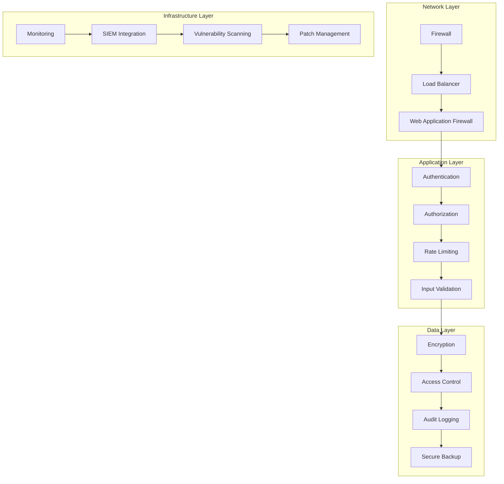

# Security Overview

**Comprehensive security architecture and implementation guide**

---

## Overview

The Valtronics system implements a multi-layered security architecture designed to protect data, ensure system integrity, and maintain regulatory compliance. This document provides an overview of the security framework, threat model, and implementation details.

---

## Security Architecture

### Defense in Depth Strategy



### Security Layers

#### 1. Network Security
- **Firewall Rules**: Restrict access to necessary ports only
- **DDoS Protection**: Cloud-based DDoS mitigation
- **TLS/SSL**: All communications encrypted
- **VPN Access**: Secure remote access for administrators

#### 2. Application Security
- **Authentication**: Multi-factor authentication
- **Authorization**: Role-based access control
- **Input Validation**: Comprehensive input sanitization
- **Rate Limiting**: API rate limiting and throttling

#### 3. Data Security
- **Encryption at Rest**: AES-256 database encryption
- **Encryption in Transit**: TLS 1.3 for all communications
- **Data Masking**: Sensitive data protection
- **Access Logging**: Complete audit trails

#### 4. Infrastructure Security
- **Container Security**: Secured container images
- **Secret Management**: Secure credential storage
- **Monitoring**: Real-time security monitoring
- **Vulnerability Management**: Regular security scanning

---

## Threat Model

### Threat Categories

#### External Threats
- **Unauthorized Access**: Attempted system breaches
- **Data Exfiltration**: Data theft attempts
- **Denial of Service**: Service disruption attacks
- **Malware**: Malicious software infiltration

#### Internal Threats
- **Insider Threats**: Malicious or accidental misuse
- **Privilege Escalation**: Unauthorized access elevation
- **Data Manipulation**: Unauthorized data changes
- **Credential Theft**: Stolen authentication credentials

#### System Threats
- **Vulnerabilities**: Software security flaws
- **Misconfigurations**: Improper system setup
- **Supply Chain**: Third-party component risks
- **Compliance**: Regulatory compliance issues

### Risk Assessment Matrix

| Threat | Likelihood | Impact | Risk Level | Mitigation |
|--------|------------|---------|------------|------------|
| Unauthorized Access | Medium | High | High | MFA, RBAC |
| Data Breach | Low | Critical | High | Encryption, Access Control |
| DDoS Attack | High | Medium | Medium | Rate Limiting, Cloud Protection |
| Insider Threat | Low | High | Medium | Monitoring, Access Controls |
| Vulnerability Exploit | Medium | High | High | Patch Management, Scanning |

---

## Authentication and Authorization

### Authentication Framework

#### Multi-Factor Authentication (MFA)
```python
# app/core/auth/mfa.py
import pyotp
import qrcode
from typing import Optional

class MFAService:
    def __init__(self):
        self.issuer = "Valtronics"
    
    def generate_secret(self, user_id: str) -> str:
        """Generate TOTP secret for user"""
        return pyotp.random_base32()
    
    def generate_qr_code(self, user_email: str, secret: str) -> bytes:
        """Generate QR code for TOTP setup"""
        totp_uri = pyotp.totp.TOTP(secret).provisioning_uri(
            name=user_email,
            issuer_name=self.issuer
        )
        qr = qrcode.QRCode(version=1, box_size=10, border=5)
        qr.add_data(totp_uri)
        qr.make(fit=True)
        img = qr.make_image(fill_color="black", back_color="white")
        
        # Convert to bytes
        from io import BytesIO
        buffer = BytesIO()
        img.save(buffer, format='PNG')
        return buffer.getvalue()
    
    def verify_token(self, secret: str, token: str) -> bool:
        """Verify TOTP token"""
        totp = pyotp.TOTP(secret)
        return totp.verify(token, valid_window=1)
```

#### JWT Token Management
```python
# app/core/auth/jwt.py
from datetime import datetime, timedelta
from jose import JWTError, jwt
from app.core.config import settings

class JWTManager:
    def __init__(self):
        self.secret_key = settings.SECRET_KEY
        self.algorithm = settings.ALGORITHM
        self.access_token_expire_minutes = settings.ACCESS_TOKEN_EXPIRE_MINUTES
        self.refresh_token_expire_days = 30
    
    def create_access_token(self, data: dict) -> str:
        """Create JWT access token"""
        to_encode = data.copy()
        expire = datetime.utcnow() + timedelta(minutes=self.access_token_expire_minutes)
        to_encode.update({"exp": expire, "type": "access"})
        
        encoded_jwt = jwt.encode(to_encode, self.secret_key, algorithm=self.algorithm)
        return encoded_jwt
    
    def create_refresh_token(self, data: dict) -> str:
        """Create JWT refresh token"""
        to_encode = data.copy()
        expire = datetime.utcnow() + timedelta(days=self.refresh_token_expire_days)
        to_encode.update({"exp": expire, "type": "refresh"})
        
        encoded_jwt = jwt.encode(to_encode, self.secret_key, algorithm=self.algorithm)
        return encoded_jwt
    
    def verify_token(self, token: str) -> dict:
        """Verify and decode JWT token"""
        try:
            payload = jwt.decode(token, self.secret_key, algorithms=[self.algorithm])
            return payload
        except JWTError:
            raise ValueError("Invalid token")
```

#### Session Management
```python
# app/core/auth/session.py
from typing import Optional, Dict
import redis
from datetime import datetime, timedelta

class SessionManager:
    def __init__(self, redis_client):
        self.redis = redis_client
        self.session_timeout = 3600  # 1 hour
    
    def create_session(self, user_id: int, session_data: Dict) -> str:
        """Create user session"""
        session_id = f"session:{user_id}:{datetime.utcnow().timestamp()}"
        
        session_data.update({
            "user_id": user_id,
            "created_at": datetime.utcnow().isoformat(),
            "last_accessed": datetime.utcnow().isoformat()
        })
        
        self.redis.setex(
            session_id,
            self.session_timeout,
            json.dumps(session_data)
        )
        
        return session_id
    
    def get_session(self, session_id: str) -> Optional[Dict]:
        """Get session data"""
        session_data = self.redis.get(session_id)
        if not session_data:
            return None
        
        data = json.loads(session_data)
        
        # Update last accessed time
        data["last_accessed"] = datetime.utcnow().isoformat()
        self.redis.setex(session_id, self.session_timeout, json.dumps(data))
        
        return data
    
    def destroy_session(self, session_id: str) -> bool:
        """Destroy user session"""
        result = self.redis.delete(session_id)
        return result > 0
```

### Authorization Framework

#### Role-Based Access Control (RBAC)
```python
# app/core/auth/rbac.py
from enum import Enum
from typing import List, Set

class Permission(Enum):
    # Device permissions
    DEVICE_READ = "device:read"
    DEVICE_WRITE = "device:write"
    DEVICE_DELETE = "device:delete"
    
    # Telemetry permissions
    TELEMETRY_READ = "telemetry:read"
    TELEMETRY_WRITE = "telemetry:write"
    
    # Alert permissions
    ALERT_READ = "alert:read"
    ALERT_WRITE = "alert:write"
    ALERT_ACKNOWLEDGE = "alert:acknowledge"
    
    # Analytics permissions
    ANALYTICS_READ = "analytics:read"
    ANALYTICS_EXPORT = "analytics:export"
    
    # System permissions
    SYSTEM_ADMIN = "system:admin"
    USER_MANAGE = "user:manage"
    CONFIG_MANAGE = "config:manage"

class Role(Enum):
    ADMIN = "admin"
    OPERATOR = "operator"
    ANALYST = "analyst"
    USER = "user"

ROLE_PERMISSIONS = {
    Role.ADMIN: {
        Permission.DEVICE_READ, Permission.DEVICE_WRITE, Permission.DEVICE_DELETE,
        Permission.TELEMETRY_READ, Permission.TELEMETRY_WRITE,
        Permission.ALERT_READ, Permission.ALERT_WRITE, Permission.ALERT_ACKNOWLEDGE,
        Permission.ANALYTICS_READ, Permission.ANALYTICS_EXPORT,
        Permission.SYSTEM_ADMIN, Permission.USER_MANAGE, Permission.CONFIG_MANAGE
    },
    Role.OPERATOR: {
        Permission.DEVICE_READ, Permission.DEVICE_WRITE,
        Permission.TELEMETRY_READ, Permission.TELEMETRY_WRITE,
        Permission.ALERT_READ, Permission.ALERT_WRITE, Permission.ALERT_ACKNOWLEDGE,
        Permission.ANALYTICS_READ
    },
    Role.ANALYST: {
        Permission.DEVICE_READ,
        Permission.TELEMETRY_READ,
        Permission.ALERT_READ,
        Permission.ANALYTICS_READ, Permission.ANALYTICS_EXPORT
    },
    Role.USER: {
        Permission.DEVICE_READ,
        Permission.TELEMETRY_READ,
        Permission.ALERT_READ
    }
}

class RBACManager:
    @staticmethod
    def has_permission(user_role: Role, permission: Permission) -> bool:
        """Check if user role has permission"""
        role_permissions = ROLE_PERMISSIONS.get(user_role, set())
        return permission in role_permissions
    
    @staticmethod
    def get_user_permissions(user_role: Role) -> Set[Permission]:
        """Get all permissions for user role"""
        return ROLE_PERMISSIONS.get(user_role, set())
    
    @staticmethod
    def check_permissions(user_role: Role, required_permissions: List[Permission]) -> bool:
        """Check if user role has all required permissions"""
        user_permissions = RBACManager.get_user_permissions(user_role)
        return all(perm in user_permissions for perm in required_permissions)
```

---

## Data Protection

### Encryption Implementation

#### Database Encryption
```python
# app/core/encryption/database.py
from cryptography.fernet import Fernet
from sqlalchemy_utils import EncryptedType
from sqlalchemy_utils.types.encrypted.encrypted_type import AesEngine

class DatabaseEncryption:
    def __init__(self, key: str):
        self.cipher_suite = Fernet(key.encode())
    
    def encrypt_sensitive_data(self, data: str) -> str:
        """Encrypt sensitive data"""
        if not data:
            return data
        return self.cipher_suite.encrypt(data.encode()).decode()
    
    def decrypt_sensitive_data(self, encrypted_data: str) -> str:
        """Decrypt sensitive data"""
        if not encrypted_data:
            return encrypted_data
        return self.cipher_suite.decrypt(encrypted_data.encode()).decode()

# Custom encrypted field type
class EncryptedStringType(EncryptedType):
    """Custom encrypted string field type"""
    impl = str
    secret_key = settings.ENCRYPTION_KEY
    engine = AesEngine
    padding = 'pkcs5'
```

#### File Encryption
```python
# app/core/encryption/file.py
import os
from cryptography.fernet import Fernet
from cryptography.hazmat.primitives import hashes
from cryptography.hazmat.primitives.kdf.pbkdf2 import PBKDF2HMAC

class FileEncryption:
    def __init__(self, password: str):
        self.password = password.encode()
        self.salt = os.urandom(16)
        self.key = self._derive_key()
        self.cipher_suite = Fernet(self.key)
    
    def _derive_key(self) -> bytes:
        """Derive encryption key from password"""
        kdf = PBKDF2HMAC(
            algorithm=hashes.SHA256(),
            length=32,
            salt=self.salt,
            iterations=100000,
        )
        key = kdf.derive(self.password)
        return key
    
    def encrypt_file(self, input_file: str, output_file: str) -> None:
        """Encrypt file"""
        with open(input_file, 'rb') as f:
            data = f.read()
        
        encrypted_data = self.cipher_suite.encrypt(data)
        
        with open(output_file, 'wb') as f:
            f.write(self.salt + encrypted_data)
    
    def decrypt_file(self, input_file: str, output_file: str) -> None:
        """Decrypt file"""
        with open(input_file, 'rb') as f:
            data = f.read()
        
        salt = data[:16]
        encrypted_data = data[16:]
        
        # Re-derive key with same salt
        kdf = PBKDF2HMAC(
            algorithm=hashes.SHA256(),
            length=32,
            salt=salt,
            iterations=100000,
        )
        key = kdf.derive(self.password)
        cipher_suite = Fernet(key)
        
        decrypted_data = cipher_suite.decrypt(encrypted_data)
        
        with open(output_file, 'wb') as f:
            f.write(decrypted_data)
```

### Data Masking
```python
# app/core/encryption/masking.py
import re
from typing import Any

class DataMasking:
    @staticmethod
    def mask_email(email: str) -> str:
        """Mask email address"""
        if '@' not in email:
            return email
        
        local, domain = email.split('@', 1)
        if len(local) <= 2:
            return f"{'*' * len(local)}@{domain}"
        
        return f"{local[0]}{'*' * (len(local) - 2)}{local[-1]}@{domain}"
    
    @staticmethod
    def mask_phone(phone: str) -> str:
        """Mask phone number"""
        # Remove non-digit characters
        digits = re.sub(r'\D', '', phone)
        
        if len(digits) <= 4:
            return '*' * len(phone)
        
        return f"{'*' * (len(digits) - 4)}{digits[-4:]}"
    
    @staticmethod
    def mask_credit_card(card_number: str) -> str:
        """Mask credit card number"""
        digits = re.sub(r'\D', '', card_number)
        
        if len(digits) != 16:
            return '*' * len(card_number)
        
        return f"{'*' * 12}{digits[-4:]}"
    
    @staticmethod
    def mask_sensitive_data(data: Any, data_type: str) -> Any:
        """Mask sensitive data based on type"""
        if isinstance(data, str):
            if data_type == 'email':
                return DataMasking.mask_email(data)
            elif data_type == 'phone':
                return DataMasking.mask_phone(data)
            elif data_type == 'credit_card':
                return DataMasking.mask_credit_card(data)
            else:
                return '*' * len(data)
        
        return data
```

---

## Network Security

### SSL/TLS Configuration

#### SSL Certificate Management
```python
# app/core/security/ssl.py
import ssl
from cryptography import x509
from cryptography.x509.oid import NameOID
from cryptography.hazmat.primitives import hashes
from cryptography.hazmat.primitives.asymmetric import rsa
from cryptography.hazmat.primitives import serialization
import datetime

class SSLManager:
    def __init__(self):
        self.cert_path = "/etc/ssl/certs/valtronics.crt"
        self.key_path = "/etc/ssl/private/valtronics.key"
    
    def generate_self_signed_cert(self) -> None:
        """Generate self-signed SSL certificate"""
        # Generate private key
        private_key = rsa.generate_private_key(
            public_exponent=65537,
            key_size=2048,
        )
        
        # Create certificate
        subject = x509.Name([
            x509.NameAttribute(NameOID.COUNTRY_NAME, "US"),
            x509.NameAttribute(NameOID.STATE_OR_PROVINCE_NAME, "Michigan"),
            x509.NameAttribute(NameOID.LOCALITY_NAME, "Flushing"),
            x509.NameAttribute(NameOID.ORGANIZATION_NAME, "Software Customs Auto Bot Solution"),
            x509.NameAttribute(NameOID.COMMON_NAME, "valtronics.com"),
        ])
        
        cert = x509.CertificateBuilder().subject_name(
            subject
        ).issuer_name(
            subject
        ).public_key(
            private_key.public_key()
        ).serial_number(
            x509.random_serial_number()
        ).not_valid_before(
            datetime.datetime.utcnow()
        ).not_valid_after(
            datetime.datetime.utcnow() + datetime.timedelta(days=365)
        ).add_extension(
            x509.SubjectAlternativeName([
                x509.DNSName("valtronics.com"),
                x509.DNSName("www.valtronics.com"),
                x509.IPAddress(ipaddress.IPv4Address("127.0.0.1")),
            ]),
            critical=False,
        ).sign(private_key, hashes.SHA256())
        
        # Save certificate and key
        with open(self.cert_path, "wb") as f:
            f.write(cert.public_bytes(serialization.Encoding.PEM))
        
        with open(self.key_path, "wb") as f:
            f.write(private_key.private_bytes(
                encoding=serialization.Encoding.PEM,
                format=serialization.PrivateFormat.PKCS8,
                encryption_algorithm=serialization.NoEncryption()
            ))
    
    def get_ssl_context(self) -> ssl.SSLContext:
        """Get SSL context for HTTPS"""
        context = ssl.create_default_context(ssl.Purpose.CLIENT_AUTH)
        context.check_hostname = True
        context.verify_mode = ssl.CERT_REQUIRED
        context.load_cert_chain(self.cert_path, self.key_path)
        
        # Set strong cipher suites
        context.set_ciphers('ECDHE-ECDSA-AES256-GCM-SHA384:ECDHE-RSA-AES256-GCM-SHA384')
        
        return context
```

### Firewall Configuration

#### UFW Firewall Rules
```bash
#!/bin/bash
# scripts/setup_firewall.sh

# Reset UFW
sudo ufw --force reset

# Default policies
sudo ufw default deny incoming
sudo ufw default allow outgoing

# Allow SSH (for management)
sudo ufw allow 22/tcp

# Allow HTTP and HTTPS
sudo ufw allow 80/tcp
sudo ufw allow 443/tcp

# Allow WebSocket connections
sudo ufw allow 8000/tcp

# Allow MQTT (if used)
sudo ufw allow 1883/tcp

# Allow Redis (if external access needed)
sudo ufw allow 6379/tcp

# Allow PostgreSQL (if external access needed)
sudo ufw allow 5432/tcp

# Rate limiting for SSH
sudo ufw limit 22/tcp

# Enable firewall
sudo ufw --force enable

# Show status
sudo ufw status verbose
```

#### Nginx Security Headers
```nginx
# nginx/security.conf
server {
    # Security headers
    add_header X-Frame-Options "SAMEORIGIN" always;
    add_header X-Content-Type-Options "nosniff" always;
    add_header X-XSS-Protection "1; mode=block" always;
    add_header Referrer-Policy "no-referrer-when-downgrade" always;
    add_header Content-Security-Policy "default-src 'self' http: https: data: blob: 'unsafe-inline'" always;
    add_header Strict-Transport-Security "max-age=31536000; includeSubDomains" always;
    
    # Hide server information
    server_tokens off;
    
    # Disable access to sensitive files
    location ~ /\. {
        deny all;
    }
    
    location ~ ~$ {
        deny all;
    }
    
    # Rate limiting
    limit_req_zone $binary_remote_addr zone=api:10m rate=10r/s;
    limit_req_zone $binary_remote_addr zone=login:10m rate=1r/s;
    
    location /api/ {
        limit_req zone=api burst=20 nodelay;
        proxy_pass http://backend:8000;
    }
    
    location /api/v1/auth/login {
        limit_req zone=login burst=5 nodelay;
        proxy_pass http://backend:8000;
    }
}
```

---

## Monitoring and Logging

### Security Monitoring

#### Intrusion Detection
```python
# app/security/intrusion_detection.py
import time
import logging
from typing import Dict, List
from collections import defaultdict, deque

class IntrusionDetectionSystem:
    def __init__(self):
        self.failed_attempts = defaultdict(deque)
        self.suspicious_ips = set()
        self.blocked_ips = set()
        self.logger = logging.getLogger(__name__)
        
        # Configuration
        self.max_failed_attempts = 5
        self.lockout_duration = 300  # 5 minutes
        self.suspicious_threshold = 10
    
    def record_failed_attempt(self, ip_address: str, user_id: str = None) -> None:
        """Record failed authentication attempt"""
        timestamp = time.time()
        self.failed_attempts[ip_address].append({
            'timestamp': timestamp,
            'user_id': user_id
        })
        
        # Clean old attempts (older than 1 hour)
        cutoff_time = timestamp - 3600
        while (self.failed_attempts[ip_address] and 
               self.failed_attempts[ip_address][0]['timestamp'] < cutoff_time):
            self.failed_attempts[ip_address].popleft()
        
        # Check for suspicious activity
        self._check_suspicious_activity(ip_address)
    
    def _check_suspicious_activity(self, ip_address: str) -> None:
        """Check for suspicious activity from IP"""
        attempts = len(self.failed_attempts[ip_address])
        
        if attempts >= self.max_failed_attempts:
            if ip_address not in self.blocked_ips:
                self._block_ip(ip_address)
                self.logger.warning(f"IP {ip_address} blocked due to {attempts} failed attempts")
        
        if attempts >= self.suspicious_threshold:
            if ip_address not in self.suspicious_ips:
                self.suspicious_ips.add(ip_address)
                self.logger.warning(f"Suspicious activity detected from IP {ip_address}")
    
    def _block_ip(self, ip_address: str) -> None:
        """Block IP address"""
        self.blocked_ips.add(ip_address)
        # In production, this would update firewall rules
        # For now, just track in memory
    
    def is_ip_blocked(self, ip_address: str) -> bool:
        """Check if IP is blocked"""
        return ip_address in self.blocked_ips
    
    def is_ip_suspicious(self, ip_address: str) -> bool:
        """Check if IP is suspicious"""
        return ip_address in self.suspicious_ips
    
    def get_security_stats(self) -> Dict:
        """Get security statistics"""
        return {
            'blocked_ips': len(self.blocked_ips),
            'suspicious_ips': len(self.suspicious_ips),
            'total_failed_attempts': sum(
                len(attempts) for attempts in self.failed_attempts.values()
            ),
            'unique_ips_with_failures': len(self.failed_attempts)
        }
```

#### Security Event Logging
```python
# app/security/logging.py
import logging
import json
from datetime import datetime
from typing import Dict, Any

class SecurityLogger:
    def __init__(self):
        self.logger = logging.getLogger('security')
        
        # Configure security logger
        handler = logging.FileHandler('/var/log/valtronics/security.log')
        formatter = logging.Formatter(
            '%(asctime)s - %(name)s - %(levelname)s - %(message)s'
        )
        handler.setFormatter(formatter)
        self.logger.addHandler(handler)
        self.logger.setLevel(logging.INFO)
    
    def log_authentication_event(self, event_type: str, user_id: int, 
                               ip_address: str, success: bool, **kwargs) -> None:
        """Log authentication event"""
        event = {
            'event_type': 'authentication',
            'action': event_type,
            'user_id': user_id,
            'ip_address': ip_address,
            'success': success,
            'timestamp': datetime.utcnow().isoformat(),
            **kwargs
        }
        
        level = logging.INFO if success else logging.WARNING
        self.logger.log(level, json.dumps(event))
    
    def log_authorization_event(self, user_id: int, resource: str, 
                                action: str, success: bool, **kwargs) -> None:
        """Log authorization event"""
        event = {
            'event_type': 'authorization',
            'user_id': user_id,
            'resource': resource,
            'action': action,
            'success': success,
            'timestamp': datetime.utcnow().isoformat(),
            **kwargs
        }
        
        level = logging.INFO if success else logging.WARNING
        self.logger.log(level, json.dumps(event))
    
    def log_data_access(self, user_id: int, data_type: str, 
                        action: str, record_id: int = None, **kwargs) -> None:
        """Log data access event"""
        event = {
            'event_type': 'data_access',
            'user_id': user_id,
            'data_type': data_type,
            'action': action,
            'record_id': record_id,
            'timestamp': datetime.utcnow().isoformat(),
            **kwargs
        }
        
        self.logger.info(json.dumps(event))
    
    def log_security_incident(self, incident_type: str, severity: str, 
                               description: str, **kwargs) -> None:
        """Log security incident"""
        event = {
            'event_type': 'security_incident',
            'incident_type': incident_type,
            'severity': severity,
            'description': description,
            'timestamp': datetime.utcnow().isoformat(),
            **kwargs
        }
        
        level = {
            'low': logging.INFO,
            'medium': logging.WARNING,
            'high': logging.ERROR,
            'critical': logging.CRITICAL
        }.get(severity, logging.WARNING)
        
        self.logger.log(level, json.dumps(event))
```

---

## Compliance and Regulations

### GDPR Compliance

#### Data Subject Rights Implementation
```python
# app/compliance/gdpr.py
from typing import Dict, List, Optional
from datetime import datetime

class GDPRCompliance:
    def __init__(self, db_session):
        self.db = db_session
    
    def get_user_data(self, user_id: int) -> Dict:
        """Get all personal data for a user"""
        user_data = {
            'user_info': self._get_user_info(user_id),
            'devices': self._get_user_devices(user_id),
            'telemetry': self._get_user_telemetry(user_id),
            'alerts': self._get_user_alerts(user_id),
            'audit_logs': self._get_user_audit_logs(user_id)
        }
        
        return user_data
    
    def delete_user_data(self, user_id: int) -> bool:
        """Delete all personal data for a user (Right to be Forgotten)"""
        try:
            # Delete user account
            self._delete_user_account(user_id)
            
            # Anonymize telemetry data
            self._anonymize_telemetry_data(user_id)
            
            # Delete alerts
            self._delete_user_alerts(user_id)
            
            # Delete audit logs after retention period
            self._delete_old_audit_logs(user_id)
            
            return True
        except Exception as e:
            logging.error(f"Error deleting user data: {e}")
            return False
    
    def export_user_data(self, user_id: int) -> str:
        """Export user data in machine-readable format"""
        user_data = self.get_user_data(user_id)
        
        return json.dumps({
            'export_date': datetime.utcnow().isoformat(),
            'user_id': user_id,
            'data': user_data
        }, indent=2)
    
    def _get_user_info(self, user_id: int) -> Dict:
        """Get user personal information"""
        # Implementation depends on your user model
        pass
    
    def _get_user_devices(self, user_id: int) -> List[Dict]:
        """Get devices associated with user"""
        # Implementation depends on your device model
        pass
    
    def _get_user_telemetry(self, user_id: int) -> List[Dict]:
        """Get telemetry data for user's devices"""
        # Implementation depends on your telemetry model
        pass
    
    def _get_user_alerts(self, user_id: int) -> List[Dict]:
        """Get alerts for user's devices"""
        # Implementation depends on your alert model
        pass
    
    def _get_user_audit_logs(self, user_id: int) -> List[Dict]:
        """Get audit logs for user"""
        # Implementation depends on your audit model
        pass
```

### HIPAA Compliance

#### PHI Protection
```python
# app/compliance/hipaa.py
from enum import Enum
from typing import Dict, List

class PHIDataType(Enum):
    NAME = "name"
    EMAIL = "email"
    PHONE = "phone"
    ADDRESS = "address"
    MEDICAL_RECORD = "medical_record"
    DEVICE_READING = "device_reading"

class HIPAACompliance:
    def __init__(self):
        self.phi_fields = {
            'name': ['first_name', 'last_name'],
            'email': ['email'],
            'phone': ['phone', 'mobile'],
            'address': ['address', 'city', 'state', 'zip'],
            'medical_record': ['diagnosis', 'treatment', 'medication'],
            'device_reading': ['health_metrics', 'vital_signs']
        }
    
    def identify_phi(self, data: Dict) -> List[str]:
        """Identify PHI fields in data"""
        phi_fields = []
        
        for field_name, field_value in data.items():
            for phi_type, phi_field_list in self.phi_fields.items():
                if field_name in phi_field_list:
                    phi_fields.append(field_name)
        
        return phi_fields
    
    def encrypt_phi(self, data: Dict) -> Dict:
        """Encrypt PHI fields"""
        encrypted_data = data.copy()
        phi_fields = self.identify_phi(data)
        
        for field in phi_fields:
            if field in encrypted_data:
                encrypted_data[field] = self._encrypt_field(encrypted_data[field])
        
        return encrypted_data
    
    def decrypt_phi(self, encrypted_data: Dict) -> Dict:
        """Decrypt PHI fields"""
        decrypted_data = encrypted_data.copy()
        
        for field_name, field_value in encrypted_data.items():
            if self._is_encrypted_field(field_value):
                decrypted_data[field_name] = self._decrypt_field(field_value)
        
        return decrypted_data
    
    def _encrypt_field(self, value: str) -> str:
        """Encrypt individual field"""
        # Implementation depends on your encryption method
        pass
    
    def _decrypt_field(self, encrypted_value: str) -> str:
        """Decrypt individual field"""
        # Implementation depends on your encryption method
        pass
    
    def _is_encrypted_field(self, value: str) -> bool:
        """Check if field is encrypted"""
        # Implementation depends on your encryption method
        pass
```

---

## Security Best Practices

### Development Security

#### Secure Coding Guidelines
```python
# app/security/secure_coding.py
import re
from typing import Any

class SecureCoding:
    @staticmethod
    def sanitize_input(input_data: str, input_type: str) -> str:
        """Sanitize user input"""
        if input_type == 'email':
            return SecureCoding._sanitize_email(input_data)
        elif input_type == 'phone':
            return SecureCoding._sanitize_phone(input_data)
        elif input_type == 'username':
            return SecureCoding._sanitize_username(input_data)
        else:
            return SecureCoding._sanitize_general(input_data)
    
    @staticmethod
    def _sanitize_email(email: str) -> str:
        """Sanitize email input"""
        # Basic email validation
        pattern = r'^[a-zA-Z0-9._%+-]+@[a-zA-Z0-9.-]+\.[a-zA-Z]{2,}$'
        if not re.match(pattern, email):
            raise ValueError("Invalid email format")
        
        return email.lower().strip()
    
    @staticmethod
    def _sanitize_phone(phone: str) -> str:
        """Sanitize phone input"""
        # Remove non-digit characters
        digits = re.sub(r'\D', '', phone)
        
        # Validate phone number format
        if len(digits) not in [10, 11]:
            raise ValueError("Invalid phone number format")
        
        return digits
    
    @staticmethod
    def _sanitize_username(username: str) -> str:
        """Sanitize username input"""
        # Allow only alphanumeric and underscore
        pattern = r'^[a-zA-Z0-9_]{3,20}$'
        if not re.match(pattern, username):
            raise ValueError("Invalid username format")
        
        return username.lower()
    
    @staticmethod
    def _sanitize_general(input_data: str) -> str:
        """General input sanitization"""
        # Remove potentially harmful characters
        sanitized = re.sub(r'[<>"\']', '', input_data)
        
        # Limit length
        if len(sanitized) > 1000:
            raise ValueError("Input too long")
        
        return sanitized.strip()
    
    @staticmethod
    def validate_sql_query(query: str) -> bool:
        """Validate SQL query for injection attempts"""
        dangerous_patterns = [
            r'\bDROP\b',
            r'\bDELETE\b',
            r'\bINSERT\b',
            r'\bUPDATE\b',
            r'\bCREATE\b',
            r'\bALTER\b',
            r'\bEXEC\b',
            r'\bUNION\b',
            r'\bSELECT\b.*\bFROM\b.*\bWHERE\b.*\bOR\b',
            r'\bSELECT\b.*\bFROM\b.*\bAND\b.*\b1\s*=\s*1'
        ]
        
        query_upper = query.upper()
        
        for pattern in dangerous_patterns:
            if re.search(pattern, query_upper):
                return False
        
        return True
```

### Operational Security

#### Security Checklist
```python
# app/security/checklist.py
from typing import Dict, List

class SecurityChecklist:
    def __init__(self):
        self.checks = [
            self._check_ssl_certificates,
            self._check_database_encryption,
            self._check_user_permissions,
            self._check_firewall_rules,
            self._check_backup_encryption,
            self._check_audit_logging,
            self._check_password_policies,
            self._check_session_management,
            self._check_api_rate_limiting,
            self._check_input_validation
        ]
    
    def run_security_audit(self) -> Dict[str, Any]:
        """Run complete security audit"""
        results = {
            'timestamp': datetime.utcnow().isoformat(),
            'checks': {},
            'overall_score': 0,
            'issues': []
        }
        
        passed_checks = 0
        total_checks = len(self.checks)
        
        for check in self.checks:
            check_name = check.__name__.replace('_check_', '')
            try:
                result = check()
                results['checks'][check_name] = result
                
                if result['status'] == 'pass':
                    passed_checks += 1
                else:
                    results['issues'].extend(result['issues'])
                    
            except Exception as e:
                results['checks'][check_name] = {
                    'status': 'error',
                    'message': str(e)
                }
                results['issues'].append(f"Error in {check_name}: {str(e)}")
        
        results['overall_score'] = (passed_checks / total_checks) * 100
        
        return results
    
    def _check_ssl_certificates(self) -> Dict[str, Any]:
        """Check SSL certificate configuration"""
        # Implementation depends on your SSL setup
        return {
            'status': 'pass',
            'message': 'SSL certificates are properly configured'
        }
    
    def _check_database_encryption(self) -> Dict[str, Any]:
        """Check database encryption"""
        # Implementation depends on your database setup
        return {
            'status': 'pass',
            'message': 'Database encryption is enabled'
        }
    
    def _check_user_permissions(self) -> Dict[str, Any]:
        """Check user permissions"""
        # Implementation depends on your RBAC setup
        return {
            'status': 'pass',
            'message': 'User permissions are properly configured'
        }
    
    def _check_firewall_rules(self) -> Dict[str, Any]:
        """Check firewall configuration"""
        # Implementation depends on your firewall setup
        return {
            'status': 'pass',
            'message': 'Firewall rules are properly configured'
        }
    
    def _check_backup_encryption(self) -> Dict[str, Any]:
        """Check backup encryption"""
        # Implementation depends on your backup setup
        return {
            'status': 'pass',
            'message': 'Backups are encrypted'
        }
    
    def _check_audit_logging(self) -> Dict[str, Any]:
        """Check audit logging"""
        # Implementation depends on your logging setup
        return {
            'status': 'pass',
            'message': 'Audit logging is enabled'
        }
    
    def _check_password_policies(self) -> Dict[str, Any]:
        """Check password policies"""
        # Implementation depends on your password policy
        return {
            'status': 'pass',
            'message': 'Password policies are enforced'
        }
    
    def _check_session_management(self) -> Dict[str, Any]:
        """Check session management"""
        # Implementation depends on your session setup
        return {
            'status': 'pass',
            'message': 'Session management is secure'
        }
    
    def _check_api_rate_limiting(self) -> Dict[str, Any]:
        """Check API rate limiting"""
        # Implementation depends on your rate limiting setup
        return {
            'status': 'pass',
            'message': 'API rate limiting is enabled'
        }
    
    def _check_input_validation(self) -> Dict[str, Any]:
        """Check input validation"""
        # Implementation depends on your validation setup
        return {
            'status': 'pass',
            'message': 'Input validation is implemented'
        }
```

---

## Security Monitoring

### Real-time Security Dashboard
```python
# app/security/dashboard.py
from typing import Dict, List
from datetime import datetime, timedelta

class SecurityDashboard:
    def __init__(self):
        self.metrics = {
            'failed_logins': 0,
            'blocked_ips': 0,
            'suspicious_activities': 0,
            'security_incidents': 0
        }
    
    def get_security_metrics(self, time_range: str = '24h') -> Dict[str, Any]:
        """Get security metrics for dashboard"""
        end_time = datetime.utcnow()
        
        if time_range == '24h':
            start_time = end_time - timedelta(hours=24)
        elif time_range == '7d':
            start_time = end_time - timedelta(days=7)
        elif time_range == '30d':
            start_time = end_time - timedelta(days=30)
        else:
            start_time = end_time - timedelta(hours=24)
        
        metrics = {
            'time_range': time_range,
            'period': {
                'start': start_time.isoformat(),
                'end': end_time.isoformat()
            },
            'failed_login_attempts': self._get_failed_login_attempts(start_time, end_time),
            'blocked_ips': self._get_blocked_ips(start_time, end_time),
            'suspicious_activities': self._get_suspicious_activities(start_time, end_time),
            'security_incidents': self._get_security_incidents(start_time, end_time),
            'top_threats': self._get_top_threats(start_time, end_time),
            'security_score': self._calculate_security_score(start_time, end_time)
        }
        
        return metrics
    
    def _get_failed_login_attempts(self, start_time: datetime, end_time: datetime) -> Dict[str, Any]:
        """Get failed login attempts statistics"""
        # Implementation depends on your logging system
        return {
            'total': 45,
            'unique_ips': 12,
            'trend': 'decreasing',
            'peak_hour': '14:00'
        }
    
    def _get_blocked_ips(self, start_time: datetime, end_time: datetime) -> Dict[str, Any]:
        """Get blocked IPs statistics"""
        # Implementation depends on your security system
        return {
            'total': 8,
            'currently_blocked': 5,
            'auto_unblocked': 3,
            'average_block_duration': '2.5 hours'
        }
    
    def _get_suspicious_activities(self, start_time: datetime, end_time: datetime) -> Dict[str, Any]:
        """Get suspicious activities statistics"""
        # Implementation depends on your monitoring system
        return {
            'total': 23,
            'by_type': {
                'brute_force': 15,
                'sql_injection': 3,
                'xss_attempts': 5
            },
            'trend': 'stable'
        }
    
    def _get_security_incidents(self, start_time: datetime, end_time: datetime) -> Dict[str, Any]:
        """Get security incidents statistics"""
        # Implementation depends on your incident tracking
        return {
            'total': 3,
            'by_severity': {
                'low': 1,
                'medium': 1,
                'high': 1,
                'critical': 0
            },
            'resolved': 2,
            'open': 1
        }
    
    def _get_top_threats(self, start_time: datetime, end_time: datetime) -> List[Dict[str, Any]]:
        """Get top security threats"""
        return [
            {
                'threat_type': 'brute_force_attack',
                'count': 15,
                'severity': 'medium',
                'trend': 'increasing'
            },
            {
                'threat_type': 'sql_injection',
                'count': 3,
                'severity': 'high',
                'trend': 'stable'
            },
            {
                'threat_type': 'xss_attempt',
                'count': 5,
                'severity': 'medium',
                'trend': 'decreasing'
            }
        ]
    
    def _calculate_security_score(self, start_time: datetime, end_time: datetime) -> float:
        """Calculate overall security score"""
        # Implementation depends on your scoring algorithm
        return 87.5
```

---

## Support

For security documentation and support:
- **Security Policies**: [Security Best Practices](security-best-practices.md)
- **Authentication**: [Authentication & Authorization](auth-authorization.md)
- **Data Protection**: [Data Protection](data-protection.md)
- **Compliance**: [Compliance](compliance.md)
- **Email**: autobotsolution@gmail.com

---

**© 2024 Software Customs Auto Bot Solution. All Rights Reserved.**  
**Security Overview v1.0**
