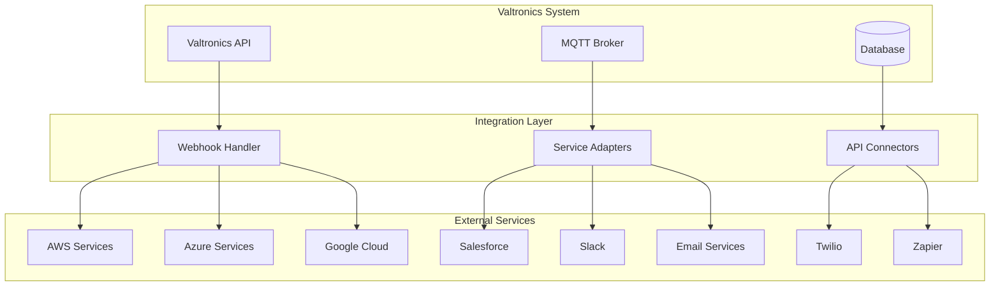

# Integration and Third-Party Services Guide

**Comprehensive guide for integrating Valtronics with external services and platforms**

---

## Overview

This guide covers integration strategies and implementations for connecting the Valtronics system with third-party services, APIs, and platforms to extend functionality and enable seamless data exchange.

---

## Integration Architecture

### Integration Patterns



### Integration Categories

#### 1. Cloud Platform Integrations
- **AWS**: S3, Lambda, DynamoDB, IoT Core, SNS
- **Azure**: Blob Storage, Functions, Cosmos DB, IoT Hub
- **Google Cloud**: Cloud Storage, Cloud Functions, Firestore, IoT Core

#### 2. Communication Integrations
- **Email**: SMTP, SendGrid, Mailgun, AWS SES
- **SMS**: Twilio, AWS SNS, MessageBird
- **Chat**: Slack, Microsoft Teams, Discord
- **Push Notifications**: Firebase, OneSignal, AWS SNS

#### 3. Data Platform Integrations
- **Analytics**: Google Analytics, Mixpanel, Amplitude
- **Data Warehouses**: Snowflake, BigQuery, Redshift
- **Business Intelligence**: Tableau, Power BI, Looker

#### 4. Business System Integrations
- **CRM**: Salesforce, HubSpot, Zoho CRM
- **ERP**: SAP, Oracle NetSuite, Microsoft Dynamics
- **Project Management**: Jira, Asana, Trello

---

## Cloud Platform Integrations

### AWS Integration

#### AWS IoT Core Integration
```python
# app/integrations/aws_iot.py
import boto3
import json
import logging
from typing import Dict, Any, List
from botocore.exceptions import ClientError

class AWSIoTIntegration:
    def __init__(self, region_name: str, access_key: str, secret_key: str):
        self.region_name = region_name
        self.access_key = access_key
        self.secret_key = secret_key
        
        # Initialize AWS clients
        self.iot_client = boto3.client(
            'iot',
            region_name=region_name,
            aws_access_key_id=access_key,
            aws_secret_access_key=secret_key
        )
        
        self.iot_data_client = boto3.client(
            'iot-data',
            region_name=region_name,
            aws_access_key_id=access_key,
            aws_secret_access_key=secret_key
        )
        
        self.sns_client = boto3.client(
            'sns',
            region_name=region_name,
            aws_access_key_id=access_key,
            aws_secret_access_key=secret_key
        )
        
        self.logger = logging.getLogger(__name__)
    
    def create_thing(self, thing_name: str, device_id: int) -> Dict[str, Any]:
        """Create AWS IoT thing for device"""
        try:
            # Create thing
            response = self.iot_client.create_thing(
                thingName=thing_name,
                attributePayload={
                    'attributes': {
                        'valtronics_device_id': str(device_id),
                        'integration_source': 'valtronics'
                    }
                }
            )
            
            # Create keys and certificate
            keys_response = self.iot_client.create_keys_and_certificate(
                setAsActive=True
            )
            
            # Attach policy to certificate
            policy_name = f"valtronics-device-policy-{device_id}"
            self._create_device_policy(policy_name)
            
            self.iot_client.attach_policy(
                policyName=policy_name,
                target=keys_response['certificateArn']
            )
            
            # Attach certificate to thing
            self.iot_client.attach_thing_principal(
                thingName=thing_name,
                principal=keys_response['certificateArn']
            )
            
            return {
                'thing_name': thing_name,
                'thing_arn': response['thingArn'],
                'certificate_arn': keys_response['certificateArn'],
                'certificate_pem': keys_response['certificatePem'],
                'public_key': keys_response['keyPair']['PublicKey'],
                'private_key': keys_response['keyPair']['PrivateKey']
            }
            
        except ClientError as e:
            self.logger.error(f"Error creating AWS IoT thing: {e}")
            raise
    
    def _create_device_policy(self, policy_name: str):
        """Create device policy"""
        policy_document = {
            "Version": "2012-10-17",
            "Statement": [
                {
                    "Effect": "Allow",
                    "Action": [
                        "iot:Connect",
                        "iot:Subscribe",
                        "iot:Publish",
                        "iot:Receive"
                    ],
                    "Resource": [
                        f"arn:aws:iot:{self.region_name}:*:client/${{iot:ClientId}}",
                        f"arn:aws:iot:{self.region_name}:*:topicfilter/valtronics/*",
                        f"arn:aws:iot:{self.region_name}:*:topic/valtronics/*"
                    ]
                }
            ]
        }
        
        try:
            self.iot_client.create_policy(
                policyName=policy_name,
                policyDocument=json.dumps(policy_document)
            )
        except ClientError as e:
            if e.response['Error']['Code'] != 'ResourceAlreadyExistsException':
                raise
    
    def publish_to_aws(self, topic: str, payload: Dict[str, Any]):
        """Publish message to AWS IoT"""
        try:
            self.iot_data_client.publish(
                topic=topic,
                qos=1,
                payload=json.dumps(payload)
            )
            self.logger.info(f"Published to AWS IoT topic: {topic}")
            
        except ClientError as e:
            self.logger.error(f"Error publishing to AWS IoT: {e}")
            raise
    
    def create_sns_topic(self, topic_name: str) -> str:
        """Create SNS topic for alerts"""
        try:
            response = self.sns_client.create_topic(
                Name=topic_name
            )
            return response['TopicArn']
            
        except ClientError as e:
            self.logger.error(f"Error creating SNS topic: {e}")
            raise
    
    def send_sns_alert(self, topic_arn: str, message: str, subject: str, attributes: Dict[str, str] = None):
        """Send alert via SNS"""
        try:
            message_attributes = {}
            if attributes:
                for key, value in attributes.items():
                    message_attributes[key] = {
                        'DataType': 'String',
                        'StringValue': value
                    }
            
            self.sns_client.publish(
                TopicArn=topic_arn,
                Message=message,
                Subject=subject,
                MessageAttributes=message_attributes
            )
            
            self.logger.info(f"Sent SNS alert: {subject}")
            
        except ClientError as e:
            self.logger.error(f"Error sending SNS alert: {e}")
            raise
```

#### AWS Lambda Integration
```python
# app/integrations/aws_lambda.py
import boto3
import json
import logging
from typing import Dict, Any, Optional

class AWSLambdaIntegration:
    def __init__(self, region_name: str, access_key: str, secret_key: str):
        self.lambda_client = boto3.client(
            'lambda',
            region_name=region_name,
            aws_access_key_id=access_key,
            aws_secret_access_key=secret_key
        )
        self.logger = logging.getLogger(__name__)
    
    def invoke_lambda_function(self, function_name: str, payload: Dict[str, Any], 
                              invocation_type: str = 'Event') -> Optional[Dict[str, Any]]:
        """Invoke AWS Lambda function"""
        try:
            response = self.lambda_client.invoke(
                FunctionName=function_name,
                InvocationType=invocation_type,
                Payload=json.dumps(payload)
            )
            
            if invocation_type == 'RequestResponse':
                return json.loads(response['Payload'].read().decode('utf-8'))
            else:
                return {'status': 'invoked'}
                
        except Exception as e:
            self.logger.error(f"Error invoking Lambda function {function_name}: {e}")
            raise
    
    def create_telemetry_processor_lambda(self):
        """Create Lambda function for telemetry processing"""
        lambda_code = """
import json
import boto3

def lambda_handler(event, context):
    # Process telemetry data
    telemetry_data = event.get('telemetry', {})
    device_id = event.get('device_id')
    
    # Add processing logic here
    processed_data = {
        'device_id': device_id,
        'processed_at': context.aws_request_id,
        'telemetry': telemetry_data,
        'metadata': {
            'lambda_version': '1.0',
            'processing_stage': 'aws_lambda'
        }
    }
    
    # Store in DynamoDB or send to other services
    # Implementation depends on requirements
    
    return {
        'statusCode': 200,
        'body': json.dumps({
            'message': 'Telemetry processed successfully',
            'data': processed_data
        })
    }
"""
        
        try:
            # Create Lambda function
            response = self.lambda_client.create_function(
                FunctionName='valtronics-telemetry-processor',
                Runtime='python3.9',
                Role='arn:aws:iam::account:role/lambda-execution-role',
                Handler='index.lambda_handler',
                Code={
                    'ZipFile': lambda_code.encode('utf-8')
                },
                Description='Process Valtronics telemetry data',
                Timeout=30,
                MemorySize=128,
                Environment={
                    'Variables': {
                        'ENVIRONMENT': 'production'
                    }
                }
            )
            
            return response['FunctionArn']
            
        except Exception as e:
            self.logger.error(f"Error creating Lambda function: {e}")
            raise
```

### Azure Integration

#### Azure IoT Hub Integration
```python
# app/integrations/azure_iot.py
from azure.iot.hub import IoTHubRegistryManager
from azure.iot.hub import IoTHubDeviceClient
from azure.iot.hub import IoTHubMessage
import json
import logging
from typing import Dict, Any

class AzureIoTIntegration:
    def __init__(self, connection_string: str):
        self.connection_string = connection_string
        self.registry_manager = IoTHubRegistryManager.from_connection_string(connection_string)
        self.logger = logging.getLogger(__name__)
    
    def create_device(self, device_id: str, valtronics_device_id: int) -> Dict[str, Any]:
        """Create device in Azure IoT Hub"""
        try:
            device = self.registry_manager.create_device(
                device_id,
                {
                    'status': 'enabled',
                    'authentication': {
                        'type': 'symmetricKey',
                        'symmetricKey': {
                            'primaryKey': '',
                            'secondaryKey': ''
                        }
                    },
                    'properties': {
                        'desired': {
                            'valtronics_device_id': str(valtronics_device_id),
                            'integration_source': 'valtronics'
                        }
                    }
                }
            )
            
            return {
                'device_id': device_id,
                'primary_key': device.authentication.symmetric_key.primary_key,
                'secondary_key': device.authentication.symmetric_key.secondary_key,
                'connection_string': self._build_connection_string(device_id, device.authentication.symmetric_key.primary_key)
            }
            
        except Exception as e:
            self.logger.error(f"Error creating Azure IoT device: {e}")
            raise
    
    def _build_connection_string(self, device_id: str, primary_key: str) -> str:
        """Build device connection string"""
        # Extract IoT Hub name from connection string
        hub_name = self.connection_string.split(';')[0].split('=')[1]
        
        return f"HostName={hub_name};DeviceId={device_id};SharedAccessKey={primary_key}"
    
    def send_message_to_device(self, device_id: str, message: Dict[str, Any]):
        """Send message to device"""
        try:
            device_client = IoTHubDeviceClient.create_from_connection_string(
                self._build_connection_string(device_id, '')
            )
            
            message = IoTHubMessage(json.dumps(message))
            device_client.send_message(message)
            
            self.logger.info(f"Sent message to Azure IoT device: {device_id}")
            
        except Exception as e:
            self.logger.error(f"Error sending message to Azure IoT device: {e}")
            raise
```

---

## Communication Integrations

### Email Integration

#### SendGrid Integration
```python
# app/integrations/email/sendgrid.py
import sendgrid
from sendgrid.helpers.mail import Mail, Email, To, Content
import logging
from typing import Dict, Any, List

class SendGridIntegration:
    def __init__(self, api_key: str, from_email: str):
        self.sg = sendgrid.SendGridAPIClient(api_key)
        self.from_email = from_email
        self.logger = logging.getLogger(__name__)
    
    def send_alert_email(self, to_emails: List[str], subject: str, content: str, 
                        template_data: Dict[str, Any] = None):
        """Send alert email"""
        try:
            message = Mail(
                from_email=Email(self.from_email),
                to_emails=[To(email) for email in to_emails],
                subject=subject,
                content=Content("text/html", content)
            )
            
            # Add template data if provided
            if template_data:
                message.dynamic_template_data = template_data
            
            response = self.sg.send(message)
            
            if response.status_code == 202:
                self.logger.info(f"Alert email sent successfully to {len(to_emails)} recipients")
            else:
                self.logger.error(f"Failed to send email: {response.status_code}")
                
        except Exception as e:
            self.logger.error(f"Error sending SendGrid email: {e}")
            raise
    
    def send_telemetry_report(self, to_emails: List[str], device_stats: Dict[str, Any]):
        """Send telemetry report email"""
        subject = "Valtronics Telemetry Report"
        
        # Generate HTML content
        html_content = self._generate_telemetry_report_html(device_stats)
        
        return self.send_alert_email(to_emails, subject, html_content)
    
    def _generate_telemetry_report_html(self, device_stats: Dict[str, Any]) -> str:
        """Generate HTML telemetry report"""
        html = """
        <html>
        <head>
            <style>
                body { font-family: Arial, sans-serif; margin: 20px; }
                .header { background: #00ffff; color: #0a0a0f; padding: 20px; text-align: center; }
                .stats { margin: 20px 0; }
                .stat-item { margin: 10px 0; padding: 10px; border: 1px solid #ddd; }
                .stat-label { font-weight: bold; color: #666; }
                .stat-value { font-size: 1.2em; color: #333; }
                .footer { margin-top: 40px; padding: 20px; background: #f5f5f5; text-align: center; }
            </style>
        </head>
        <body>
            <div class="header">
                <h1>Valtronics Telemetry Report</h1>
                <p>Generated on {timestamp}</p>
            </div>
            
            <div class="stats">
                <h2>Device Statistics</h2>
                <div class="stat-item">
                    <span class="stat-label">Total Devices:</span>
                    <span class="stat-value">{total_devices}</span>
                </div>
                <div class="stat-item">
                    <span class="stat-label">Online Devices:</span>
                    <span class="stat-value">{online_devices}</span>
                </div>
                <div class="stat-item">
                    <span class="stat-label">Offline Devices:</span>
                    <span class="stat-value">{offline_devices}</span>
                </div>
                <div class="stat-item">
                    <span class="stat-label">Error Devices:</span>
                    <span class="stat-value">{error_devices}</span>
                </div>
            </div>
            
            <div class="stats">
                <h2>Telemetry Statistics</h2>
                <div class="stat-item">
                    <span class="stat-label">Total Data Points:</span>
                    <span class="stat-value">{total_data_points}</span>
                </div>
                <div class="stat-item">
                    <span class="stat-label">Data Points (24h):</span>
                    <span class="stat-value">{data_points_24h}</span>
                </div>
                <div class="stat-item">
                    <span class="stat-label">Active Alerts:</span>
                    <span class="stat-value">{active_alerts}</span>
                </div>
            </div>
            
            <div class="footer">
                <p>This report was generated automatically by the Valtronics system.</p>
                <p>For more information, visit your Valtronics dashboard.</p>
            </div>
        </body>
        </html>
        """.format(
            timestamp=datetime.utcnow().strftime('%Y-%m-%d %H:%M:%S UTC'),
            **device_stats
        )
        
        return html
```

### SMS Integration

#### Twilio Integration
```python
# app/integrations/sms/twilio.py
from twilio.rest import Client
from twilio.base.exceptions import TwilioRestException
import logging
from typing import Dict, Any, List

class TwilioIntegration:
    def __init__(self, account_sid: str, auth_token: str, from_number: str):
        self.client = Client(account_sid, auth_token)
        self.from_number = from_number
        self.logger = logging.getLogger(__name__)
    
    def send_alert_sms(self, to_numbers: List[str], message: str):
        """Send alert SMS to multiple numbers"""
        results = []
        
        for number in to_numbers:
            try:
                message = self.client.messages.create(
                    body=message,
                    from_=self.from_number,
                    to=number
                )
                
                results.append({
                    'number': number,
                    'status': 'sent',
                    'message_id': message.sid
                })
                
                self.logger.info(f"SMS sent to {number}: {message.sid}")
                
            except TwilioRestException as e:
                self.logger.error(f"Error sending SMS to {number}: {e}")
                results.append({
                    'number': number,
                    'status': 'error',
                    'error': str(e)
                })
        
        return results
    
    def send_critical_alert(self, to_numbers: List[str], alert_data: Dict[str, Any]):
        """Send critical alert SMS"""
        message = f"""
🚨 CRITICAL ALERT 🚨

Device: {alert_data.get('device_name', 'Unknown')}
Alert: {alert_data.get('alert_type', 'Unknown')}
Message: {alert_data.get('message', 'No message')}
Time: {alert_data.get('timestamp', datetime.utcnow().strftime('%Y-%m-%d %H:%M:%S'))}

Please check your Valtronics dashboard immediately.
        """.strip()
        
        return self.send_alert_sms(to_numbers, message)
    
    def send_device_offline_alert(self, to_numbers: List[str], device_name: str, 
                                offline_duration: str):
        """Send device offline alert"""
        message = f"""
⚠️ DEVICE OFFLINE ⚠️

Device: {device_name}
Status: Offline
Duration: {offline_duration}

Please investigate the device connectivity issue.
        """.strip()
        
        return self.send_alert_sms(to_numbers, message)
```

### Slack Integration

#### Slack Bot Integration
```python
# app/integrations/chat/slack.py
import slack_sdk
from slack_sdk.web import WebClient
from slack_sdk.errors import SlackApiError
import logging
from typing import Dict, Any, List

class SlackIntegration:
    def __init__(self, bot_token: str):
        self.client = WebClient(token=bot_token)
        self.logger = logging.getLogger(__name__)
    
    def send_alert_message(self, channel: str, alert_data: Dict[str, Any]):
        """Send alert message to Slack channel"""
        try:
            # Determine color based on severity
            color = self._get_alert_color(alert_data.get('severity', 'info'))
            
            blocks = [
                {
                    "type": "header",
                    "text": {
                        "type": "plain_text",
                        "text": f"🚨 {alert_data.get('title', 'Valtronics Alert')}"
                    }
                },
                {
                    "type": "section",
                    "fields": [
                        {
                            "type": "mrkdwn",
                            "text": f"*Severity:* {alert_data.get('severity', 'unknown').upper()}"
                        },
                        {
                            "type": "mrkdwn",
                            "text": f"*Device:* {alert_data.get('device_name', 'N/A')}"
                        },
                        {
                            "type": "mrkdwn",
                            "text": f"*Time:* {alert_data.get('timestamp', datetime.utcnow().strftime('%Y-%m-%d %H:%M:%S'))}"
                        }
                    ]
                },
                {
                    "type": "section",
                    "text": {
                        "type": "mrkdwn",
                        "text": f"*Message:* {alert_data.get('message', 'No message available')}"
                    }
                }
            ]
            
            # Add device details if available
            if 'device_details' in alert_data:
                blocks.append({
                    "type": "section",
                    "text": {
                        "type": "mrkdwn",
                        "text": f"*Device Details:* {alert_data['device_details']}"
                    }
                })
            
            # Add action buttons
            blocks.append({
                "type": "actions",
                "elements": [
                    {
                        "type": "button",
                        "text": {
                            "type": "plain_text",
                            "text": "View Dashboard"
                        },
                        "url": "https://valtronics.com/dashboard"
                    },
                    {
                        "type": "button",
                        "text": {
                            "type": "plain_text",
                            "text": "Acknowledge"
                        },
                        "action_id": f"acknowledge_{alert_data.get('alert_id', 'unknown')}"
                    }
                ]
            })
            
            response = self.client.chat_postMessage(
                channel=channel,
                blocks=blocks
            )
            
            self.logger.info(f"Slack alert sent to channel {channel}")
            return response['ts']
            
        except SlackApiError as e:
            self.logger.error(f"Error sending Slack message: {e}")
            raise
    
    def _get_alert_color(self, severity: str) -> str:
        """Get Slack color based on alert severity"""
        colors = {
            'critical': '#ff0000',
            'warning': '#ffff00',
            'info': '#36a64f',
            'low': '#808080'
        }
        return colors.get(severity.lower(), '#808080')
    
    def send_telemetry_summary(self, channel: str, telemetry_stats: Dict[str, Any]):
        """Send telemetry summary to Slack"""
        try:
            blocks = [
                {
                    "type": "header",
                    "text": {
                        "type": "plain_text",
                        "text": "📊 Valtronics Telemetry Summary"
                    }
                },
                {
                    "type": "section",
                    "fields": [
                        {
                            "type": "mrkdwn",
                            "text": f"*Total Devices:* {telemetry_stats.get('total_devices', 0)}"
                        },
                        {
                            "type": "mrkdwn",
                            "text": f"*Online:* {telemetry_stats.get('online_devices', 0)}"
                        },
                        {
                            "type": "mrkdwn",
                            "text": f"*Offline:* {telemetry_stats.get('offline_devices', 0)}"
                        },
                        {
                            "type": "mrkdwn",
                            "text": f"*Data Points (24h):* {telemetry_stats.get('data_points_24h', 0)}"
                        }
                    ]
                }
            ]
            
            # Add device status breakdown if available
            if 'device_breakdown' in telemetry_stats:
                device_breakdown = telemetry_stats['device_breakdown']
                blocks.append({
                    "type": "section",
                    "text": {
                        "type": "mrkdwn",
                        "text": f"*Device Breakdown:* {device_breakdown}"
                    }
                })
            
            response = self.client.chat_postMessage(
                channel=channel,
                blocks=blocks
            )
            
            self.logger.info(f"Telemetry summary sent to Slack channel {channel}")
            return response['ts']
            
        except SlackApiError as e:
            self.logger.error(f"Error sending telemetry summary: {e}")
            raise
```

---

## Business System Integrations

### Salesforce Integration

#### Salesforce CRM Integration
```python
# app/integrations/crm/salesforce.py
from simple_salesforce import Salesforce
import logging
from typing import Dict, Any, List, Optional

class SalesforceIntegration:
    def __init__(self, username: str, password: str, security_token: str, sandbox: bool = False):
        self.sf = Salesforce(
            username=username,
            password=password,
            security_token=security_token,
            sandbox=sandbox
        )
        self.logger = logging.getLogger(__name__)
    
    def create_device_record(self, device_data: Dict[str, Any]) -> str:
        """Create device record in Salesforce"""
        try:
            # Map Valtronics device fields to Salesforce fields
            sf_device_data = {
                'Name': device_data.get('name'),
                'Device_ID__c': device_data.get('device_id'),
                'Device_Type__c': device_data.get('device_type'),
                'Manufacturer__c': device_data.get('manufacturer'),
                'Model__c': device_data.get('model'),
                'Firmware_Version__c': device_data.get('firmware_version'),
                'Location__c': device_data.get('location'),
                'Status__c': device_data.get('status', 'Active'),
                'Valtronics_Device_ID__c': str(device_data.get('id'))
            }
            
            # Create device record
            result = self.sf.Device__c.create(sf_device_data)
            
            self.logger.info(f"Created Salesforce device record: {result}")
            return result
            
        except Exception as e:
            self.logger.error(f"Error creating Salesforce device record: {e}")
            raise
    
    def update_device_record(self, device_id: str, update_data: Dict[str, Any]):
        """Update device record in Salesforce"""
        try:
            # Find device by Valtronics ID
            query = f"SELECT Id FROM Device__c WHERE Valtronics_Device_ID__c = '{device_id}'"
            result = self.sf.query(query)
            
            if not result['records']:
                self.logger.warning(f"Device not found in Salesforce: {device_id}")
                return False
            
            sf_record_id = result['records'][0]['Id']
            
            # Map update data
            sf_update_data = {}
            field_mapping = {
                'name': 'Name',
                'device_type': 'Device_Type__c',
                'manufacturer': 'Manufacturer__c',
                'model': 'Model__c',
                'firmware_version': 'Firmware_Version__c',
                'location': 'Location__c',
                'status': 'Status__c'
            }
            
            for field, sf_field in field_mapping.items():
                if field in update_data:
                    sf_update_data[sf_field] = update_data[field]
            
            # Update record
            self.sf.Device__c.update(sf_record_id, sf_update_data)
            
            self.logger.info(f"Updated Salesforce device record: {sf_record_id}")
            return True
            
        except Exception as e:
            self.logger.error(f"Error updating Salesforce device record: {e}")
            raise
    
    def create_case_from_alert(self, alert_data: Dict[str, Any]) -> str:
        """Create Salesforce case from alert"""
        try:
            # Map alert data to case fields
            case_data = {
                'Subject': f"Valtronics Alert: {alert_data.get('title', 'Unknown Alert')}",
                'Description': alert_data.get('message', 'No description available'),
                'Origin': 'Web',
                'Status': 'New',
                'Priority': self._map_alert_severity_to_case_priority(alert_data.get('severity')),
                'Device__c': self._find_device_by_valtronics_id(alert_data.get('device_id')),
                'Alert_ID__c': str(alert_data.get('id')),
                'Alert_Severity__c': alert_data.get('severity'),
                'Alert_Timestamp__c': alert_data.get('timestamp')
            }
            
            # Create case
            result = self.sf.Case.create(case_data)
            
            self.logger.info(f"Created Salesforce case from alert: {result}")
            return result
            
        except Exception as e:
            self.logger.error(f"Error creating Salesforce case: {e}")
            raise
    
    def _map_alert_severity_to_case_priority(self, severity: str) -> str:
        """Map alert severity to Salesforce case priority"""
        severity_mapping = {
            'critical': 'High',
            'warning': 'Medium',
            'info': 'Low'
        }
        return severity_mapping.get(severity.lower(), 'Medium')
    
    def _find_device_by_valtronics_id(self, device_id: str) -> Optional[str]:
        """Find Salesforce device record by Valtronics ID"""
        try:
            query = f"SELECT Id FROM Device__c WHERE Valtronics_Device_ID__c = '{device_id}'"
            result = self.sf.query(query)
            
            if result['records']:
                return result['records'][0]['Id']
            
            return None
            
        except Exception:
            return None
```

---

## Automation Integrations

### Zapier Integration

#### Zapier Webhook Handler
```python
# app/integrations/automation/zapier.py
from flask import Flask, request, jsonify
import logging
from typing import Dict, Any
import hmac
import hashlib

class ZapierIntegration:
    def __init__(self, webhook_secret: str):
        self.webhook_secret = webhook_secret
        self.logger = logging.getLogger(__name__)
        self.app = Flask(__name__)
        self._setup_routes()
    
    def _setup_routes(self):
        """Setup Zapier webhook routes"""
        
        @self.app.route('/zapier/webhook', methods=['POST'])
        def zapier_webhook():
            return self._handle_webhook()
        
        @self.app.route('/zapier/trigger/device-alert', methods=['POST'])
        def device_alert_trigger():
            return self._device_alert_trigger()
        
        @self.app.route('/zapier/trigger/telemetry-data', methods=['POST'])
        def telemetry_data_trigger():
            return self._telemetry_data_trigger()
    
    def _verify_webhook_signature(self, request_data: bytes, signature: str) -> bool:
        """Verify Zapier webhook signature"""
        expected_signature = hmac.new(
            self.webhook_secret.encode(),
            request_data,
            hashlib.sha256
        ).hexdigest()
        
        return hmac.compare_digest(signature, expected_signature)
    
    def _handle_webhook(self):
        """Handle generic Zapier webhook"""
        try:
            # Verify signature if provided
            signature = request.headers.get('X-Zapier-Signature')
            if signature and not self._verify_webhook_signature(request.data, signature):
                return jsonify({'error': 'Invalid signature'}), 401
            
            data = request.get_json()
            
            # Process webhook data
            result = self._process_webhook_data(data)
            
            return jsonify({'success': True, 'result': result})
            
        except Exception as e:
            self.logger.error(f"Error handling Zapier webhook: {e}")
            return jsonify({'error': str(e)}), 500
    
    def _device_alert_trigger(self):
        """Trigger for device alerts"""
        try:
            data = request.get_json()
            
            # Validate required fields
            required_fields = ['device_id', 'alert_type', 'message']
            for field in required_fields:
                if field not in data:
                    return jsonify({'error': f'Missing required field: {field}'}), 400
            
            # Format data for Zapier
            zapier_data = {
                'device_id': data['device_id'],
                'device_name': data.get('device_name', 'Unknown'),
                'alert_type': data['alert_type'],
                'severity': data.get('severity', 'info'),
                'message': data['message'],
                'timestamp': data.get('timestamp', datetime.utcnow().isoformat()),
                'device_status': data.get('device_status', 'unknown')
            }
            
            # Trigger Zapier webhook
            self._trigger_zapier_webhook('device_alert', zapier_data)
            
            return jsonify({'success': True, 'data': zapier_data})
            
        except Exception as e:
            self.logger.error(f"Error in device alert trigger: {e}")
            return jsonify({'error': str(e)}), 500
    
    def _telemetry_data_trigger(self):
        """Trigger for telemetry data"""
        try:
            data = request.get_json()
            
            # Validate required fields
            required_fields = ['device_id', 'metric_name', 'metric_value']
            for field in required_fields:
                if field not in data:
                    return jsonify({'error': f'Missing required field: {field}'}), 400
            
            # Format data for Zapier
            zapier_data = {
                'device_id': data['device_id'],
                'device_name': data.get('device_name', 'Unknown'),
                'metric_name': data['metric_name'],
                'metric_value': data['metric_value'],
                'unit': data.get('unit', ''),
                'timestamp': data.get('timestamp', datetime.utcnow().isoformat()),
                'location': data.get('location', 'Unknown')
            }
            
            # Trigger Zapier webhook
            self._trigger_zapier_webhook('telemetry_data', zapier_data)
            
            return jsonify({'success': True, 'data': zapier_data})
            
        except Exception as e:
            self.logger.error(f"Error in telemetry data trigger: {e}")
            return jsonify({'error': str(e)}), 500
    
    def _trigger_zapier_webhook(self, trigger_type: str, data: Dict[str, Any]):
        """Trigger Zapier webhook"""
        # Implementation would send data to Zapier webhook URL
        # This is a placeholder for the actual webhook call
        webhook_url = f"https://hooks.zapier.com/trigger/{trigger_type}/"
        
        # In a real implementation, you would make an HTTP request to the webhook URL
        self.logger.info(f"Triggering Zapier webhook for {trigger_type}")
    
    def _process_webhook_data(self, data: Dict[str, Any]) -> Dict[str, Any]:
        """Process webhook data based on event type"""
        event_type = data.get('event_type', 'unknown')
        
        if event_type == 'device_created':
            return self._handle_device_created(data)
        elif event_type == 'alert_triggered':
            return self._handle_alert_triggered(data)
        elif event_type == 'telemetry_received':
            return self._handle_telemetry_received(data)
        else:
            return {'status': 'unknown_event_type'}
    
    def _handle_device_created(self, data: Dict[str, Any]) -> Dict[str, Any]:
        """Handle device created event"""
        # Implementation would process device creation
        return {'status': 'device_created_processed'}
    
    def _handle_alert_triggered(self, data: Dict[str, Any]) -> Dict[str, Any]:
        """Handle alert triggered event"""
        # Implementation would process alert
        return {'status': 'alert_processed'}
    
    def _handle_telemetry_received(self, data: Dict[str, Any]) -> Dict[str, Any]:
        """Handle telemetry received event"""
        # Implementation would process telemetry data
        return {'status': 'telemetry_processed'}
    
    def run(self, host: str = '0.0.0.0', port: int = 5000):
        """Run the Flask app"""
        self.app.run(host=host, port=port, debug=False)
```

---

## Integration Security

### API Key Management
```python
# app/integrations/security/api_key_manager.py
import os
import json
import logging
from typing import Dict, Any, Optional
from cryptography.fernet import Fernet
from datetime import datetime, timedelta

class APIKeyManager:
    def __init__(self, encryption_key: str):
        self.cipher_suite = Fernet(encryption_key.encode())
        self.keys_file = 'integration_keys.json'
        self.logger = logging.getLogger(__name__)
        self._load_keys()
    
    def _load_keys(self):
        """Load encrypted API keys"""
        try:
            if os.path.exists(self.keys_file):
                with open(self.keys_file, 'r') as f:
                    encrypted_data = f.read()
                
                if encrypted_data:
                    decrypted_data = self.cipher_suite.decrypt(encrypted_data.encode()).decode()
                    self.keys = json.loads(decrypted_data)
                else:
                    self.keys = {}
            else:
                self.keys = {}
                
        except Exception as e:
            self.logger.error(f"Error loading API keys: {e}")
            self.keys = {}
    
    def _save_keys(self):
        """Save encrypted API keys"""
        try:
            data = json.dumps(self.keys)
            encrypted_data = self.cipher_suite.encrypt(data.encode()).decode()
            
            with open(self.keys_file, 'w') as f:
                f.write(encrypted_data)
                
        except Exception as e:
            self.logger.error(f"Error saving API keys: {e}")
            raise
    
    def add_api_key(self, service: str, key_data: Dict[str, Any]):
        """Add API key for service"""
        self.keys[service] = {
            **key_data,
            'created_at': datetime.utcnow().isoformat(),
            'last_updated': datetime.utcnow().isoformat()
        }
        
        self._save_keys()
        self.logger.info(f"Added API key for service: {service}")
    
    def get_api_key(self, service: str) -> Optional[Dict[str, Any]]:
        """Get API key for service"""
        return self.keys.get(service)
    
    def update_api_key(self, service: str, key_data: Dict[str, Any]):
        """Update API key for service"""
        if service in self.keys:
            self.keys[service].update(key_data)
            self.keys[service]['last_updated'] = datetime.utcnow().isoformat()
            self._save_keys()
            self.logger.info(f"Updated API key for service: {service}")
        else:
            raise ValueError(f"Service {service} not found")
    
    def delete_api_key(self, service: str):
        """Delete API key for service"""
        if service in self.keys:
            del self.keys[service]
            self._save_keys()
            self.logger.info(f"Deleted API key for service: {service}")
        else:
            raise ValueError(f"Service {service} not found")
    
    def rotate_api_key(self, service: str, new_key: str):
        """Rotate API key for service"""
        if service in self.keys:
            old_key = self.keys[service].get('api_key')
            self.keys[service]['api_key'] = new_key
            self.keys[service]['last_updated'] = datetime.utcnow().isoformat()
            self.keys[service]['previous_key'] = old_key
            self._save_keys()
            self.logger.info(f"Rotated API key for service: {service}")
        else:
            raise ValueError(f"Service {service} not found")
    
    def get_all_services(self) -> List[str]:
        """Get list of all services with API keys"""
        return list(self.keys.keys())
    
    def validate_api_key(self, service: str, provided_key: str) -> bool:
        """Validate API key for service"""
        service_data = self.keys.get(service)
        if not service_data:
            return False
        
        stored_key = service_data.get('api_key')
        return stored_key == provided_key
```

---

## Integration Testing

### Integration Test Framework
```python
# app/integrations/testing/integration_tester.py
import asyncio
import logging
from typing import Dict, Any, List, Callable
from datetime import datetime
import json

class IntegrationTester:
    def __init__(self):
        self.logger = logging.getLogger(__name__)
        self.test_results = []
        self.integration_services = {}
    
    def register_integration_service(self, name: str, service_instance):
        """Register integration service for testing"""
        self.integration_services[name] = service_instance
        self.logger.info(f"Registered integration service: {name}")
    
    async def run_all_tests(self) -> Dict[str, Any]:
        """Run all integration tests"""
        self.logger.info("Starting integration tests...")
        
        test_results = {
            'timestamp': datetime.utcnow().isoformat(),
            'total_tests': 0,
            'passed': 0,
            'failed': 0,
            'services': {}
        }
        
        for service_name, service_instance in self.integration_services.items():
            service_results = await self._test_service(service_name, service_instance)
            test_results['services'][service_name] = service_results
            
            test_results['total_tests'] += service_results['total_tests']
            test_results['passed'] += service_results['passed']
            test_results['failed'] += service_results['failed']
        
        self.logger.info(f"Integration tests completed: {test_results['passed']}/{test_results['total_tests']} passed")
        return test_results
    
    async def _test_service(self, service_name: str, service_instance) -> Dict[str, Any]:
        """Test individual integration service"""
        service_results = {
            'service': service_name,
            'total_tests': 0,
            'passed': 0,
            'failed': 0,
            'tests': []
        }
        
        # Get test methods for the service
        test_methods = self._get_test_methods(service_instance)
        
        for test_method in test_methods:
            test_result = await self._run_test(service_name, test_method)
            service_results['tests'].append(test_result)
            service_results['total_tests'] += 1
            
            if test_result['passed']:
                service_results['passed'] += 1
            else:
                service_results['failed'] += 1
        
        return service_results
    
    def _get_test_methods(self, service_instance) -> List[Callable]:
        """Get test methods for service instance"""
        test_methods = []
        
        for attr_name in dir(service_instance):
            if attr_name.startswith('test_'):
                attr = getattr(service_instance, attr_name)
                if callable(attr):
                    test_methods.append(attr)
        
        return test_methods
    
    async def _run_test(self, service_name: str, test_method: Callable) -> Dict[str, Any]:
        """Run individual test method"""
        test_name = test_method.__name__
        
        try:
            start_time = datetime.utcnow()
            
            # Run test
            if asyncio.iscoroutinefunction(test_method):
                result = await test_method()
            else:
                result = test_method()
            
            end_time = datetime.utcnow()
            duration = (end_time - start_time).total_seconds()
            
            test_result = {
                'name': test_name,
                'passed': True,
                'duration': duration,
                'result': result,
                'error': None
            }
            
            self.logger.info(f"Test {service_name}.{test_name} passed")
            
        except Exception as e:
            end_time = datetime.utcnow()
            duration = (end_time - start_time).total_seconds()
            
            test_result = {
                'name': test_name,
                'passed': False,
                'duration': duration,
                'result': None,
                'error': str(e)
            }
            
            self.logger.error(f"Test {service_name}.{test_name} failed: {e}")
        
        return test_result
    
    def generate_test_report(self, test_results: Dict[str, Any]) -> str:
        """Generate test report"""
        report = f"""
# Integration Test Report

**Generated:** {test_results['timestamp']}

## Summary
- **Total Tests:** {test_results['total_tests']}
- **Passed:** {test_results['passed']}
- **Failed:** {test_results['failed']}
- **Success Rate:** {(test_results['passed'] / test_results['total_tests'] * 100):.1f}%

## Service Results

"""
        
        for service_name, service_results in test_results['services'].items():
            report += f"### {service_name}\n"
            report += f"- **Total Tests:** {service_results['total_tests']}\n"
            report += f"- **Passed:** {service_results['passed']}\n"
            report += f"- **Failed:** {service_results['failed']}\n"
            report += f"- **Success Rate:** {(service_results['passed'] / service_results['total_tests'] * 100):.1f}%\n\n"
            
            for test in service_results['tests']:
                status = "✅" if test['passed'] else "❌"
                report += f"  {status} {test['name']} ({test['duration']:.3f}s)\n"
                if not test['passed']:
                    report += f"    Error: {test['error']}\n"
            
            report += "\n"
        
        return report
```

---

## Best Practices

### Integration Security
- Use encrypted storage for API keys and credentials
- Implement proper authentication and authorization
- Use HTTPS for all external communications
- Implement rate limiting and throttling
- Monitor and log all integration activities

### Error Handling
- Implement robust error handling and retry logic
- Use circuit breakers for external service calls
- Implement proper logging for debugging
- Handle service outages gracefully
- Provide fallback mechanisms

### Performance Optimization
- Use connection pooling for external services
- Implement caching for frequently accessed data
- Use asynchronous operations where possible
- Monitor integration performance
- Optimize data transfer formats

### Monitoring and Observability
- Track integration metrics and KPIs
- Implement proper logging and tracing
- Monitor external service availability
- Set up alerts for integration failures
- Regularly test integration endpoints

---

## Support

For integration and third-party service support:
- **Documentation**: [API Overview](../03-api/api-overview.md)
- **Security**: [Security Overview](../07-security/security-overview.md)
- **Troubleshooting**: [Troubleshooting Guide](../10-reference/troubleshooting.md)
- **Email**: autobotsolution@gmail.com

---

**© 2024 Software Customs Auto Bot Solution. All Rights Reserved.**  
**Integration and Third-Party Services Guide v1.0**
