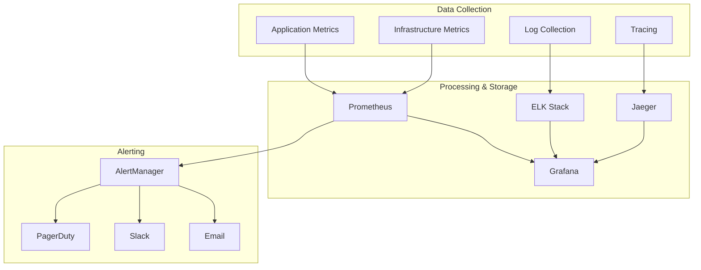

# Monitoring and Observability Guide

**Comprehensive guide for system monitoring, observability, and alerting**

---

## Overview

This guide covers the complete monitoring and observability stack for the Valtronics system, including infrastructure monitoring, application performance monitoring, log management, and alerting strategies.

---

## Monitoring Architecture

### Monitoring Stack Components



### Monitoring Levels

#### 1. Infrastructure Monitoring
- **System Metrics**: CPU, memory, disk, network
- **Container Metrics**: Resource usage, health status
- **Network Metrics**: Bandwidth, latency, packet loss
- **Storage Metrics**: Disk usage, I/O performance

#### 2. Application Monitoring
- **Performance Metrics**: Response time, throughput, error rate
- **Business Metrics**: Device count, data volume, user activity
- **Custom Metrics**: Application-specific KPIs
- **Dependency Metrics**: Database, cache, external APIs

#### 3. Log Management
- **Application Logs**: Structured application logs
- **Access Logs**: HTTP requests and responses
- **Error Logs**: Application errors and exceptions
- **Audit Logs**: Security and compliance events

#### 4. Distributed Tracing
- **Request Tracing**: End-to-end request flow
- **Service Dependencies**: Microservice interactions
- **Performance Analysis**: Bottleneck identification
- **Error Tracking**: Error propagation analysis

---

## Prometheus Monitoring

### Prometheus Configuration

#### Prometheus Server Configuration
```yaml
# prometheus/prometheus.yml
global:
  scrape_interval: 15s
  evaluation_interval: 15s
  external_labels:
    cluster: 'valtronics-prod'
    region: 'us-east-1'

rule_files:
  - "/etc/prometheus/rules/*.yml"

alerting:
  alertmanagers:
    - static_configs:
        - targets:
          - alertmanager:9093

scrape_configs:
  # Prometheus itself
  - job_name: 'prometheus'
    static_configs:
      - targets: ['localhost:9090']

  # Node Exporter
  - job_name: 'node-exporter'
    static_configs:
      - targets: ['node-exporter:9100']

  # Application Metrics
  - job_name: 'valtronics-api'
    static_configs:
      - targets: ['api:8000']
    metrics_path: '/metrics'
    scrape_interval: 10s

  # Database Metrics
  - job_name: 'postgres-exporter'
    static_configs:
      - targets: ['postgres-exporter:9187']

  # Redis Metrics
  - job_name: 'redis-exporter'
    static_configs:
      - targets: ['redis-exporter:9121']

  # MQTT Broker Metrics
  - job_name: 'mosquitto-exporter'
    static_configs:
      - targets: ['mosquitto-exporter:9234']

  # Kubernetes (if applicable)
  - job_name: 'kubernetes-pods'
    kubernetes_sd_configs:
      - role: pod
    relabel_configs:
      - source_labels: [__meta_kubernetes_pod_annotation_prometheus_io_scrape]
        action: keep
        regex: __meta_kubernetes_pod_annotation_prometheus_io_scrape
      - source_labels: [__meta_kubernetes_pod_annotation_prometheus_io_path]
        action: replace
        target_label: __metrics_path__
        regex: __meta_kubernetes_pod_annotation_prometheus_io_path
        (.+)
      - action: replace
        source_labels:
          - __meta_kubernetes_namespace
          - __meta_kubernetes_pod_name
        target_label: job
        regex: (.+)-(.+)
        replacement: $1-$2
      - source_labels: [__address__]
        target_label: __address__
        regex: (.+):(.+)
        replacement: $2
      - source_labels: [__meta_kubernetes_pod_label_app_kubernetes_io_name]
        target_label: application
        replacement: $1
      - source_labels: [__metrics_path__]
        target_label: __metrics_path__
        replacement: $1

remote_write:
  - url: "https://longterm-storage.example.com/api/v1/write"
    queue_config:
      max_samples_per_send: 10000
      max_shards: 200
      capacity: 2500
```

#### Alerting Rules
```yaml
# prometheus/rules/valtronics.yml
groups:
  - name: valtronics.rules
    rules:
      # System Health Alerts
      - alert: HighCPUUsage
        expr: 100 - (avg by (instance) (irate(node_cpu_seconds_total{mode="idle"}[5m])) * 100) > 80
        for: 10m
        labels:
          severity: warning
          service: system
        annotations:
          summary: "High CPU usage on {{ $labels.instance }}"
          description: "CPU usage is above 80% for more than 10 minutes."

      - alert: HighMemoryUsage
        expr: (1 - (node_memory_MemAvailable_bytes / node_memory_MemTotal_bytes)) * 100 > 85
        for: 10m
        labels:
          severity: warning
          service: system
        annotations:
          summary: "High memory usage on {{ $labels.instance }}"
          description: "Memory usage is above 85% for more than 10 minutes."

      - alert: DiskSpaceLow
        expr: (node_filesystem_avail_bytes / node_filesystem_size_bytes) * 100 < 10
        for: 5m
        labels:
          severity: critical
          service: system
        annotations:
          summary: "Low disk space on {{ $labels.instance }}"
          description: "Disk space is below 10% on {{ $labels.mountpoint }}."

      # Application Alerts
      - alert: HighErrorRate
        expr: rate(valtronics_api_requests_total{status=~"5.."}[5m]) / rate(valtronics_api_requests_total[5m]) > 0.05
        for: 5m
        labels:
          severity: warning
          service: application
        annotations:
          summary: "High error rate detected"
          description: "Error rate is above 5% for more than 5 minutes."

      - alert: HighResponseTime
        expr: histogram_quantile(0.95, rate(valtronics_api_request_duration_seconds_bucket[5m])) > 1.0
        for: 5m
        labels:
          severity: warning
          service: application
        annotations:
          summary: "High response time detected"
          description: "95th percentile response time is above 1 second."

      - alert: DatabaseConnectionsHigh
        expr: valtronics_database_connections_used / valtronics_database_connections_max > 0.8
        for: 5m
        labels:
          severity: warning
          service: database
        annotations:
          summary: "High database connection usage"
          description: "Database connection usage is above 80%."

      # Device Alerts
      - alert: DevicesOffline
        expr: valtronics_devices_total{status="offline"} / valtronics_devices_total > 0.2
        for: 10m
        labels:
          severity: warning
          service: devices
        annotations:
          summary: "Many devices are offline"
          description: "More than 20% of devices are offline."

      - alert: TelemetryDataMissing
        expr: rate(valtronics_telemetry_points_total[5m]) < 10
        for: 5m
        labels:
          severity: warning
          service: telemetry
        annotations:
          summary: "Low telemetry data rate"
          description: "Telemetry data rate is below 10 points per second."

      - alert: CriticalAlertsHigh
        expr: valtronics_alerts_total{severity="critical"} > 0
        for: 1m
        labels:
          severity: critical
          service: alerts
        annotations:
          summary: "Critical alerts detected"
          description: "Critical alerts are present and need attention."
```

### Custom Metrics Exporter
```python
# app/monitoring/metrics_exporter.py
from prometheus_client import Counter, Histogram, Gauge, start_http_server
from prometheus_client.core import REGISTRY
import time
import logging
from typing import Dict, Any

class ValtronicsMetricsExporter:
    def __init__(self):
        self.logger = logging.getLogger(__name__)
        
        # Define metrics
        self.device_count = Gauge(
            'valtronics_devices_total',
            'Total number of devices by status',
            ['status']
        )
        
        self.telemetry_points = Counter(
            'valtronics_telemetry_points_total',
            'Total number of telemetry points',
            ['device_type', 'metric_name']
        )
        
        self.alerts = Counter(
            'valtronics_alerts_total',
            'Total number of alerts',
            ['severity', 'alert_type']
        )
        
        self.api_requests = Counter(
            'valtronics_api_requests_total',
            'Total number of API requests',
            ['method', 'endpoint', 'status']
        )
        
        self.api_request_duration = Histogram(
            'valtronics_api_request_duration_seconds',
            'API request duration in seconds',
            ['method', 'endpoint'],
            buckets=[0.1, 0.25, 0.5, 1.0, 2.5, 5.0, 10.0, 25.0, 50.0]
        )
        
        self.database_connections = Gauge(
            'valtronics_database_connections',
            'Number of database connections',
            ['state']  # used, idle, max
        )
        
        self.mqtt_messages = Counter(
            'valtronics_mqtt_messages_total',
            'Total number of MQTT messages',
            ['topic', 'direction']  # publish, subscribe
        )
        
        self.system_health = Gauge(
            'valtronics_system_health_score',
            'System health score',
            ['component']
        )
    
    def update_device_metrics(self, device_stats: Dict[str, Any]):
        """Update device metrics"""
        # Reset all device counts
        self.device_count.labels(status='online').set(0)
        self.device_count.labels(status='offline').set(0)
        self.device_count.labels(status='error').set(0)
        self.device_count.labels(status='warning').set(0)
        
        # Update with current stats
        for status, count in device_stats.items():
            self.device_count.labels(status=status).set(count)
    
    def increment_telemetry_points(self, device_type: str, metric_name: str):
        """Increment telemetry points counter"""
        self.telemetry_points.labels(device_type=device_type, metric_name=metric_name).inc()
    
    def increment_alerts(self, severity: str, alert_type: str):
        """Increment alerts counter"""
        self.alerts.labels(severity=severity, alert_type=alert_type).inc()
    
    def record_api_request(self, method: str, endpoint: str, status: int, duration: float):
        """Record API request metrics"""
        self.api_requests.labels(method=method, endpoint=endpoint, status=str(status)).inc()
        self.api_request_duration.labels(method=method, endpoint=endpoint).observe(duration)
    
    def update_database_connections(self, used: int, idle: int, max_connections: int):
        """Update database connection metrics"""
        self.database_connections.labels(state='used').set(used)
        self.database_connections.labels(state='idle').set(idle)
        self.database_connections.labels(state='max').set(max_connections)
    
    def increment_mqtt_messages(self, topic: str, direction: str):
        """Increment MQTT message counter"""
        self.mqtt_messages.labels(topic=topic, direction=direction).inc()
    
    def update_system_health(self, health_scores: Dict[str, float]):
        """Update system health scores"""
        for component, score in health_scores.items():
            self.system_health.labels(component=component).set(score)
    
    def start_metrics_server(self, port: int = 8001):
        """Start Prometheus metrics server"""
        start_http_server(port)
        self.logger.info(f"Metrics server started on port {port}")
    
    def get_metrics_summary(self) -> Dict[str, Any]:
        """Get metrics summary for debugging"""
        from prometheus_client import generate_latest
        
        metrics_data = generate_latest(REGISTRY)
        
        summary = {}
        
        for metric_family in metrics_data:
            for sample in metric_family.samples:
                metric_name = sample.name
                labels = sample.labels
                value = sample.value
                
                if metric_name not in summary:
                    summary[metric_name] = []
                
                summary[metric_name].append({
                    'labels': labels,
                    'value': value
                })
        
        return summary
```

---

## Grafana Dashboards

### Dashboard Configuration

#### System Overview Dashboard
```json
{
  "dashboard": {
    "id": null,
    "title": "Valtronics System Overview",
    "tags": ["valtronics", "system", "overview"],
    "timezone": "browser",
    "panels": [
      {
        "id": 1,
        "title": "System Health",
        "type": "stat",
        "targets": [
          {
            "expr": "valtronics_system_health_score{component='overall'}",
            "legendFormat": "{{component}}"
          }
        ],
        "fieldConfig": {
          "defaults": {
            "color": {
              "mode": "thresholds"
            },
            "thresholds": {
              "steps": [
                {"color": "red", "value": 0},
                {"color": "yellow", "value": 50},
                {"color": "green", "value": 80}
              ]
            },
            "unit": "short",
            "max": 100,
            "min": 0
          }
        },
        "gridPos": {"h": 8, "w": 12, "x": 0, "y": 0}
      },
      {
        "id": 2,
        "title": "Device Status",
        "type": "piechart",
        "targets": [
          {
            "expr": "sum by (status) (valtronics_devices_total)",
            "legendFormat": "{{status}}"
          }
        ],
        "fieldConfig": {
          "defaults": {
            "color": {
              "mode": "palette-classic"
            },
            "unit": "short"
          }
        },
        "gridPos": {"h": 8, "w": 12, "x": 12, "y": 0}
      },
      {
        "id": 3,
        "title": "CPU Usage",
        "type": "graph",
        "targets": [
          {
            "expr": "100 - (avg by (instance) (irate(node_cpu_seconds_total{mode=\"idle\"}[5m])) * 100)",
            "legendFormat": "{{instance}}"
          }
        ],
        "fieldConfig": {
          "defaults": {
            "unit": "percent",
            "min": 0,
            "max": 100
          }
        },
        "gridPos": {"h": 8, "w": 12, "x": 0, "y": 8}
      },
      {
        "id": 4,
        "title": "Memory Usage",
        "type": "graph",
        "targets": [
          {
            "expr": "(1 - (node_memory_MemAvailable_bytes / node_memory_MemTotal_bytes)) * 100",
            "legendFormat": "{{instance}}"
          }
        ],
        "fieldConfig": {
          "defaults": {
            "unit": "percent",
            "min": 0,
            "max": 100
          }
        },
        "gridPos": {"h": 8, "w": 12, "x": 12, "y": 8}
      },
      {
        "id": 5,
        "title": "API Request Rate",
        "type": "graph",
        "targets": [
          {
            "expr": "sum by (endpoint) (rate(valtronics_api_requests_total[5m]))",
            "legendFormat": "{{endpoint}}"
          }
        ],
        "fieldConfig": {
          "defaults": {
            "unit": "reqps"
          }
        },
        "gridPos": {"h": 8, "w": 12, "x": 0, "y": 16}
      },
      {
        "id": 6,
        "title": "API Response Time",
        "type": "graph",
        "targets": [
          {
            "expr": "histogram_quantile(0.95, rate(valtronics_api_request_duration_seconds_bucket[5m]))",
            "legendFormat": "95th percentile"
          },
          {
            "expr": "histogram_quantile(0.50, rate(valtronics_api_request_duration_seconds_bucket[5m]))",
            "legendFormat": "50th percentile"
          }
        ],
        "fieldConfig": {
          "defaults": {
            "unit": "s"
          }
        },
        "gridPos": {"h": 8, "w": 12, "x": 12, "y": 16}
      },
      {
        "id": 7,
        "title": "Telemetry Data Rate",
        "type": "graph",
        "targets": [
          {
            "expr": "sum by (device_type) (rate(valtronics_telemetry_points_total[5m]))",
            "legendFormat": "{{device_type}}"
          }
        ],
        "fieldConfig": {
          "defaults": {
            "unit": "pps"
          }
        },
        "gridPos": {"h": 8, "w": 12, "x": 0, "y": 24}
      },
      {
        "id": 8,
        "title": "Alert Rate",
        "type": "graph",
        "targets": [
          {
            "expr": "sum by (severity) (rate(valtronics_alerts_total[5m]))",
            "legendFormat": "{{severity}}"
          }
        ],
        "fieldConfig": {
          "defaults": {
            "unit": "pps"
          }
        },
        "gridPos": {"h": 8, "w": 12, "x": 12, "y": 24}
      }
    ],
    "time": {
      "from": "now-1h",
      "to": "now"
    },
    "refresh": "30s"
  }
}
```

---

## Log Management

### ELK Stack Configuration

#### Elasticsearch Configuration
```yaml
# elasticsearch/elasticsearch.yml
cluster.name: valtronics
node.name: elasticsearch-1
path.data: /usr/share/elasticsearch/data
path.logs: /usr/share/elasticsearch/logs
network.host: 0.0.0.0
http.port: 9200
discovery.type: single-node

# Index templates for different log types
index_template:
  - name: "valtronics-logs-*"
    index_patterns: ["valtronics-logs-*"]
    settings:
      number_of_shards: 1
      number_of_replicas: 0
    mappings:
      properties:
        timestamp:
          type: date
        level:
          type: keyword
        service:
          type: keyword
        message:
          type: text
        fields:
          raw_message:
            type: text
            index: false
```

#### Logstash Configuration
```ruby
# logstash/pipeline/logstash.conf
input {
  beats {
    port => 5044
  }
}

filter {
  # Parse JSON logs
  if [message] {
    json {
      source => "message"
    }
  }
  
  # Parse timestamp
  if [timestamp] {
    date {
      match => ["timestamp", "ISO8601"]
      target => "@timestamp"
    }
  }
  
  # Add environment information
  mutate {
    add_field => { "environment" => "production" }
    add_field => { "cluster" => "valtronics" }
  }
  
  # Parse application logs
  if [service] == "valtronics-api" {
    grok {
      match => { "message" => "%{TIMESTAMP_ISO8601:timestamp} %{LOGLEVEL:level} %{GREEDYDATA:logger_name} - %{GREEDYDATA:message}" }
    }
  }
  
  # Parse device logs
  if [service] == "valtronics-device" {
    grok {
      match => { "message" => "%{TIMESTAMP_ISO8601:timestamp} \[%{LOGLEVEL:level}\] %{GREEDYDATA:device_id} - %{GREEDYDATA:message}" }
    }
  }
}

output {
  elasticsearch {
    hosts => ["elasticsearch:9200"]
    index => "valtronics-logs-%{+YYYY.MM.dd}"
    template_name => "valtronics-logs"
    template_pattern => "valtronics-logs-*"
    template => "/etc/logstash/templates/valtronics-logs.json"
  }
}
```

#### Filebeat Configuration
```yaml
# filebeat/filebeat.yml
filebeat.inputs:
  - type: log
    enabled: true
    paths:
      - /var/log/valtronics/*.log
    fields:
      service: valtronics-api
    multiline.pattern: '^\d{4}-\d{2}-\d{2} \d{2}:\d{2}:\d{2},\d{3}'
    multiline.negate: true
    multiline.match: after

  - type: log
    enabled: true
    paths:
      - /var/log/mosquitto/mosquitto.log
    fields:
      service: mosquitto
      component: mqtt

output.logstash:
  hosts: ["logstash:5044"]

processors:
  - add_host_metadata:
    when.not.contains.tags: forwarded
  - add_docker_metadata: ~
  - add_kubernetes_metadata: ~
```

### Log Aggregation and Analysis
```python
# app/monitoring/log_aggregator.py
import logging
import json
from typing import Dict, Any, List
from datetime import datetime, timedelta
import asyncio
from collections import defaultdict, deque

class LogAggregator:
    def __init__(self):
        self.logger = logging.getLogger(__name__)
        self.log_buffer = deque(maxlen=10000)
        self.error_patterns = defaultdict(int)
        self.log_statistics = {
            'total_logs': 0,
            'error_logs': 0,
            'warning_logs': 0,
            'info_logs': 0,
            'debug_logs': 0
        }
        self.service_stats = defaultdict(lambda: defaultdict(int))
        self.hourly_stats = defaultdict(lambda: defaultdict(int))
    
    def process_log_entry(self, log_entry: Dict[str, Any]):
        """Process incoming log entry"""
        timestamp = log_entry.get('timestamp', datetime.utcnow())
        level = log_entry.get('level', 'INFO')
        service = log_entry.get('service', 'unknown')
        message = log_entry.get('message', '')
        
        # Add to buffer
        self.log_buffer.append({
            'timestamp': timestamp,
            'level': level,
            'service': service,
            'message': message,
            'raw_message': log_entry
        })
        
        # Update statistics
        self._update_statistics(level, service)
        
        # Analyze for patterns
        self._analyze_patterns(level, message)
    
    def _update_statistics(self, level: str, service: str):
        """Update log statistics"""
        self.log_statistics['total_logs'] += 1
        self.log_statistics[f'{level.lower()}_logs'] += 1
        self.service_stats[service][level] += 1
        
        # Update hourly stats
        hour_key = datetime.utcnow().strftime('%Y-%m-%d-%H')
        self.hourly_stats[hour_key][service] += 1
        self.hourly_stats[hour_key][level] += 1
    
    def _analyze_patterns(self, level: str, message: str):
        """Analyze log patterns for anomalies"""
        if level in ['ERROR', 'CRITICAL']:
            # Extract error patterns
            if 'Connection' in message:
                self.error_patterns['connection_error'] += 1
            elif 'Database' in message:
                self.error_patterns['database_error'] += 1
            elif 'Timeout' in message:
                self.error_patterns['timeout_error'] += 1
            elif 'Memory' in message:
                self.error_patterns['memory_error'] += 1
            elif 'File' in message:
                self.error_patterns['file_error'] += 1
    
    def get_error_summary(self, hours: int = 24) -> Dict[str, Any]:
        """Get error summary for specified time period"""
        cutoff_time = datetime.utcnow() - timedelta(hours=hours)
        
        # Filter logs from buffer
        recent_errors = [
            log for log in self.log_buffer
            if log['timestamp'] > cutoff_time and log['level'] in ['ERROR', 'CRITICAL']
        ]
        
        # Group by service
        errors_by_service = defaultdict(list)
        for error in recent_errors:
            errors_by_service[error['service']].append(error)
        
        # Calculate statistics
        summary = {
            'period': f'{hours}h',
            'total_errors': len(recent_errors),
            'errors_by_service': {},
            'error_patterns': dict(self.error_patterns),
            'top_errors': []
        }
        
        for service, errors in errors_by_service.items():
            summary['errors_by_service'][service] = {
                'count': len(errors),
                'rate': len(errors) / hours,
                'top_messages': self._get_top_messages(errors, 5)
            }
        
        # Get top error messages
        all_errors = sorted(recent_errors, key=lambda x: x['timestamp'], reverse=True)
        summary['top_errors'] = self._get_top_messages(all_errors, 10)
        
        return summary
    
    def _get_top_messages(self, logs: List[Dict[str, Any]], limit: int) -> List[Dict[str, Any]]:
        """Get top error messages"""
        message_counts = defaultdict(int)
        for log in logs:
            # Truncate long messages for counting
            message = log['message'][:100]
            message_counts[message] += 1
        
        # Sort by count and return top messages
        top_messages = sorted(
            message_counts.items(),
            key=lambda x: x[1],
            reverse=True
        )[:limit]
        
        return [
            {'message': msg, 'count': count}
            for msg, count in top_messages
        ]
    
    def get_service_health(self) -> Dict[str, Any]:
        """Get service health based on log patterns"""
        health_scores = {}
        
        for service, stats in self.service_stats.items():
            total_logs = sum(stats.values())
            error_logs = stats.get('ERROR', 0) + stats.get('CRITICAL', 0)
            
            if total_logs == 0:
                health_score = 100
            else:
                error_rate = error_logs / total_logs
                health_score = max(0, 100 - (error_rate * 100))
            
            health_scores[service] = {
                'health_score': health_score,
                'total_logs': total_logs,
                'error_rate': error_rate,
                'status': 'healthy' if health_score > 80 else 'degraded' if health_score > 60 else 'unhealthy'
            }
        
        return health_scores
    
    def get_log_trends(self, hours: int = 24) -> Dict[str, Any]:
        """Get log trends over time"""
        trends = {
            'period': f'{hours}h',
            'hourly_stats': {},
            'level_trends': {},
            'service_trends': {}
        }
        
        # Get hourly statistics
        for hour_key, hour_stats in self.hourly_stats.items():
            if datetime.strptime(hour_key, '%Y-%m-%d-%H') > datetime.utcnow() - timedelta(hours=hours):
                trends['hourly_stats'][hour_key] = dict(hour_stats)
        
        # Calculate level trends
        for level in ['ERROR', 'WARNING', 'INFO', 'DEBUG']:
            level_data = []
            for hour_key, hour_stats in trends['hourly_stats'].items():
                level_data.append(hour_stats.get(level, 0))
            
            if level_data:
                trends['level_trends'][level] = {
                    'total': sum(level_data),
                    'avg': sum(level_data) / len(level_data),
                    'max': max(level_data),
                    'min': min(level_data)
                }
        
        # Calculate service trends
        for service in self.service_stats:
            service_data = []
            for hour_key, hour_stats in trends['hourly_stats'].items():
                service_data.append(hour_stats.get(service, 0))
            
            if service_data:
                trends['service_trends'][service] = {
                    'total': sum(service_data),
                    'avg': sum(service_data) / len(service_data),
                    'max': max(service_data),
                    'min': min(service_data)
                }
        
        return trends
```

---

## Distributed Tracing

### Jaeger Configuration

#### Jaeger Configuration
```yaml
# jaeger/jaeger.yml
collector:
  zipkin:
    host-port: 9411
  http:
    host-port: 14269
query:
  base-path: /jaeger

storage:
  type: elasticsearch
  elasticsearch:
    host-ports: "elasticsearch:9200"
    index-prefix: jaeger
```

### OpenTelemetry Integration
```python
# app/tracing/tracing.py
from opentelemetry import trace
from opentelemetry.exporter.jaeger.thrift import JaegerExporter
from opentelemetry.sdk.trace.exporter import BatchSpanProcessor
from opentelemetry.sdk.trace import TracerProvider
from opentelemetry.sdk.trace.exporter import SimpleSpanProcessor
from opentelemetry.sdk.resources import Resource
from opentelemetry.semconv.trace import HttpTraceFormat
from opentelemetry import metrics
import logging

class TracingManager:
    def __init__(self):
        self.logger = logging.getLogger(__name__)
        self.tracer = None
        self.exporter = None
        self.span_processor = None
        self.resource = None
    
    def initialize_tracing(self, service_name: str, jaeger_endpoint: str):
        """Initialize distributed tracing"""
        try:
            # Create resource
            self.resource = Resource.create({
                "service.name": service_name,
                "service.version": "1.0.0"
            })
            
            # Create Jaeger exporter
            self.exporter = JaegerExporter(
                endpoint=jaeger_endpoint,
                collector_endpoint=jaeger_endpoint,
                insecure=True
            )
            
            # Create span processor
            self.span_processor = BatchSpanProcessor(self.exporter)
            
            # Create tracer provider
            self.tracer = TracerProvider(
                resource=self.resource,
                span_processor=self.span_processor,
                active_span_processor=SimpleSpanProcessor(),
            )
            
            # Set global tracer provider
            trace.set_tracer_provider(self.tracer)
            
            self.logger.info(f"Tracing initialized for service: {service_name}")
            
        except Exception as e:
            self.logger.error(f"Failed to initialize tracing: {e}")
    
    def create_span(self, name: str, kind: str = "internal"):
        """Create a new span"""
        if not self.tracer:
            return None
        
        return self.tracer.start_span(name, kind=kind)
    
    def add_span_attributes(self, span, attributes: Dict[str, Any]):
        """Add attributes to span"""
        if span and attributes:
            for key, value in attributes.items():
                span.set_attribute(key, str(value))
    
    def add_span_events(self, span, events: List[Dict[str, Any]]):
        """Add events to span"""
        if span and events:
            for event in events:
                span.add_event(event.get('name', ''), attributes=event.get('attributes', {}))
    
    def create_trace_context(self, headers: Dict[str, str]) -> Dict[str, str]:
        """Extract trace context from headers"""
        context = {}
        
        try:
            propagator = HttpTraceFormat()
            context = propagator.extract(headers)
        except Exception as e:
            self.logger.debug(f"Failed to extract trace context: {e}")
        
        return context
    
    def inject_trace_context(self, headers: Dict[str, str], span):
        """Inject trace context into headers"""
        try:
            propagator = HttpTraceFormat()
            propagator.inject(span.context, headers)
        except Exception as e:
            self.logger.debug(f"Failed to inject trace context: {e}")
    
    def trace_function(self, name: str = None):
        """Decorator to trace function execution"""
        def decorator(func):
            if not self.tracer:
                return func
            
            @trace.with_tracer(name or func.__name__)
            def wrapper(*args, **kwargs):
                return func(*args, **kwargs)
            
            return wrapper
        
        return decorator
    
    def trace_async_function(self, name: str = None):
        """Decorator to trace async function execution"""
        def decorator(func):
            if not self.tracer:
                return func
            
            @trace.with_tracer(name or func.__name__)
            async def wrapper(*args, **kwargs):
                return await func(*args, **kwargs)
            
            return wrapper
        
        return decorator

# Example usage
tracing_manager = TracingManager()

@tracing_manager.trace_function("process_telemetry")
def process_telemetry(device_id: int, telemetry_data: Dict[str, Any]):
    """Process telemetry data with tracing"""
    # Function implementation
    pass

@tracing_manager.trace_async_function("api_request")
async def handle_api_request(request):
    """Handle API request with tracing"""
    # Function implementation
    pass
```

---

## Alert Management

### AlertManager Configuration
```yaml
# alertmanager/alertmanager.yml
global:
  smtp_smarthost: localhost
  smtp_from: alerts@valtronics.com
  smtp_require_tls: false

route:
  group_by: ['alertname', 'cluster', 'service']
  group_wait: 10s
  group_interval: 10s
  repeat_interval: 1h
  receiver: 'web.hook'
  routes:
    - match:
        alertname: CriticalAlertsHigh
      receiver: 'pagerduty'
      group_wait: 0s
      repeat_interval: 5m
    - match:
        service: database
      receiver: 'database-team'
    - match:
        service: system
      receiver: 'ops-team'

receivers:
  - name: 'web.hook'
    webhook_configs:
      - url: 'http://localhost:3000/api/alerts'
        send_resolved: true
        http_config:
          bearer_token: 'your-webhook-token'
        message: |
          {
            "alert": "{{ .CommonAnnotations.summary }}",
            "status": "{{ .Status }}",
            "labels": {{ .CommonLabels | toJson }},
            "annotations": {{ .CommonAnnotations | toJson }},
            "startsAt": "{{ .StartsAt }}",
            "endsAt": "{{ .EndsAt }}"
          }
  
  - name: 'pagerduty'
    pagerduty_configs:
      - service_key: 'your-pagerduty-key'
        severity: 'critical'
        description: '{{ .CommonAnnotations.summary }}'
        details: '{{ range .Alerts.Firing | value }}'
        client: 'Valtronics'
        client_url: 'http://valtronics.com'
  
  - name: 'slack'
    slack_configs:
      - api_url: 'https://hooks.slack.com/services/YOUR_SLACK_WEBHOOK'
        channel: '#alerts'
        title: 'Valtronics Alert: {{ .CommonAnnotations.summary }}'
        text: |
          {{ range .Alerts.Firing }}
          *Alert:* {{ .Annotations.summary }}
          *Description:* {{ .Annotations.description }}
          *Labels:* {{ range .Labels.SortedPairs }}  {{ .Name }}={{ .Value }} {{ end }}
          {{ end }}
        send_resolved: true
        color: 'danger'
        fields:
          - title: "Runbook"
            value: "{{ .CommonAnnotations.runbook_url }}"
  
  - name: 'email'
    email_configs:
      - to: 'alerts@valtronics.com'
        subject: 'Valtronics Alert: {{ .CommonAnnotations.summary }}'
        body: |
          {{ range .Alerts.Firing }}
          Alert: {{ .Annotations.summary }}
          Description: {{ .Annotations.description }}
          Labels: {{ range .Labels.SortedPairs }} {{ .Name }}={{ .Value }} {{ end }}
          {{ end }}
        html: |
          {{ range .Alerts.Firing }}
          <strong>Alert:</strong> {{ .Annotations.summary }}<br>
          <strong>Description:</strong> {{ .Annotations.description }}<br>
          <strong>Labels:</strong><br>
          {{ range .Labels.SortedPairs }} {{ .Name }}={{ .Value }}<br>{{ end }}
          {{ end }}
        send_resolved: true

inhibit_rules:
  - source_match:
      alertname: 'HighErrorRate'
    target_match:
      alertname: 'DatabaseConnectionsHigh'
    equal: ['cluster', 'service']
```

### Custom Alert Manager
```python
# app/monitoring/alert_manager.py
import asyncio
import logging
from typing import Dict, Any, List, Callable
from datetime import datetime, timedelta
from dataclasses import dataclass
from enum import Enum

class AlertSeverity(Enum):
    INFO = "info"
    WARNING = "warning"
    CRITICAL = "critical"

@dataclass
class Alert:
    name: str
    severity: AlertSeverity
    message: str
    labels: Dict[str, str]
    annotations: Dict[str, str]
    timestamp: datetime
    resolved: bool = False
    resolved_at: Optional[datetime] = None

class CustomAlertManager:
    def __init__(self):
        self.logger = logging.getLogger(__name__)
        self.alerts: List[Alert] = []
        self.alert_handlers: List[Callable] = []
        self.alert_rules = []
        self.alert_history = deque(maxlen=1000)
    
    def add_alert_handler(self, handler: Callable[[Alert], None]):
        """Add alert handler function"""
        self.alert_handlers.append(handler)
    
    def create_alert(self, name: str, severity: AlertSeverity, message: str, 
                     labels: Dict[str, str] = None, annotations: Dict[str, str] = None):
        """Create and send alert"""
        alert = Alert(
            name=name,
            severity=severity,
            message=message,
            labels=labels or {},
            annotations=annotations or {},
            timestamp=datetime.utcnow()
        )
        
        self.alerts.append(alert)
        self.alert_history.append(alert)
        
        # Send to handlers
        for handler in self.alert_handlers:
            try:
                handler(alert)
            except Exception as e:
                self.logger.error(f"Error in alert handler: {e}")
        
        self.logger.warning(f"Alert created: {name} - {message}")
    
    def resolve_alert(self, name: str, labels: Dict[str, str] = None):
        """Resolve alert"""
        for alert in self.alerts:
            if alert.name == name and not alert.resolved:
                alert.resolved = True
                alert.resolved_at = datetime.utcnow()
                
                # Send to handlers
                for handler in self.alert_handlers:
                    try:
                        handler(alert)
                    except Exception as e:
                        self.logger.error(f"Error in alert handler: {e}")
                
                self.logger.info(f"Alert resolved: {name}")
                break
    
    def add_alert_rule(self, rule_func: Callable[[], Optional[Alert]]):
        """Add alert rule function"""
        self.alert_rules.append(rule_func)
    
    def check_alert_rules(self):
        """Check all alert rules"""
        for rule in self.alert_rules:
            try:
                alert = rule()
                if alert:
                    self.create_alert(
                        alert.name,
                        alert.severity,
                        alert.message,
                        alert.labels,
                        alert.annotations
                    )
            except Exception as e:
                self.logger.error(f"Error in alert rule: {e}")
    
    def get_active_alerts(self) -> List[Alert]:
        """Get all active alerts"""
        return [alert for alert in self.alerts if not alert.resolved]
    
    def get_alert_statistics(self) -> Dict[str, Any]:
        """Get alert statistics"""
        active_alerts = self.get_active_alerts()
        resolved_alerts = [alert for alert in self.alerts if alert.resolved]
        
        severity_counts = {}
        for alert in active_alerts:
            severity_counts[alert.severity.value] = severity_counts.get(alert.severity.value, 0) + 1
        
        return {
            'total_alerts': len(self.alerts),
            'active_alerts': len(active_alerts),
            'resolved_alerts': len(resolved_alerts),
            'severity_counts': severity_counts,
            'alert_rate': len(self.alerts) / max(1, len(self.alert_history))
        }
    
    def cleanup_old_alerts(self, days: int = 30):
        """Clean up old resolved alerts"""
        cutoff_date = datetime.utcnow() - timedelta(days=days)
        
        original_count = len(self.alerts)
        self.alerts = [
            alert for alert in self.alerts 
            if not alert.resolved or alert.resolved_at > cutoff_date
        ]
        
        cleaned_count = original_count - len(self.alerts)
        if cleaned_count > 0:
            self.logger.info(f"Cleaned up {cleaned_count} old alerts")

# Alert rules
def high_error_rate_rule():
    """Alert rule for high error rate"""
    # Implementation would check current error rate
    error_rate = 0.1  # This would be calculated from metrics
    
    if error_rate > 0.05:  # 5% error rate threshold
        return Alert(
            name="HighErrorRate",
            severity=AlertSeverity.WARNING,
            message=f"Error rate is {error_rate:.2%}",
            labels={"component": "api"},
            annotations={"threshold": "5%"}
        )
    
    return None

def device_offline_rule():
    """Alert rule for devices going offline"""
    # Implementation would check device status
    offline_devices = 5  # This would be calculated from metrics
    
    if offline_devices > 2:
        return Alert(
            name="DevicesOffline",
            severity=AlertSeverity.WARNING,
            message=f"{offline_devices} devices are offline",
            labels={"component": "devices"},
            annotations={"threshold": "2 devices"}
        )
    
    return None

# Usage example
alert_manager = CustomAlertManager()
alert_manager.add_alert_rule(high_error_rate_rule)
alert_manager.add_alert_rule(device_offline_rule)
```

---

## Best Practices

### Monitoring Best Practices
- **Comprehensive Coverage**: Monitor all system components
- **Meaningful Metrics**: Track business-relevant KPIs
- **Proper Alerting**: Set appropriate thresholds and escalation
- **Documentation**: Document all metrics and alerts
- **Regular Review**: Continuously improve monitoring setup

### Observability Best Practices
- **Structured Logging**: Use consistent log formats
- **Correlation IDs**: Track requests across services
- **Distributed Tracing**: Implement end-to-end tracing
- **Error Tracking**: Capture and analyze errors
- **Performance Metrics**: Monitor response times and throughput

### Alerting Best Practices
- **Actionable Alerts**: Make alerts actionable with clear context
- **Escalation Paths**: Define clear escalation procedures
- **Alert Fatigue**: Avoid alert fatigue with proper thresholds
- **Testing**: Regularly test alerting systems
- **Documentation**: Document alert procedures

---

## Support

For monitoring and observability support:
- **Documentation**: [Performance and Scaling](performance-scaling.md)
- **Troubleshooting**: [Troubleshooting Guide](../10-reference/troubleshooting.md)
- **API**: [API Overview](../03-api/api-overview.md)
- **Email**: autobotsolution@gmail.com

---

**© 2024 Software Customs Auto Bot Solution. All Rights Reserved.**  
**Monitoring and Observability Guide v1.0**
