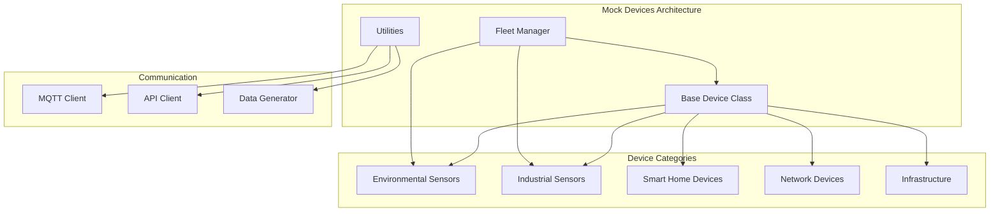

# Mock Devices Overview

**Complete guide to Valtronics Mock Devices for testing and development**

---

## Overview

The Valtronics Mock Devices system provides a comprehensive suite of simulated IoT devices for testing, development, and demonstration purposes. These devices generate realistic telemetry data, simulate real-world conditions, and can be used to test the entire Valtronics platform without requiring physical hardware.

---

## Architecture



### Core Components

#### 1. Base Device Class
- **Purpose**: Foundation for all mock devices
- **Features**: MQTT communication, API integration, health monitoring
- **Location**: `/mock-devices/base_device.py`

#### 2. Utility Modules
- **MQTT Client**: Enhanced MQTT with reconnection and error handling
- **API Client**: HTTP client for Valtronics API integration
- **Data Generator**: Realistic data generation algorithms
- **Location**: `/mock-devices/utils/`

#### 3. Fleet Manager
- **Purpose**: Coordinate multiple devices simultaneously
- **Features**: Device lifecycle management, statistics collection, error handling
- **Location**: `/mock-devices/device_fleet.py`

---

## Device Categories

### Environmental Sensors

#### Temperature Sensor
```python
# Example usage
from mock_devices.environmental.temperature_sensor import create_temperature_sensor

sensor = create_temperature_sensor(1001, "Server Room A")
await sensor.start()
```

**Features:**
- Realistic temperature cycles (daily/seasonal variations)
- Heat source simulation
- Ventilation effects
- Calibration drift simulation
- Alert thresholds

**Key Metrics:**
- Temperature (°C)
- Sensor accuracy
- Calibration offset
- Heat sources count

#### Humidity Sensor
```python
# Example usage
from mock_devices.environmental.humidity_sensor import create_humidity_sensor

sensor = create_humidity_sensor(2001, "Data Center B")
await sensor.start()
```

**Features:**
- Inverse correlation with temperature
- Dew point calculations
- Humidity source simulation
- Air circulation effects
- Moisture content tracking

**Key Metrics:**
- Humidity (%)
- Dew point (°C)
- Temperature coupling
- Air circulation rate

#### Pressure Sensor
```python
# Example usage
from mock_devices.environmental.pressure_sensor import create_pressure_sensor

sensor = create_pressure_sensor(3001, "Mountain Station", altitude=500.0)
await sensor.start()
```

**Features:**
- Barometric pressure simulation
- Altitude compensation
- Weather pattern simulation
- Sea level pressure calculation
- Weather front detection

**Key Metrics:**
- Pressure (hPa)
- Sea level pressure (hPa)
- Weather trend
- Altitude compensation

#### Air Quality Monitor
```python
# Example usage
from mock_devices.environmental.air_quality_monitor import create_air_quality_monitor

monitor = create_air_quality_monitor(4001, "Office Building A")
await monitor.start()
```

**Features:**
- Multi-pollutant monitoring (PM2.5, PM10, CO2, VOC, O3, NO2, SO2)
- AQI calculation
- Pollution source simulation
- Ventilation effects
- Weather impact modeling

**Key Metrics:**
- PM2.5 (μg/m³)
- PM10 (μg/m³)
- CO2 (ppm)
- VOC (ppm)
- AQI value
- Individual pollutant AQI

### Industrial Sensors

#### Vibration Sensor
```python
# Example usage
from mock_devices.industrial.vibration_sensor import create_vibration_sensor

sensor = create_vibration_sensor(5001, "Motor A")
await sensor.start()
```

**Features:**
- Equipment vibration monitoring
- Fault simulation (bearing, misalignment, unbalance, looseness)
- FFT spectrum simulation
- Health score calculation
- Frequency analysis

**Key Metrics:**
- Vibration RMS (mm/s)
- Vibration Peak (mm/s)
- Crest factor
- Dominant frequency (Hz)
- Equipment health score (%)

---

## Installation and Setup

### Prerequisites
- Python 3.8+
- MQTT broker (Mosquitto recommended)
- Valtronics API server running
- Required Python packages (see requirements.txt)

### Installation Steps

#### 1. Install Dependencies
```bash
cd /home/robbie/Desktop/Valtronics/valtronics/mock-devices
pip install -r requirements.txt
```

#### 2. Configure MQTT
```bash
# Edit config.json
nano config.json
```

```json
{
  "mqtt": {
    "broker_host": "localhost",
    "broker_port": 1883,
    "username": "valtronics_user",
    "password": "valtronics_password",
    "keepalive": 60,
    "qos": 1
  },
  "api": {
    "base_url": "http://localhost:8000",
    "timeout": 30,
    "retry_attempts": 3,
    "retry_delay": 5
  }
}
```

#### 3. Start MQTT Broker
```bash
# Start Mosquitto
sudo systemctl start mosquitto
sudo systemctl enable mosquitto
```

#### 4. Verify Installation
```python
# Test individual device
python -c "
from mock_devices.environmental.temperature_sensor import create_temperature_sensor
sensor = create_temperature_sensor(1001, 'Test Location')
print('Mock devices installation verified!')
"
```

---

## Usage Examples

### Single Device Usage

#### Basic Device Operation
```python
import asyncio
from mock_devices.environmental.temperature_sensor import TemperatureSensor

async def main():
    # Create temperature sensor
    sensor = TemperatureSensor(1001, "Server Room A")
    
    # Configure device
    sensor.add_heat_source("Server Rack 1", intensity=5.0, proximity_factor=0.8)
    sensor.set_ventilation_rate(0.7)
    
    try:
        # Start device
        await sensor.start()
        
        # Run for 5 minutes
        await asyncio.sleep(300)
        
        # Get device info
        info = sensor.get_device_info()
        print(f"Device info: {info}")
        
    finally:
        await sensor.stop()

if __name__ == "__main__":
    asyncio.run(main())
```

#### Device Configuration
```python
# Temperature sensor configuration
sensor.set_ventilation_rate(0.8)  # 0-1 scale
sensor.add_heat_source("HVAC Unit", intensity=3.0, proximity_factor=0.5)
sensor.calibrate_sensor(22.5)  # Reference temperature

# Humidity sensor configuration
sensor.set_temperature_coupling(0.7)  # Correlation strength
sensor.add_humidity_source("Water Leak", intensity=8.0)
sensor.set_air_circulation(0.6)

# Pressure sensor configuration
sensor.set_altitude(500.0)  # meters
sensor.set_temperature_compensation(True)
sensor.simulate_weather_front(-8.0)  # hPa change

# Air quality monitor configuration
sensor.set_ventilation_rate(0.5)
sensor.set_occupancy_level(1.2)  # 0-2 scale
sensor.add_pollution_source("Traffic", "all", intensity=15.0)
```

### Fleet Management

#### Basic Fleet Operation
```python
import asyncio
from mock_devices.device_fleet import FleetConfig, DeviceFleetManager

async def main():
    # Configure fleet
    config = FleetConfig(
        total_devices=20,
        enable_failures=True,
        failure_rate=0.01,
        enable_anomalies=True,
        anomaly_rate=0.02
    )
    
    # Create fleet manager
    fleet_manager = DeviceFleetManager(config)
    
    try:
        # Create fleet
        await fleet_manager.create_fleet()
        
        # Start fleet
        await fleet_manager.start_fleet()
        
        # Monitor fleet
        while True:
            stats = fleet_manager.get_fleet_statistics()
            print(f"Fleet stats: {stats['performance_metrics']}")
            await asyncio.sleep(60)
            
    except KeyboardInterrupt:
        print("Shutting down fleet...")
    finally:
        await fleet_manager.stop_fleet()

if __name__ == "__main__":
    asyncio.run(main())
```

#### Custom Fleet Configuration
```python
# Custom device distribution
config = FleetConfig(
    total_devices=50,
    device_distribution={
        "temperature_sensor": 20,
        "humidity_sensor": 15,
        "pressure_sensor": 10,
        "air_quality_monitor": 5
    },
    locations=[
        "Server Room A", "Server Room B", "Data Center 1",
        "Office Building A", "Factory Floor A", "Warehouse A"
    ],
    start_stagger=2,  # Seconds between device starts
    enable_failures=True,
    failure_rate=0.005,  # 0.5% failure rate
    enable_anomalies=True,
    anomaly_rate=0.01
)
```

---

## Data Generation

### Realistic Patterns

#### Temperature Patterns
```python
# Daily temperature cycle
hour_of_day = timestamp.hour + timestamp.minute / 60.0
daily_cycle = seasonal_variation * math.sin(2 * math.pi * (hour_of_day - 6) / 24)

# Seasonal variation
day_of_year = timestamp.timetuple().tm_yday
seasonal_cycle = 3 * math.sin(2 * math.pi * (day_of_year - 80) / 365)

# Combined with base temperature
temperature = base_temperature + daily_cycle + seasonal_cycle
```

#### Humidity Correlation
```python
# Inverse correlation with temperature
temp_normalized = (temperature - 20) / 20
humidity = base_humidity - temp_normalized * 15

# Add constraints
humidity = max(20, min(90, humidity))
```

#### Pressure Weather Patterns
```python
# Weather cycles (4-hour periods)
weather_trend = 2 * math.sin(2 * math.pi * i / (hours * 60 * 4))

# Daily pressure variation
daily_variation = 1 * math.sin(2 * math.pi * (hour_of_day - 12) / 24)

pressure = adjusted_base + weather_trend + daily_variation + noise
```

### Anomaly Simulation

#### Fault Conditions
```python
# Bearing fault simulation
if fault_conditions["bearing_fault"]:
    bearing_freq = running_frequency * 3
    bearing_contribution = fault_severity["bearing_fault"] * 0.5
    vibration += bearing_contribution * math.sin(2 * math.pi * bearing_freq * 0.1)
```

#### Random Failures
```python
# Random failure probability
if random.random() < failure_probability:
    # Simulate different failure types
    failure_types = ["mqtt_disconnect", "sensor_error", "calibration_drift"]
    failure_type = random.choice(failure_types)
    
    if failure_type == "mqtt_disconnect":
        device.mqtt_connected = False
    elif failure_type == "sensor_error":
        device.error_count += 5
```

---

## Monitoring and Statistics

### Device Statistics
```python
# Get device statistics
stats = sensor.get_temperature_statistics()

print(f"Current temperature: {stats['current_temperature']}")
print(f"Average temperature: {stats['average_temperature']}")
print(f"Min/Max: {stats['min_temperature']}/{stats['max_temperature']}")
print(f"Data points: {stats['data_points']}")
```

### Fleet Statistics
```python
# Get fleet statistics
fleet_stats = fleet_manager.get_fleet_statistics()

print(f"Total devices: {fleet_stats['fleet_info']['total_devices']}")
print(f"Uptime: {fleet_stats['fleet_info']['uptime_hours']:.2f} hours")
print(f"Telemetry points: {fleet_stats['performance_metrics']['total_telemetry_points']}")
print(f"Error rate: {fleet_stats['performance_metrics']['error_rate']:.4f}")
```

### Health Monitoring
```python
# Check device health
health_score = sensor._calculate_health_score()

if health_score < 50:
    print("Warning: Device health score is low")
elif health_score < 30:
    print("Critical: Device requires immediate attention")
```

---

## Configuration Options

### Global Configuration
```json
{
  "mqtt": {
    "broker_host": "localhost",
    "broker_port": 1883,
    "username": "valtronics_user",
    "password": "valtronics_password",
    "keepalive": 60,
    "qos": 1
  },
  "api": {
    "base_url": "http://localhost:8000",
    "timeout": 30,
    "retry_attempts": 3,
    "retry_delay": 5
  },
  "device": {
    "telemetry_interval": 30,
    "health_check_interval": 300,
    "batch_size": 10,
    "max_retries": 3
  },
  "simulation": {
    "noise_level": 0.1,
    "drift_rate": 0.01,
    "failure_probability": 0.02,
    "alert_probability": 0.05
  }
}
```

### Device-Specific Configuration
```python
# Temperature sensor configuration
sensor.base_temperature = 22.0
sensor.seasonal_variation = 5.0
sensor.daily_amplitude = 8.0
sensor.sensor_accuracy = 0.1

# Alert thresholds
sensor.temp_min_threshold = 10.0
sensor.temp_max_threshold = 35.0
sensor.temp_critical_min = 5.0
sensor.temp_critical_max = 40.0
```

---

## Best Practices

### Device Management
- **Start devices with stagger**: Prevent overwhelming the system
- **Monitor device health**: Regularly check device statistics
- **Handle errors gracefully**: Implement proper error handling and recovery
- **Use appropriate telemetry intervals**: Balance data frequency with system load

### Data Generation
- **Use realistic patterns**: Simulate real-world conditions
- **Add appropriate noise**: Include sensor noise and environmental variations
- **Implement correlations**: Model relationships between different parameters
- **Validate data ranges**: Ensure values stay within physical bounds

### Fleet Operations
- **Start small**: Begin with a few devices and scale up gradually
- **Monitor system resources**: Track CPU, memory, and network usage
- **Implement proper shutdown**: Ensure clean device termination
- **Export configurations**: Save fleet setups for reproducibility

---

## Troubleshooting

### Common Issues

#### MQTT Connection Problems
```python
# Check MQTT broker status
sudo systemctl status mosquitto

# Test MQTT connection
mosquitto_pub -h localhost -t test/topic -m "Hello MQTT"
mosquitto_sub -h localhost -t test/topic
```

#### Device Registration Failures
```python
# Check API server status
curl -X GET http://localhost:8000/health

# Verify API endpoints
curl -X GET http://localhost:8000/api/v1/devices/
```

#### Performance Issues
```python
# Reduce telemetry frequency
device.config.telemetry_interval = 60  # Increase interval

# Reduce fleet size
config.total_devices = 10  # Start with fewer devices
```

### Debug Mode
```python
# Enable debug logging
import logging
logging.basicConfig(level=logging.DEBUG)

# Monitor device logs
device.logger.setLevel(logging.DEBUG)
```

---

## Integration Examples

### With Valtronics API
```python
# Register device automatically
await device._register_device()

# Send alerts to API
await device._send_alert(alert_data)

# Update device status
await device._update_device_status(DeviceStatus.WARNING)
```

### With External Systems
```python
# Export data to external systems
import json
with open('telemetry_data.json', 'w') as f:
    json.dump(telemetry_data, f)

# Integrate with monitoring tools
from prometheus_client import Gauge, Counter

temperature_gauge = Gauge('mock_device_temperature', 'Temperature reading')
temperature_gauge.set(current_temperature)
```

---

## Advanced Features

### Custom Device Types
```python
# Create custom device by extending BaseDevice
class CustomSensor(BaseDevice):
    def __init__(self, device_id: int, location: str):
        config = DeviceConfig(
            device_id=device_id,
            device_name=f"Custom Sensor {device_id:04d}",
            device_type=DeviceType.SENSOR,
            manufacturer="Custom Corp",
            model="CS-C1000",
            firmware_version="1.0.0",
            location=location,
            mqtt_topic=f"valtronics/devices/{device_id}/telemetry",
            api_endpoint="/api/v1/telemetry/",
            telemetry_interval=30,
            health_check_interval=300
        )
        super().__init__(config)
    
    async def generate_telemetry(self):
        # Custom telemetry generation
        pass
```

### Data Export and Analysis
```python
# Export fleet statistics
stats = fleet_manager.get_fleet_statistics()
with open('fleet_statistics.json', 'w') as f:
    json.dump(stats, f, indent=2, default=str)

# Analyze telemetry patterns
import pandas as pd
df = pd.DataFrame(telemetry_history)
df.plot(x='timestamp', y='value')
```

---

## Support

For Mock Devices support:
- **Documentation**: [Development Setup](../08-development/development-setup.md)
- **API Reference**: [API Overview](../03-api/api-overview.md)
- **Troubleshooting**: [Troubleshooting Guide](../10-reference/troubleshooting.md)
- **Configuration**: [Configuration Guide](../06-configuration/configuration-guide.md)
- **Email**: autobotsolution@gmail.com

---

**© 2024 Software Customs Auto Bot Solution. All Rights Reserved.**  
**Mock Devices Documentation v1.0**
