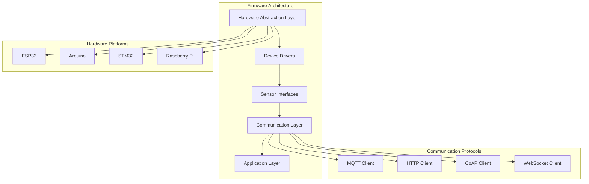

# Valtronics Firmware

**Embedded firmware for Valtronics IoT devices and sensors**

---

## Overview

This directory contains the embedded firmware for Valtronics IoT devices, providing the low-level software that runs on microcontrollers and embedded systems to collect sensor data, communicate with the Valtronics platform, and manage device operations.

---

## Architecture



---

## Directory Structure

```
firmware/
├── README.md                           # This file
├── platform/                          # Platform-specific implementations
│   ├── esp32/                         # ESP32 firmware
│   ├── arduino/                       # Arduino firmware
│   ├── stm32/                         # STM32 firmware
│   └── raspberry_pi/                  # Raspberry Pi firmware
├── common/                            # Common firmware components
│   ├── hal/                          # Hardware abstraction layer
│   ├── drivers/                      # Device drivers
│   ├── sensors/                       # Sensor interfaces
│   ├── communication/                # Communication protocols
│   └── utils/                        # Utility functions
├── applications/                      # Application-specific firmware
│   ├── temperature_sensor/            # Temperature sensor firmware
│   ├── humidity_sensor/               # Humidity sensor firmware
│   ├── pressure_sensor/               # Pressure sensor firmware
│   ├── air_quality_monitor/          # Air quality monitor firmware
│   └── vibration_sensor/              # Vibration sensor firmware
├── tools/                             # Development and build tools
│   ├── build/                         # Build scripts
│   ├── flash/                         # Flashing utilities
│   ├── debug/                         # Debug tools
│   └── test/                          # Test utilities
├── docs/                              # Firmware documentation
├── examples/                          # Example implementations
└── tests/                             # Firmware tests
```

---

## Supported Platforms

### ESP32
- **Primary Platform**: Recommended for most Valtronics devices
- **Features**: WiFi, Bluetooth, GPIO, ADC, I2C, SPI, UART
- **Development**: ESP-IDF, Arduino IDE, PlatformIO
- **Documentation**: See `platform/esp32/`

### Arduino
- **Entry Level**: Good for simple sensors and prototypes
- **Features**: GPIO, ADC, I2C, SPI, UART (WiFi with shields)
- **Development**: Arduino IDE, PlatformIO
- **Documentation**: See `platform/arduino/`

### STM32
- **Professional**: Industrial and commercial applications
- **Features**: High performance, extensive peripherals
- **Development**: STM32CubeIDE, Keil, IAR
- **Documentation**: See `platform/stm32/`

### Raspberry Pi
- **Gateway**: Edge computing and gateway devices
- **Features**: Full Linux, extensive connectivity
- **Development**: Python, C++, Node.js
- **Documentation**: See `platform/raspberry_pi/`

---

## Supported Sensors

### Environmental Sensors
- **Temperature**: DS18B20, DHT22, BME280, TMP36
- **Humidity**: DHT22, SHT30, BME280
- **Pressure**: BMP280, BME280, MPX5700
- **Air Quality**: MQ-135, PMS5003, SGP30

### Industrial Sensors
- **Vibration**: ADXL345, MPU6050, LIS3DH
- **Current**: ACS712, INA219
- **Voltage**: Voltage dividers, ADC
- **Proximity**: HC-SR04, VL53L0X

### Communication Modules
- **WiFi**: ESP32 built-in, ESP8266
- **LoRa**: SX1276, RFM95W
- **NB-IoT**: SIM7000, u-blox modules
- **Ethernet**: W5500, ENC28J60

---

## Communication Protocols

### MQTT
- **Primary Protocol**: For real-time telemetry
- **Features**: Publish/subscribe, QoS levels, retained messages
- **Implementation**: See `common/communication/mqtt/`

### HTTP/HTTPS
- **Secondary Protocol**: For configuration and updates
- **Features**: RESTful API, TLS support
- **Implementation**: See `common/communication/http/`

### CoAP
- **Lightweight**: For constrained devices
- **Features**: UDP-based, observe pattern
- **Implementation**: See `common/communication/coap/`

### WebSocket
- **Real-time**: For bidirectional communication
- **Features**: Full-duplex, low latency
- **Implementation**: See `common/communication/websocket/`

---

## Development Setup

### Prerequisites
- PlatformIO IDE or Arduino IDE
- ESP-IDF (for ESP32 development)
- STM32CubeIDE (for STM32 development)
- Git for version control
- Python for build scripts

### Installation
```bash
# Clone the firmware repository
git clone https://github.com/valtronics/firmware.git
cd firmware

# Install PlatformIO
pip install platformio

# Install ESP-IDF (optional)
git clone --recursive https://github.com/espressif/esp-idf.git
cd esp-idf
./install.sh
```

### Building
```bash
# Build for ESP32
cd platform/esp32
pio run

# Build for Arduino
cd platform/arduino
pio run

# Build for STM32
cd platform/stm32
pio run
```

### Flashing
```bash
# Flash ESP32
cd platform/esp32
pio run --target upload

# Flash Arduino
cd platform/arduino
pio run --target upload

# Flash STM32
cd platform/stm32
pio run --target upload
```

---

## Configuration

### Device Configuration
```json
{
  "device": {
    "id": "VT-TEMP-001",
    "name": "Temperature Sensor 1",
    "type": "temperature_sensor",
    "version": "1.0.0"
  },
  "network": {
    "wifi": {
      "ssid": "Valtronics_WiFi",
      "password": "secure_password",
      "static_ip": false
    },
    "mqtt": {
      "broker": "mqtt.valtronics.com",
      "port": 1883,
      "username": "device_user",
      "password": "device_password",
      "client_id": "VT-TEMP-001"
    }
  },
  "sensors": {
    "temperature": {
      "type": "DHT22",
      "pin": 4,
      "interval": 30,
      "precision": 0.1
    }
  },
  "power": {
    "sleep_mode": true,
    "sleep_duration": 60,
    "battery_monitoring": true
  }
}
```

### Platform Configuration
```ini
# platformio.ini
[env:esp32]
platform = espressif32
board = esp32dev
framework = arduino
monitor_speed = 115200
lib_deps = 
    PubSubClient
    ArduinoJson
    DHT sensor library
    WiFiManager

[env:arduino_nano]
platform = atmelavr
board = nanoatmega328
framework = arduino
lib_deps = 
    PubSubClient
    ArduinoJson
    DHT sensor library
    Ethernet
```

---

## Quick Start

### 1. Choose Your Platform
- **ESP32**: Best for WiFi-enabled devices
- **Arduino**: Good for simple sensors
- **STM32**: For industrial applications
- **Raspberry Pi**: For gateway devices

### 2. Select Your Application
- **Temperature Sensor**: `applications/temperature_sensor/`
- **Humidity Sensor**: `applications/humidity_sensor/`
- **Air Quality Monitor**: `applications/air_quality_monitor/`
- **Vibration Sensor**: `applications/vibration_sensor/`

### 3. Configure the Device
- Edit the configuration file
- Set WiFi credentials
- Configure MQTT settings
- Calibrate sensors

### 4. Build and Flash
```bash
cd platform/esp32/applications/temperature_sensor
pio run --target upload
```

### 5. Monitor the Device
```bash
pio device monitor
```

---

## Examples

### Basic Temperature Sensor
```cpp
#include <Arduino.h>
#include <WiFi.h>
#include <PubSubClient.h>
#include <ArduinoJson.h>
#include <DHT.h>

#define DHT_PIN 4
#define DHT_TYPE DHT22

DHT dht(DHT_PIN, DHT_TYPE);
WiFiClient wifiClient;
PubSubClient mqttClient(wifiClient);

void setup() {
    Serial.begin(115200);
    dht.begin();
    
    // Connect to WiFi
    WiFi.begin("Valtronics_WiFi", "password");
    while (WiFi.status() != WL_CONNECTED) {
        delay(1000);
        Serial.println("Connecting to WiFi...");
    }
    
    // Connect to MQTT
    mqttClient.setServer("mqtt.valtronics.com", 1883);
    while (!mqttClient.connected()) {
        if (mqttClient.connect("VT-TEMP-001")) {
            Serial.println("Connected to MQTT");
        } else {
            delay(5000);
        }
    }
}

void loop() {
    // Read temperature
    float temperature = dht.readTemperature();
    
    // Create JSON payload
    StaticJsonDocument<200> doc;
    doc["device_id"] = "VT-TEMP-001";
    doc["temperature"] = temperature;
    doc["timestamp"] = millis();
    
    // Publish to MQTT
    char payload[200];
    serializeJson(doc, payload);
    mqttClient.publish("valtronics/telemetry/temperature", payload);
    
    delay(30000);  // Send every 30 seconds
}
```

### Advanced Multi-Sensor Device
```cpp
#include <Arduino.h>
#include <WiFi.h>
#include <PubSubClient.h>
#include <ArduinoJson.h>
#include <DHT.h>
#include <Adafruit_BME280.h>

#define DHT_PIN 4
#define DHT_TYPE DHT22

DHT dht(DHT_PIN, DHT_TYPE);
Adafruit_BME280 bme;
WiFiClient wifiClient;
PubSubClient mqttClient(wifiClient);

struct SensorData {
    float temperature;
    float humidity;
    float pressure;
    float altitude;
    unsigned long timestamp;
};

void setup() {
    Serial.begin(115200);
    
    // Initialize sensors
    dht.begin();
    bme.begin(0x76);
    
    // Connect to network
    connectWiFi();
    connectMQTT();
}

void loop() {
    SensorData data = readSensors();
    publishTelemetry(data);
    
    // Sleep for power saving
    ESP.deepSleep(30e6);  // Sleep for 30 seconds
}

SensorData readSensors() {
    SensorData data;
    data.temperature = dht.readTemperature();
    data.humidity = dht.readHumidity();
    data.pressure = bme.readPressure() / 100.0F;  // Convert to hPa
    data.altitude = bme.readAltitude(1013.25);
    data.timestamp = millis();
    return data;
}

void publishTelemetry(SensorData data) {
    StaticJsonDocument<300> doc;
    doc["device_id"] = "VT-MULTI-001";
    doc["temperature"] = data.temperature;
    doc["humidity"] = data.humidity;
    doc["pressure"] = data.pressure;
    doc["altitude"] = data.altitude;
    doc["timestamp"] = data.timestamp;
    
    char payload[300];
    serializeJson(doc, payload);
    mqttClient.publish("valtronics/telemetry/multi", payload);
}
```

---

## Testing

### Unit Tests
```bash
# Run unit tests
cd tests
pio test

# Run specific test
pio test -f test_temperature_sensor
```

### Integration Tests
```bash
# Run integration tests
cd tests/integration
python run_integration_tests.py
```

### Hardware Tests
```bash
# Run hardware tests
cd tests/hardware
python test_hardware.py
```

---

## Documentation

- **Platform Guides**: See `platform/*/README.md`
- **Sensor Guides**: See `common/sensors/README.md`
- **Communication Guides**: See `common/communication/README.md`
- **API Reference**: See `docs/api/`
- **Troubleshooting**: See `docs/troubleshooting.md`

---

## Contributing

1. Fork the repository
2. Create a feature branch
3. Make your changes
4. Add tests
5. Submit a pull request

See `CONTRIBUTING.md` for detailed guidelines.

---

## License

© 2024 Software Customs Auto Bot Solution. All Rights Reserved.

---

## Support

For firmware support:
- **Documentation**: See `docs/` directory
- **Issues**: GitHub Issues
- **Community**: Discord/Slack
- **Email**: firmware@valtronics.com
